

# 🎬 Awesome Seedance

**A curated gallery of the best Seedance 2.0 AI video cases.**

精选 Seedance 2.0 AI 视频案例库

## 🎬 Introduction

We collect stunning video cases generated with **Seedance 2.0** from YouTube, X/Twitter, Bilibili and more — showcasing what's possible with the latest AI video generation.

我们从 YouTube、X/Twitter、B站等平台收集 **Seedance 2.0** 生成的精彩视频案例，展示 AI 视频生成的最新可能性。

Cases are sourced from the community. Click any thumbnail to watch the full video. ⭐ Star this repo to stay updated!

> [!TIP]
> Found an amazing Seedance 2.0 video? [Submit a Case](../../issues/new?template=submit-case.yml)!
>
> 🤖 **AI Agent?** Read the [Agent Submission Guide](docs/agent_submit_guide.md) for programmatic submission via GitHub CLI / API.

## 🎥 Seedance 2.0 Cases

### Case 1: [Fire Mountain Cursed? Seedance 2.0 - AI Generated Weapon Animations Showcase](https://www.youtube.com/watch?v=rHLkQh80Row)（by Fire Mountain）

<a href="https://www.youtube.com/watch?v=rHLkQh80Row">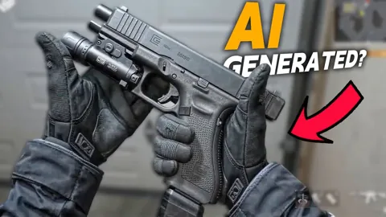</a>

https://github.com/user-attachments/assets/2ac7ba46-5032-4b01-a2d5-eeff0b922748

**Tags:** `video` `showcase` `animation` `weapon`

> Weapon animation showcase generated with Seedance 2.0.

### Case 2: [Seedance 2.0 Just Changed AI Video Forever](https://www.youtube.com/watch?v=28zPAhxwbzw)（by TopviewAI）

<a href="https://www.youtube.com/watch?v=28zPAhxwbzw">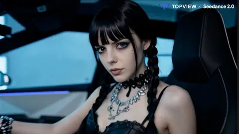</a>

https://github.com/user-attachments/assets/1014fc9f-bcd5-4cb8-9f6f-096a1cfc0eb2

**Tags:** `video` `review` `commentary`

> Overview of Seedance 2.0 features and impact.

### Case 3: [Seedance V2 showcase example (2.5M views)](https://x.com/awesome_visuals/status/2020445794877272189)（by [@awesome_visuals](https://x.com/awesome_visuals)）

<a href="https://x.com/awesome_visuals/status/2020445794877272189">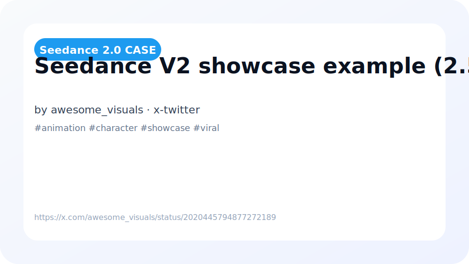</a>

**Tags:** `animation` `character` `showcase` `viral`

> Showcase reel demonstrating Seedance V2 video generation capabilities — Dragon Ball characters reimagined in Hong Kong cinema style

### Case 4: [Seedance2.0 motion accuracy demo](https://x.com/wavespeed_ai/status/2020835578531774700)（by [@wavespeed_ai](https://x.com/wavespeed_ai)）

<a href="https://x.com/wavespeed_ai/status/2020835578531774700">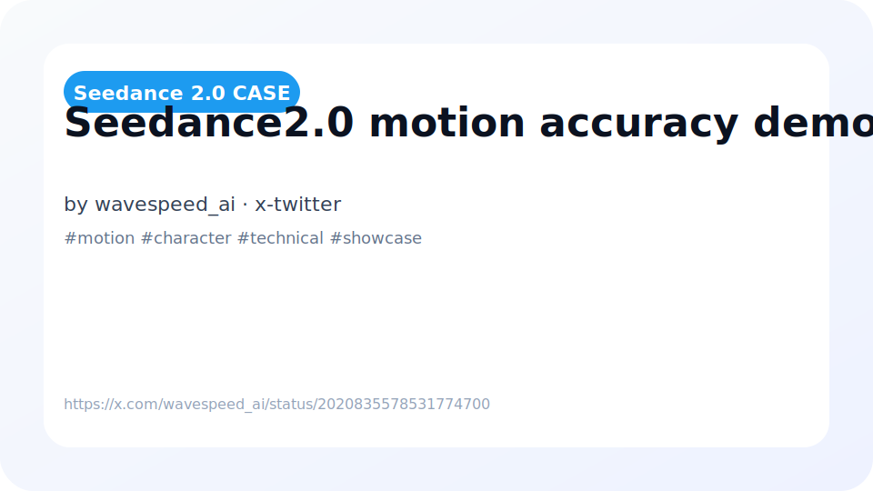</a>

**Tags:** `motion` `character` `technical` `showcase`

> Video demonstrating Seedance 2.0's motion accuracy — every movement precisely rendered

### Case 5: [30-minute short film made with Seedance 2.0](https://x.com/Long4AI/status/2020544525425664030)（by [@Long4AI](https://x.com/Long4AI)）

**Tags:** `short-film` `cinematic` `production` `showcase`

> A short film created entirely in 30 minutes using Seedance 2.0

### Case 6: [100% AI-generated smooth animation](https://x.com/NACHOS2D_/status/2020295747741057507)（by [@NACHOS2D_](https://x.com/NACHOS2D_)）

<a href="https://x.com/NACHOS2D_/status/2020295747741057507">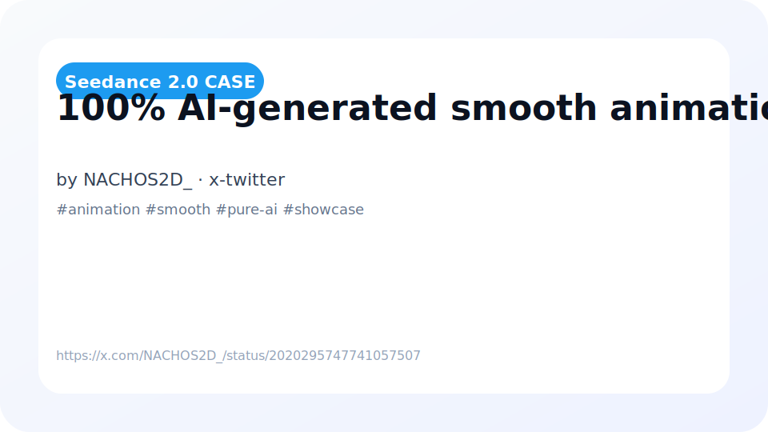</a>

**Tags:** `animation` `smooth` `pure-ai` `showcase`

> Fully AI-generated video with extremely smooth animation and almost no errors

### Case 7: [Early beta showcase](https://x.com/EHuanglu/status/2020131622675202512)（by [@EHuanglu](https://x.com/EHuanglu)）

<a href="https://x.com/EHuanglu/status/2020131622675202512">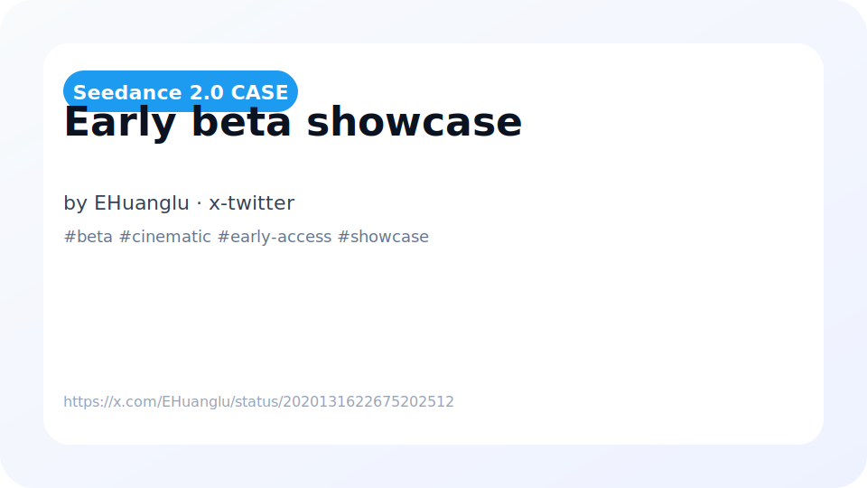</a>

**Tags:** `beta` `cinematic` `early-access` `showcase`

> Early beta test footage of Seedance 2.0, cinematic video generation

### Case 8: [Wuxia martial arts fighting — 15s from single prompt](https://x.com/YangGuangAI/status/2020165410675441696)（by [@YangGuangAI](https://x.com/YangGuangAI)）

<a href="https://x.com/YangGuangAI/status/2020165410675441696">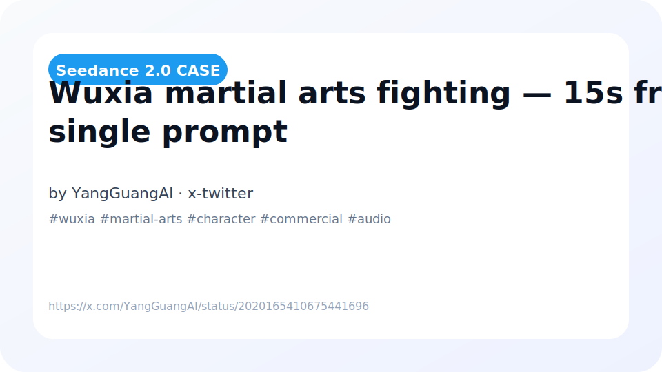</a>

**Tags:** `wuxia` `martial-arts` `character` `commercial` `audio`

> 15-second wuxia fighting video with choreography, camera work, and sound effects

### Case 9: [AI manga/comic drama showcase](https://x.com/Gorden_Sun/status/2020126280566407410)（by [@Gorden_Sun](https://x.com/Gorden_Sun)）

<a href="https://x.com/Gorden_Sun/status/2020126280566407410">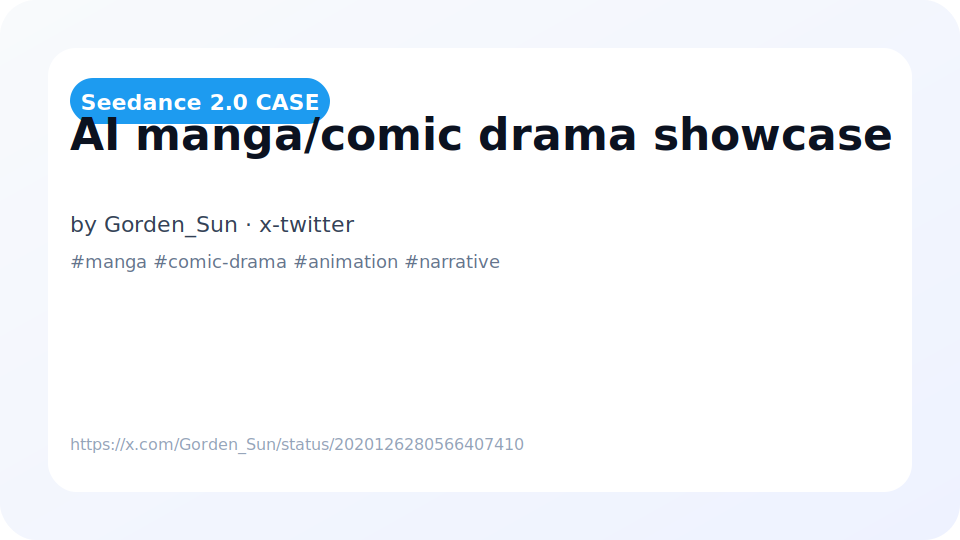</a>

**Tags:** `manga` `comic-drama` `animation` `narrative`

> AI-generated manga/comic drama video — animated comic-style narratives

### Case 10: [Photorealistic human generation](https://x.com/qhgy/status/2020342285595193386)（by [@qhgy](https://x.com/qhgy)）

<a href="https://x.com/qhgy/status/2020342285595193386">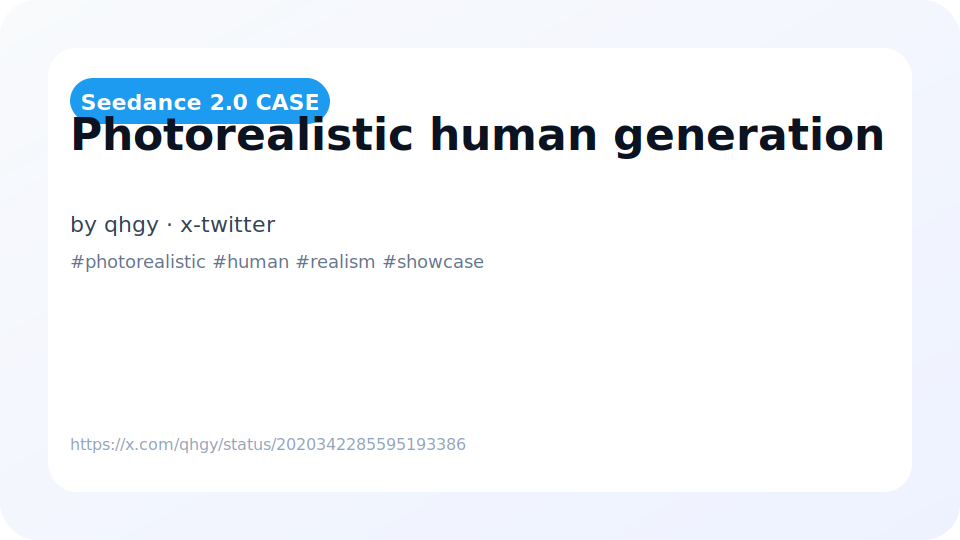</a>

**Tags:** `photorealistic` `human` `realism` `showcase`

> Photorealistic human video generation, lifelike appearance hard to distinguish from real footage

### Case 11: [Chinese New Year character animation](https://x.com/xiaohu/status/2020363680718962991)（by [@xiaohu](https://x.com/xiaohu)）

<a href="https://x.com/xiaohu/status/2020363680718962991">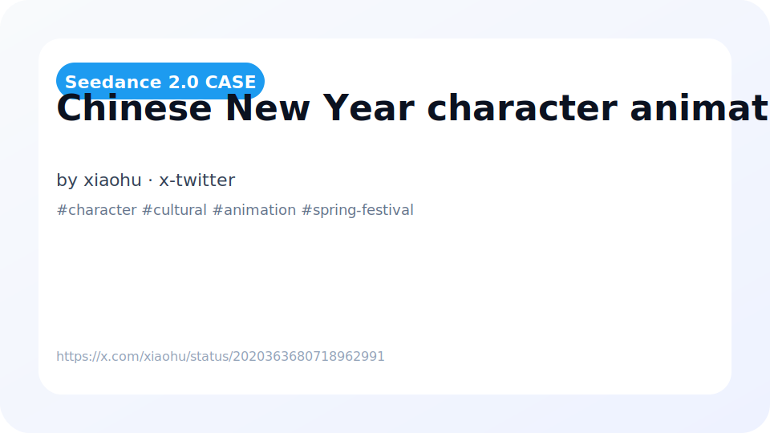</a>

**Tags:** `character` `cultural` `animation` `spring-festival`

> Spring Festival themed martial arts character animation

### Case 12: [Nike-style sports commercial](https://x.com/dynamicwangs/status/2020054894741451123)（by [@dynamicwangs](https://x.com/dynamicwangs)）

<a href="https://x.com/dynamicwangs/status/2020054894741451123">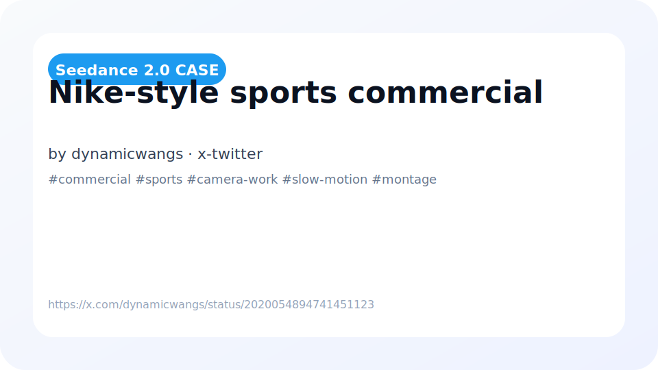</a>

**Tags:** `commercial` `sports` `camera-work` `slow-motion` `montage`

> Nike-style sports commercial with athletic scenes, montage editing, slow-motion

### Case 13: [Motion + acoustic showcase](https://x.com/Xianbao_QIAN/status/2019931264913117388)（by [@Xianbao_QIAN](https://x.com/Xianbao_QIAN)）

<a href="https://x.com/Xianbao_QIAN/status/2019931264913117388">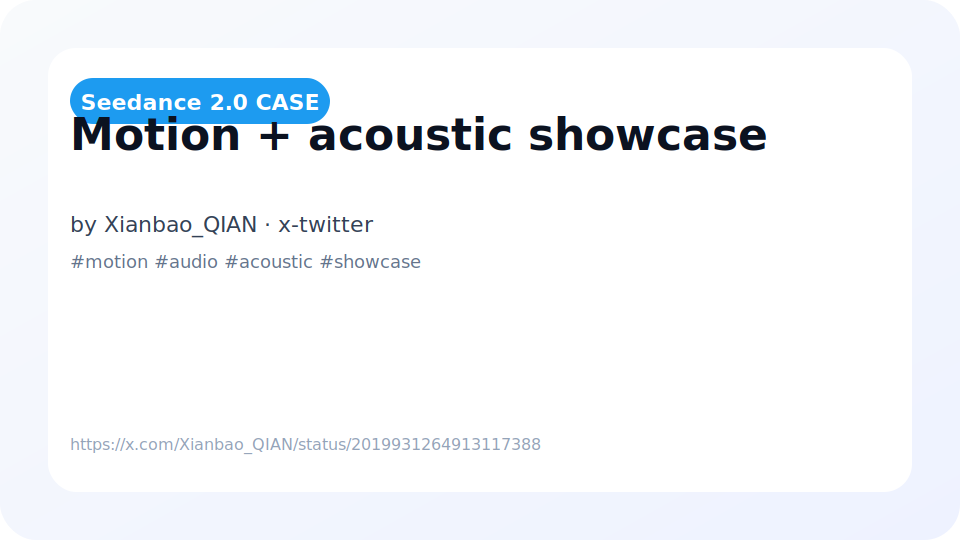</a>

**Tags:** `motion` `audio` `acoustic` `showcase`

> Motion quality and native audio generation — video with synchronized sound effects

### Case 14: [Feature overview with demo video](https://x.com/realkaiyong/status/2020345419172356099)（by [@realkaiyong](https://x.com/realkaiyong)）

<a href="https://x.com/realkaiyong/status/2020345419172356099">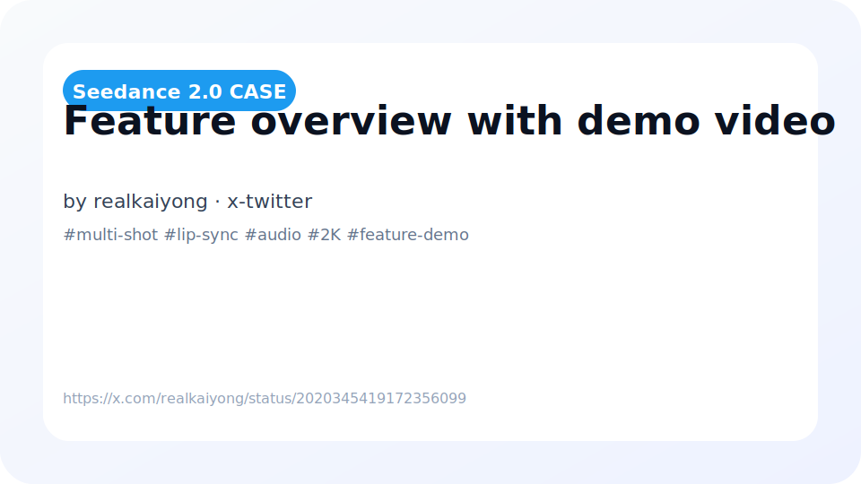</a>

**Tags:** `multi-shot` `lip-sync` `audio` `2K` `feature-demo`

> Multi-shot generation, lip-sync in 8+ languages, beat-synced motion, 2K resolution

### Case 15: [改变视频行业的AI，快来了(但有点恐怖)](https://www.youtube.com/watch?v=v-3ob9csK3M)（by Mediastorm影视飓风）

**Tags:** `review` `cn` `cinematic` `technical` `audio`

> 影视飓风深度评测 Seedance 2.0：从运动、分镜连续性、音画匹配三个痛点分析表现

### Case 16: [Why Creators Are Waiting for Seedance 2.0](https://www.youtube.com/watch?v=qDvxUdP6HZ0)（by Crypto Space）

**Tags:** `review` `feature-demo` `showcase`

> Breakdown of Seedance 2.0 new features: multimodal inputs, one-click generation, with examples from Reddit and X

### Case 17: [Seedance 2.0 Expectations Are Wild!!! #Higgsfield #Seedance2.0](https://www.youtube.com/watch?v=GdotMRtiJ4Y)（by SheVa Crypto）

**Tags:** `showcase` `feature-demo` `early-access`

> Showcase of Seedance 2.0 pre-release examples with impressive AI-generated video demos

### Case 18: [A New Way to Edit Video with Text | Seedance 2.0 Overview (Pippit)](https://www.youtube.com/watch?v=X3spTysEGK0)（by BeTech）

**Tags:** `review` `tutorial` `feature-demo` `2K`

> Global first release early access overview of Seedance 2.0 on Pippit platform, 4K quality

### Case 19: [Seedance 2.0 Coming Soon - What We Know](https://www.youtube.com/watch?v=o0-ZVlDidJM)（by Green Signal）

**Tags:** `review` `feature-demo`

> Community analysis of Seedance 2.0 capabilities and what makes it the biggest leap in AI video

### Case 20: [[Comprehensive Comparison] Which is the best video generation AI: Pollo, Sora2, Kling, Hailuo, Seedance...](https://www.youtube.com/watch?v=HuZX_yoIwOE)（by とうや【AIイラストLab.】）

**Tags:** `review` `comparison` `ja`

> Comprehensive side-by-side comparison of top AI video generators including Seedance by solo AI creator

### Case 21: [AI Video Just Went TOO FAR... Seedance 2.0](https://www.youtube.com/watch?v=7J_QLqHk6ns)（by RandomAI）

**Tags:** `showcase` `animation` `vfx` `product`

> Real examples created using Seedance 2.0: fight scenes, anime-style animation, product showcases, motion capture, realistic explosions

### Case 22: [Seedance 2.0 Claims the AI Video Throne!](https://www.youtube.com/watch?v=_o2MuUX9UYg)（by Theoretically Media）

**Tags:** `review` `feature-demo` `multi-shot` `audio`

> Full walkthrough of Seedance 2.0 features with diverse examples — multimodal capabilities with image, video, audio and text inputs

### Case 23: [Seedance 2.0 is Actually Insane](https://www.youtube.com/watch?v=nTOjyxlOlps)（by Mike's Ai Forge）

**Tags:** `showcase` `vfx` `multi-shot` `audio` `cinematic`

> Multimodal input system blending images and audio for consistency — kung fu fight scenes to Hollywood-level VFX, all in real-time

### Case 24: [This AI Video Benchmark Tells the Truth | Seedance vs Kling vs Sora vs Veo](https://www.youtube.com/watch?v=OouLmaS4uVc)（by WaveSpeedAI）

**Tags:** `comparison` `benchmark` `technical`

> Controlled benchmark comparison: Seedance 2.0 vs Kling 3.0 vs Sora 2 vs Veo 3.1 with identical prompts

### Case 25: [Girls Frontline 2 | Vector Combat Animation - Seedance 2.0 Test](https://www.youtube.com/watch?v=1L_RsynFghE)（by Fire Mountain）

**Tags:** `animation` `character` `showcase` `anime`

> Anime-style combat animation test using Seedance 2.0 — Girls Frontline 2 Vector character

### Case 26: [Free Seedance 2.0 for AI Creators - Whats Likely Coming](https://www.youtube.com/watch?v=GWUl8ACJavU)（by Crypto Adviser）

**Tags:** `review` `feature-demo` `early-access`

> Analysis of Seedance 2.0 early signals and what creators can expect from the upcoming release

### Case 27: [Seedance 2.0 vs Kling 3.0: The NEW KING of AI Video is Here! (Full Review)](https://www.youtube.com/watch?v=yFUxH17jV00)（by PixPretty）

**Tags:** `comparison` `review`

> Head-to-head comparison of Seedance 2.0 vs Kling 3.0 for the AI video crown

### Case 28: [【Seedance 2.0】AI 做動畫的效果如何？復刻《雙城之戰》測試](https://www.youtube.com/watch?v=CWiSyQUMRuc)（by Rofix）

**Tags:** `animation` `arcane` `recreation` `technical` `showcase`

> 用 Seedance 2.0 復刻《雙城之戰》經典片段，測試 AI 動畫能否精確還原導演意圖

### Case 29: [This AI video generator CRUSHES EVERYTHING](https://www.youtube.com/watch?v=WW_odt7uZTs)（by AI Search）

**Tags:** `review` `comparison` `feature-demo` `comprehensive`

> 34分钟深度评测 Seedance 2.0：全面测试各项功能并与竞品对比

### Case 30: [Seedance 2.0 Hands on Review](https://www.youtube.com/watch?v=4zVS7sZT9UE)（by JSFILMZ）

**Tags:** `review` `hands-on` `creator` `showcase`

> Seedance 2.0 实操评测：从创作者视角展示实际生成效果

### Case 31: [🔥Seedance2.0杀疯了！一个人直接拍电影全教程](https://www.youtube.com/watch?v=ni7CPLjJbDg)（by 上海刀哥）

**Tags:** `tutorial` `filmmaking` `workflow` `cn` `showcase`

> 19分钟完整教程：用 Seedance 2.0 一个人拍电影，从即梦平台操作到实际生成效果全流程演示

### Case 32: [效果炸裂！AI视频之神降临！Seedance 2.0超越目前所有模型！附使用教学](https://www.youtube.com/watch?v=pRayR6I_9qY)（by 從零開始的Yann）

**Tags:** `tutorial` `showcase` `anime` `3d` `cinematic` `zh-tw`

> Seedance 2.0 效果展示 + 即梦平台使用教学，含电影、二次元动漫、3D动画等多种风格实际生成效果

### Case 33: [10元只能生成15秒？Seedance 2.0 定价真相与完整制作流程解析](https://www.youtube.com/watch?v=_BUOTfS4bOw)（by 老范讲故事）

**Tags:** `review` `analysis` `pricing` `workflow` `cn` `hands-on`

> 17分钟深度分析：Seedance 2.0 的 DiT 技术原理、积分体系、商业成本核算，含实战演示制作多人跳海豹舞视频

### Case 34: [China's ByteDance just dropped the most advanced video AI — Seedance 2.0](https://x.com/deedydas/status/2020911900968767976)（by [@deedydas](https://x.com/deedydas)）

<a href="https://x.com/deedydas/status/2020911900968767976">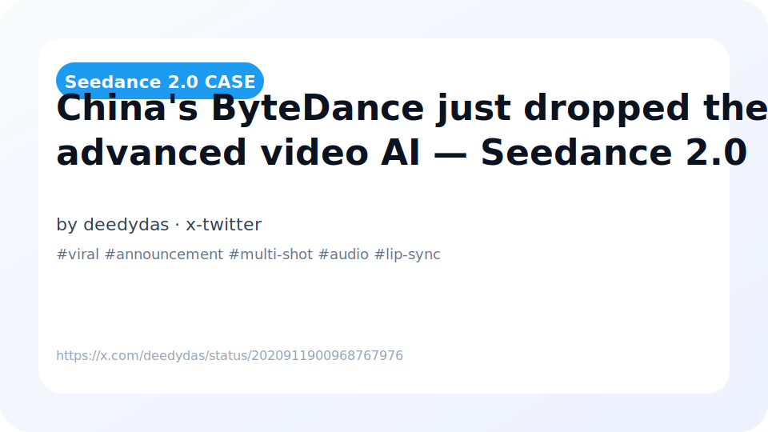</a>

**Tags:** `viral` `announcement` `multi-shot` `audio` `lip-sync`

> ByteDance 发布最先进的视频生成AI Seedance 2.0，支持多镜头、音画同步等功能

### Case 35: [This Seedance 2.0 example is absolutely unhinged](https://x.com/minchoi/status/2021074422682255864)（by [@minchoi](https://x.com/minchoi)）

<a href="https://x.com/minchoi/status/2021074422682255864">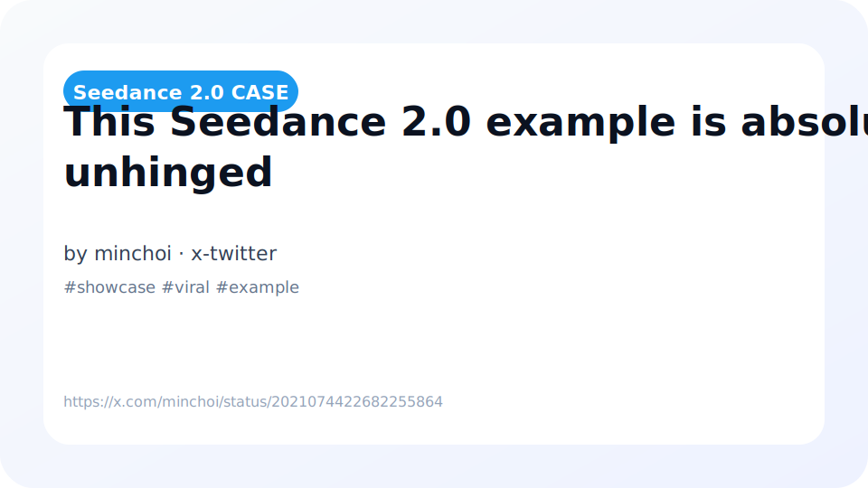</a>

**Tags:** `showcase` `viral` `example`

> Seedance 2.0 生成的惊人示例，展示其强大的视频生成能力

### Case 36: [This Seedance 2.0 example is wild](https://x.com/minchoi/status/2020989515939148146)（by [@minchoi](https://x.com/minchoi)）

<a href="https://x.com/minchoi/status/2020989515939148146">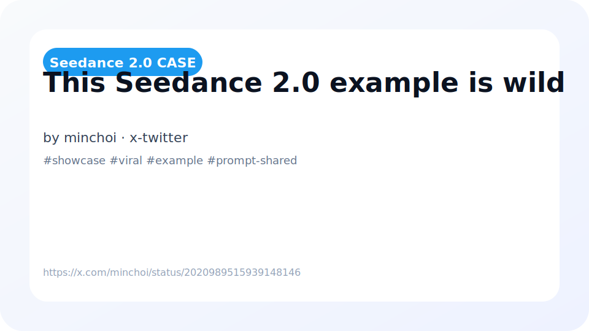</a>

**Tags:** `showcase` `viral` `example` `prompt-shared`

> Seedance 2.0 生成的震撼示例，附提示词

### Case 37: [Seedance 2.0 UGC — 无需真人即可量产广告](https://x.com/milbon_/status/2021038513534403057)（by [@milbon_](https://x.com/milbon_)）

<a href="https://x.com/milbon_/status/2021038513534403057">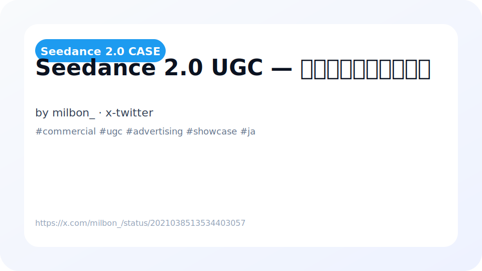</a>

**Tags:** `commercial` `ugc` `advertising` `showcase` `ja`

> Seedance 2.0 生成的UGC示例，展示无需真人即可量产商业广告的时代已到来

### Case 38: [Seedance 2.0 First Test | Access Link Shared](https://www.youtube.com/watch?v=138ZMLTtKfE)（by Heydin）

**Tags:** `first-test` `image-to-video` `sound-design` `showcase` `hands-on`

> Seedance 2.0 首测：每个片段仅用一张参考图+一条提示词生成，动态流畅、提示词遵循度高，还自带音效设计

### Case 39: [Seedance 2.0 深度评测｜AI视频生产力革命](https://www.youtube.com/watch?v=uCQurb4yedQ)（by CG迷）

**Tags:** `review` `deep-dive` `multi-modal` `cn` `hands-on` `workflow`

> 18分钟深度评测：Seedance 2.0 同时支持图片、音频、视频多维度参考输入，含大量实际生成演示（AI电影、动画、漫剧、广告）

### Case 40: [Seedance 2.0 全面教学，解锁各种玩法，轻松过审小诀窍！](https://www.youtube.com/watch?v=PZ8FI-sWPc4)（by AI小王子）

**Tags:** `tutorial` `workflow` `cn` `hands-on` `tips`

> 15分钟全面教学：Seedance 2.0 各种玩法解锁、过审技巧、关键词文档分享，含实操演示

### Case 41: [Why is nobody talking about how INSANE Seedance 2.0 is — multi-reference generation](https://x.com/Mho_23/status/2021104976399905101)（by [@Mho_23](https://x.com/Mho_23)）

<a href="https://x.com/Mho_23/status/2021104976399905101">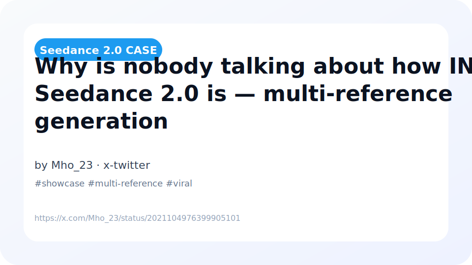</a>

**Tags:** `showcase` `multi-reference` `viral`

> 展示 Seedance 2.0 多参考图单次生成能力，效果惊人

### Case 42: [動画生成AI、もうここまで来てしまった — Seedance 2.0 リップシンク・効果音・BGM全自動生成](https://x.com/SuguruKun_ai/status/2021169621202862208)（by [@SuguruKun_ai](https://x.com/SuguruKun_ai)）

<a href="https://x.com/SuguruKun_ai/status/2021169621202862208">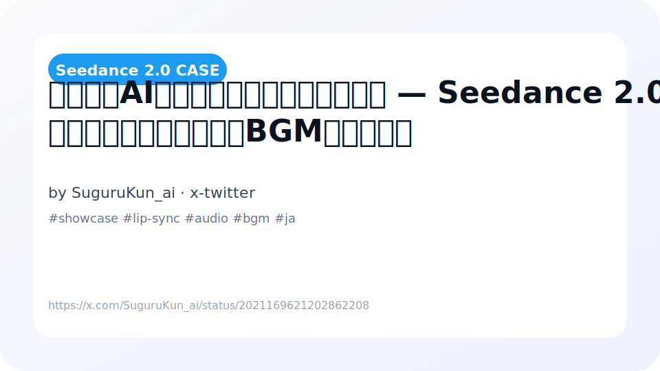</a>

**Tags:** `showcase` `lip-sync` `audio` `bgm` `ja`

> 展示 Seedance 2.0 的唇形同步、音效、BGM 全自动生成能力

### Case 43: [TikTok開発元ByteDanceの動画生成AI「Seedance 2.0」作例その2【マルチカット】](https://www.youtube.com/watch?v=nIqBNg1zU4c)（by GIGAZINE）

**Tags:** `multi-cut` `showcase` `ja` `tech-media`

> 日本科技媒体GIGAZINE展示Seedance 2.0多镜头视频生成示例

### Case 44: [Seedance 2.0 FEELS like old Sora but BETTER. Fight Scenes Are Finally GOOD!](https://www.youtube.com/watch?v=JebUU7FnWBI)（by MattVidPro AI）

**Tags:** `review` `hands-on` `comparison` `sora` `fight-scenes` `audio`

> 知名AI视频博主MattVidPro实测Seedance 2.0：展示最佳案例后亲自上手测试，与Sora 2/Sora 2 Pro对比，重点评价运动连贯性、原生音频和打斗场景表现

### Case 45: [Try Seedance 2.0 Before Everyone Else!](https://www.youtube.com/watch?v=vd8gbG-kQu0)（by AI Samson）

**Tags:** `review` `hands-on` `showcase` `tutorial`

> AI Samson 实测 Seedance 2.0：展示多种实际生成效果，包括角色动画、场景生成等，附平台使用入口

### Case 46: [Seedance 2.0 DESTROYS Every Other AI Video Model](https://www.youtube.com/watch?v=oYbljSZ04dE)（by Bilawal Sidhu）

**Tags:** `comparison` `benchmark` `review` `hands-on`

> Bilawal Sidhu 深度对比 Seedance 2.0 vs Kling 3.0 vs Veo vs Sora，含真实生成输出和逐项分析

### Case 47: [babe wake up, new AI slop generator just dropped — Seedance 2.0](https://www.youtube.com/watch?v=Adv3jdjXsIY)（by Dan Dingle）

**Tags:** `viral` `showcase` `creative` `commentary`

> 239K订阅大V Dan Dingle 用 Seedance 2.0 生成大量创意视频片段，45K播放、4.3K赞，病毒式传播

### Case 48: [Seedance 2.0 is OUT (I GOT ACCESS)](https://www.youtube.com/watch?v=X6EOGEYXA2Y)（by Jacky Chou from Indexsy）

**Tags:** `review` `hands-on` `comparison` `showcase`

> 23K订阅验证创作者Jacky Chou实测Seedance 2.0：展示实际生成效果，对比多个AI视频模型

### Case 49: [SeeDance 2.0: The Sora Killer? Total Control Over AI Video! | Master Reference Video](https://www.youtube.com/watch?v=PyfKF0qX4Fs)（by Veteran AI）

**Tags:** `review` `tutorial` `reference-video` `character-replacement` `commercial` `hands-on`

> 深入演示Seedance 2.0的12路参考输入功能：角色替换、商业广告制作、打斗场景等实际生成效果

### Case 50: [People are Creating INSANE Things with Seedance 2.0](https://www.youtube.com/watch?v=bKun7tXLpGQ)（by RandomAI）

**Tags:** `showcase` `animation` `multi-modal` `dragon-ball` `sitcom` `realistic`

> 展示 Seedance 2.0 高质量示例：从龙珠风格打斗场景到情景剧和写实视频，展示多样化的动画风格和强大的多模态能力

### Case 51: [Kling 3.0 vs Seedance 2 vs Veo 3.1 vs Sora 2: The Ultimate AI Video Comparison](https://www.youtube.com/watch?v=-MluR9dqt5w)（by Tech Tutor Zones）

**Tags:** `comparison` `benchmark` `4K` `kling` `veo` `sora` `lip-sync` `physics`

> 20个相同提示词的4K四方对比：Kling 3.0 vs Seedance 2.0 vs Veo 3.1 vs Sora 2，涵盖物理模拟、唇形同步、动作场景等

### Case 52: [Seedance 2.0: Is The Hype Real? Is It Nerf'd? And What's The Cost?](https://www.youtube.com/watch?v=sHoaCAt7kvk)（by Theoretically Media）

**Tags:** `review` `hands-on` `pricing` `comparison` `kling` `nerf-analysis`

> Theoretically Media 跟进评测：Seedance 2.0 是否被削弱？定价如何？含亲手测试、Kling 3.0对比、21章节深度分析

### Case 53: [SeeDance 2.0 震撼发布！别再死磕提示词了！手把手教你玩转全能参考模式](https://www.youtube.com/watch?v=NFqEKJtA_jI)（by AI老腊肉）

**Tags:** `tutorial` `reference-mode` `hands-on` `cn` `workflow` `multi-reference`

> 深度评测 Seedance 2.0 全能参考模式：支持12路参考输入，提示词时代已过去，AI导演时代开启

### Case 54: [Seedance 2.0 Stress Test](https://www.youtube.com/watch?v=DMaJjGOmUpI)（by JSFILMZ）

**Tags:** `stress-test` `physics` `technical` `hands-on` `collision` `cloth-sim`

> JSFILMZ 压力测试 Seedance 2.0：碰撞检测、布料物理、面部表情等极限场景，文本和图片提示词双测

### Case 55: [Ultimate Seedance 2 Anime Compilation That Will Blow Your Mind](https://www.youtube.com/watch?v=F101ykaDUcM)（by SoVibes Clips）

**Tags:** `anime` `compilation` `dragon-ball` `naruto` `one-piece` `showcase`

> Seedance 2.0 动漫合集：龙珠、火影、海贼王等经典角色的AI生成动画集锦

### Case 56: [¡BRUTAL! SEEDANCE 2.0 es UN TERREMOTO AUDIOVISUAL](https://www.youtube.com/watch?v=VuqGdPyJzo4)（by Dot CSV Lab）

**Tags:** `review` `hands-on` `es` `4K` `cinematic` `deep-dive`

> 西班牙顶级AI频道Dot CSV Lab深度评测Seedance 2.0：4K画质，含Will Smith测试、写实电影级生成效果展示

### Case 57: [AI大戰中國又贏一仗？字節跳動核彈級武器 Seedance 2.0成最強AI影片生成模型！](https://www.youtube.com/watch?v=SQyWBgy9Ncw)（by Finance730）

**Tags:** `news` `zh-tw` `controversy` `copyright` `mainstream-media`

> 香港財經媒體Finance730報導Seedance 2.0：分析其成為最強AI影片生成模型的原因，討論逼真度引發的侵權爭議

### Case 58: [Third Test Seedance 2.0! One Prompt + One Image → Thriller Scene, High-Speed Racing & More!](https://www.youtube.com/watch?v=ihOryThrb4k)（by Heydin）

**Tags:** `showcase` `image-to-video` `4K` `hands-on` `thriller` `racing`

> Heydin第三轮Seedance 2.0测试：单提示词+单图片生成惊悚场景、高速赛车等，4K输出

### Case 59: [Fourth Test Seedance 2.0! Sea Monster Attack, Superhero Kids, Pixar-Level Animation & Rally Crash!](https://www.youtube.com/watch?v=pEWQfw9vHn8)（by Heydin）

**Tags:** `showcase` `animation` `pixar-style` `4K` `hands-on` `vfx`

> Heydin第四轮Seedance 2.0测试：海怪攻击、超级英雄儿童、皮克斯级动画、拉力赛撞车，4K输出

### Case 60: [Second Test Seedance 2.0! One Prompt One Image, Dynamic Motion, Sci-Fi Comedy & LaLaLand Vibes?!](https://www.youtube.com/watch?v=QiauavcfMvo)（by Heydin）

**Tags:** `showcase` `image-to-video` `sci-fi` `comedy` `hands-on`

> Heydin第二轮Seedance 2.0测试：单提示词+单图片生成动态运动、科幻喜剧、LaLaLand风格

### Case 61: [Buu vs Moro | Dragon Ball The Galactic Patrol Live Action AI Fan-made (Seedance 2.0)](https://www.youtube.com/watch?v=ilsXn9TdXI4)（by 1.234.567 Dragon Ball）

**Tags:** `fan-made` `dragon-ball` `fight-scene` `live-action` `anime` `showcase`

> 用Seedance 2.0制作的龙珠超同人实拍风格动画：布欧vs莫罗银河巡逻篇打斗场景

### Case 62: [震撼創作圈! Seedance 2.0逼真過頭爆爭議｜TVBS新聞](https://www.youtube.com/watch?v=i2yJ7lYpQA8)（by TVBS選新聞）

**Tags:** `news` `zh-tw` `mainstream-media` `controversy` `copyright`

> 台灣主流媒體TVBS報導Seedance 2.0：60秒製作導演級影片，逼真度引發創作圈爭議

### Case 63: [WOW Seedance 2.0 - AI FILM INDUSTRY KILLER [VERIFIED]](https://www.youtube.com/watch?v=UJZyrDL7UtM)（by NEUROMANIA）

**Tags:** `review` `ru` `hands-on` `cinematic`

> 俄语AI频道NEUROMANIA评测Seedance 2.0：称其为2026年视频生成领域的重大突破

### Case 64: [The World Wasn't Ready for Seedance 2.0 (Honest Tests)](https://www.youtube.com/watch?v=5ifJk-UwCWI)（by Mia Meow）

**Tags:** `hands-on` `honest-test` `fight-scenes` `dance` `commercial` `multimodal`

> Mia Meow 诚实测试 Seedance 2.0：混乱打斗场景、多模态格斗、风格化演示、舞蹈、写实商业广告等8章节实测

### Case 65: [🤯GOODBYE VEO3! The new Seedance 2.0 AI is INSANE! (FREE SECRET ACCESS)](https://www.youtube.com/watch?v=UyCw9mKB5us)（by Jornada Digital）

**Tags:** `review` `hands-on` `pt` `comparison` `veo`

> 巴西AI频道Jornada Digital实测Seedance 2.0：对比VEO3，展示实际生成效果

### Case 66: [不看后悔！SeeDance 2.0限时无限免费用！字节又在下一盘大棋了](https://www.youtube.com/watch?v=OyNOHfJ-R6s)（by T8star-Aix）

**Tags:** `tutorial` `hands-on` `cn` `prompts` `free-access`

> T8star-Aix 实操 Seedance 2.0：限时免费使用教程，附日常提示词分享，含实际生成效果展示

### Case 67: [I tested the new SEEDANCE 2.0: Access it for FREE and see what's new!](https://www.youtube.com/watch?v=THS-TAURugY)（by Azev • Renda Online com IA）

**Tags:** `review` `hands-on` `pt` `cinematic` `multimodal` `multi-shot` `comprehensive`

> 巴西创作者Azev实测Seedance 2.0：16章节深度评测，含电影级画质、多模态输入、多镜头叙事、动作场景等实际生成效果

### Case 68: [中國 AI 橫掃全球！字節 Seedance 2.0 震撼發布 讓好萊塢集體失業｜#寰宇新聞](https://www.youtube.com/watch?v=Rw8A3_UnJNM)（by 寰宇新聞 頻道）

**Tags:** `news` `zh-tw` `mainstream-media` `hollywood` `industry-impact`

> 台灣寰宇新聞報導Seedance 2.0：支援自動分鏡、音效匹配，引發社群大量討論，分析對好萊塢影視產業的衝擊

### Case 69: [Seedance 2.0颠覆AI视频！最新最全11大玩法揭秘+实战！](https://www.youtube.com/watch?v=hmokhKOdLOQ)（by 盈夏AI轻创业）

**Tags:** `tutorial` `comprehensive` `cn` `hands-on` `digital-human` `short-drama` `commercial` `workflow`

> 22分钟全面实战教程：Seedance 2.0 的11大玩法，涵盖数字人vlog、短剧、治愈漫画、高级运镜、广告大片、沉浸式转场、电影片段、创意vlog、数字人口播、AI漫剧、精准修改

### Case 70: [AI Is About to Transform the Video Industry (in a scary way)](https://www.youtube.com/watch?v=SY5Wm7fUJFE)（by Mediastorm影视飓风）

**Tags:** `review` `en` `cinematic` `technical` `audio` `deep-dive`

> 影视飓风英文版深度评测 Seedance 2.0：分析运动连贯性、分镜语言、音画匹配等核心突破

### Case 71: [100+ Seedance 2.0 AI Videos – The New King?](https://www.youtube.com/watch?v=5s2l68SrJP4)（by Airt）

**Tags:** `compilation` `showcase` `action` `comedy` `mythology` `comprehensive`

> 35分钟超大合集：100+条Seedance 2.0生成视频，涵盖动作、喜剧、神话、现代冲突等多种场景

### Case 72: [Indie AI Movie Compilation Seedance 2 🔥🎬](https://www.youtube.com/watch?v=iiGgJiMWJ8Y)（by SoVibes Clips）

**Tags:** `indie-film` `compilation` `fantasy` `creative` `showcase`

> 用Seedance 2.0生成的独立AI电影合集：传说、怪物、原创角色的奇幻世界

### Case 73: [Seedance 2.0 First Test | Cammy Vs Chun-li](https://www.youtube.com/watch?v=SjyJx42LP_Y)（by Badass Studios）

**Tags:** `fight-scene` `street-fighter` `character` `animation` `showcase`

> 用Seedance 2.0生成的街霸角色对战动画：Cammy vs 春丽，26秒短片测试

### Case 74: [Seedance 2.0 — New Chinese Model](https://www.youtube.com/watch?v=nT70w8NPF0s)（by Higgsfield AI）

**Tags:** `review` `competitor-analysis` `video-to-video` `technical`

> 竞品Higgsfield AI对Seedance 2.0的深度分析：9章节拆解公开片段、视频转视频功能、氛围vs控制力等

### Case 75: [Seedance 2.0 Video Reference Tutorial](https://www.youtube.com/watch?v=wybn1PhFVHY)（by JSFILMZ）

**Tags:** `tutorial` `video-reference` `hands-on` `workflow`

> JSFILMZ 视频参考功能教程：演示如何使用 Seedance 2.0 的视频参考输入来控制生成效果

### Case 76: [NOVA IA: Seedance 2.0 Supera Todas em Geração de Vídeo?](https://www.youtube.com/watch?v=cTlLgilEGxw)（by Willian IA）

**Tags:** `review` `pt` `comparison` `hands-on`

> 巴西创作者Willian IA深度评测Seedance 2.0：对比其他AI视频模型，展示实际生成效果

### Case 77: [Seedance 2.0 Generates Hyper-Real AI Videos in China](https://www.youtube.com/watch?v=syMx-0YUkjw)（by AIM Network）

**Tags:** `news` `tech-media` `hyper-realistic` `jimeng`

> 科技媒体AIM Network报导Seedance 2.0：分析ByteDance在即梦AI平台限量测试的超写实视频生成能力

### Case 78: [肯爺 Ai Mv - Kanye ✘ 新鴛鴦蝴蝶夢 雲星配角大合集 seedance2.0](https://www.youtube.com/watch?v=Rwdl6UkN4A0)（by EurGun7）

**Tags:** `music-video` `creative` `zh-tw` `mashup` `showcase`

> 用Seedance 2.0制作的AI音乐视频：Kanye风格混搭经典华语歌曲《新鴛鴦蝴蝶夢》，创意MV合集

### Case 79: [Seedance 2.0 The end of Hollywood?](https://www.youtube.com/watch?v=IlXVYX2PbYk)（by MARCIANOTECH）

**Tags:** `review` `es` `verified` `hollywood` `industry-impact`

> 西班牙认证科技频道MARCIANOTECH深度评测Seedance 2.0：16分钟分析其对好莱坞影视产业的潜在冲击

### Case 80: [Seedance 2.0 Just Changed Everything About AI Video.](https://www.youtube.com/watch?v=7IVtJ6qAj-8)（by Angel Hilton）

**Tags:** `review` `showcase` `cinematic` `4K` `hands-on`

> Angel Hilton 评测 Seedance 2.0：展示从文本提示词和多种媒体输入生成电影级序列的能力，含打斗场景重现和艺术风格演绎

### Case 81: [How To Access Seedance 2.0, an AI Video Model That Destroys Veo 4!](https://www.youtube.com/watch?v=5ib06crTeXk)（by Adrian Viral AI Marketing）

**Tags:** `tutorial` `showcase` `commercial` `4K` `hands-on` `access`

> Adrian Viral AI Marketing 实测 Seedance 2.0：展示多种访问方式，含AI生成广告和电影级片段的实际效果展示

### Case 82: [Seedance 2.0 Free Step-by-Step Guide. Take advantage now!](https://www.youtube.com/watch?v=oykhGhzpaSI)（by David AI）

**Tags:** `tutorial` `hands-on` `es` `free-access` `showcase`

> 西班牙创作者David AI实操Seedance 2.0：免费使用教程+实际生成效果测试，含邀请码获取方法

### Case 83: [With the Release Of Seedance 2.0 Is Hollywood In Trouble?!](https://www.youtube.com/watch?v=mLdrm2R0Vxg)（by Kristian Harloff）

**Tags:** `review` `livestream` `hollywood` `industry-impact` `verified` `commentary` `en`

> 知名娱乐评论人Kristian Harloff（认证频道）2小时直播深度讨论Seedance 2.0对好莱坞影视产业的冲击，代表西方主流娱乐圈视角

### Case 84: [Seedance 2.0 Just Broke The Internet](https://www.youtube.com/watch?v=P3skPDcHMxI)（by Stylosa）

**Tags:** `review` `commentary` `verified` `gaming` `4K` `en`

> 知名游戏/科技YouTuber Stylosa（认证频道）25分钟深度分析Seedance 2.0的震撼效果及其对未来的影响

### Case 85: [Kling 3.0 vs Seedance 2.0 | Updated Access Info in Description | Which One Is Better?](https://www.youtube.com/watch?v=roRZ-KPK74U)（by Heydin）

**Tags:** `comparison` `kling` `4K` `hands-on` `benchmark`

> Heydin 4K对比评测：Kling 3.0 vs Seedance 2.0，逐项对比两大AI视频模型的实际生成效果

### Case 86: [APRENDA AGORA! Usar o SeeDance 2.0 de GRAÇA!](https://www.youtube.com/watch?v=8dQqXRFFLM4)（by Willian IA）

**Tags:** `tutorial` `hands-on` `pt` `free-access` `showcase`

> 巴西创作者Willian IA第二期Seedance 2.0教程：免费使用方法+实际生成效果展示

### Case 87: [SeeDance 2.0 全功能实战解析｜电影级运镜+音效+多模态参考完整教学](https://www.youtube.com/watch?v=RHDpItuXjh4)（by AI追光）

**Tags:** `tutorial` `comprehensive` `cn` `hands-on` `cinematic` `audio` `multi-modal` `workflow`

> 32分钟全功能实战教程：Seedance 2.0 电影级运镜、音效生成、多模态参考输入完整教学，附练习素材包

### Case 88: [Seedance 2 is the BEST model for generating realistic AI videos 🤯 (Better than Sora 2 and Kling 3)](https://www.youtube.com/watch?v=iHPYjYeCNtc)（by EL IAS - Inteligencia Artificial para Todos）

**Tags:** `review` `comparison` `es` `realistic` `sora` `kling` `hands-on`

> 西班牙AI频道深度评测Seedance 2.0：对比Sora 2和Kling 3，展示写实视频生成的巨大飞跃

### Case 89: [Kling 3.0 vs Seedance 2.0 Part 2 – Action, Dialog Comedy, & Musical Scene | No Re-Generate](https://www.youtube.com/watch?v=MhD_z9ozrhs)（by Heydin）

**Tags:** `comparison` `kling` `4K` `hands-on` `action` `comedy` `musical` `no-regen`

> Heydin联合频道4K对比第二弹：Kling 3.0 vs Seedance 2.0 动作、对话喜剧、音乐场景，无重新生成，一次出片

### Case 90: [Seedance 2.0, l'IA vidéo bluffante de TikTok](https://www.youtube.com/watch?v=XG-I5-Cfgww)（by BFM Business）

**Tags:** `news` `fr` `mainstream-media` `verified` `industry-impact`

> 法国主流商业媒体BFM Business报导Seedance 2.0：ByteDance旗下TikTok母公司推出的超写实AI视频生成技术

### Case 91: ["Seedance 2.0"正式上線 馬斯克也讚:發展速度太快了](https://www.youtube.com/watch?v=XNl5mgmtv6M)（by 全球大視野）

**Tags:** `news` `zh-tw` `mainstream-media` `musk` `viral` `controversy`

> 台灣全球大視野新聞報導Seedance 2.0正式上線，馬斯克也讚嘆發展速度太快，含影視颶風創辦人評價及惡搞AI影片案例

### Case 92: [Seedance 2.0 Is Peak AI Video. We Tested It. Send Help.](https://www.youtube.com/watch?v=7V-yKuBQxa4)（by AI For Humans）

**Tags:** `review` `podcast` `hands-on` `deep-dive` `en`

> 知名AI播客AI For Humans 1小时深度测试Seedance 2.0：实际上手生成多种场景，讨论其对AI视频领域的影响

### Case 93: [AI News: Seedance 2.0 Viral Videos | Tom Cruise, Brad Pitt, Keanu Reeves, Titanic Action Scenes AI](https://www.youtube.com/watch?v=96GhHuMsynw)（by NEWS9 Live）

**Tags:** `news` `mainstream-media` `verified` `viral` `celebrity` `en`

> 印度主流新闻频道NEWS9 Live（认证频道）报导Seedance 2.0病毒式传播视频：含Tom Cruise、Brad Pitt等名人AI生成片段分析

### Case 94: [Seedance 2.0 Early Access Guide: How to Use the Model Before Official Release](https://www.youtube.com/watch?v=aattOrI2wNQ)（by مونستر للمعلوميات）

**Tags:** `tutorial` `hands-on` `ar` `verified` `early-access` `showcase`

> 阿拉伯语认证科技频道实操Seedance 2.0早期访问指南：含实际生成效果演示和使用教程

### Case 95: [Why ByteDance's Seedance Has Triggered a Panic Mode in Hollywood | Vantage with Palki Sharma](https://www.youtube.com/watch?v=syYEvChJNwI)（by Firstpost）

**Tags:** `news` `mainstream-media` `verified` `hollywood` `copyright` `controversy`

> 印度主流新闻频道Firstpost（认证频道）深度报导Seedance 2.0引发好莱坞恐慌：分析版权争议和影视产业冲击

### Case 96: [AI News: This Video Model Has Everyone Freaked Out!](https://www.youtube.com/watch?v=msrbd-d6lWk)（by Matt Wolfe）

**Tags:** `news` `review` `verified` `ai-news` `showcase` `commentary`

> 知名AI YouTuber Matt Wolfe（认证频道）30分钟AI新闻节目重点报导Seedance 2.0：展示多个震撼示例并分析其影响

### Case 97: [Kling 3.0 vs Seedance 2.0 Part 3 – Monster, Fantasy & Animal Dialogue | No Re-Generate](https://www.youtube.com/watch?v=9yFFqUUZHFc)（by Heydin）

**Tags:** `comparison` `kling` `4K` `hands-on` `fantasy` `monster` `no-regen`

> Heydin联合频道4K对比第三弹：Kling 3.0 vs Seedance 2.0 怪物、奇幻、动物对话场景，无重新生成

### Case 98: [Kling 3.0 vs Seedance 2.0 Part 4 – Thriller & Racing Test | No Re-Generate](https://www.youtube.com/watch?v=7AU2KQrpas4)（by Heydin）

**Tags:** `comparison` `kling` `4K` `hands-on` `thriller` `racing` `no-regen`

> Heydin联合频道4K对比第四弹：Kling 3.0 vs Seedance 2.0 惊悚和赛车场景测试，无重新生成

### Case 99: [Seedance 2.0 Short Film Hearth](https://www.youtube.com/watch?v=3Kk2h6CWdRI)（by JSFILMZ）

**Tags:** `short-film` `4K` `narrative` `creative` `showcase`

> JSFILMZ用Seedance 2.0制作的4K短片《Hearth》：展示AI视频生成的叙事能力

### Case 100: [Better than VEO3!! Seedance 2 is Now FREE & UNLIMITED (NOT CLICKBAIT)](https://www.youtube.com/watch?v=eSm8qTH5eWA)（by Brain Project）

**Tags:** `review` `comparison` `veo` `free-access` `hands-on` `4K`

> Brain Project评测Seedance 2.0：对比VEO3，展示免费无限使用方法和实际生成效果

### Case 101: [Seedance 2.0 爆火出圈！导演级AI视频生成神器，免费方法全公开！实测效果震撼 | 零度解说](https://www.youtube.com/watch?v=t2oGF1Y-vcI)（by 零度解说）

**Tags:** `tutorial` `hands-on` `cn` `verified` `4K` `free-access` `showcase`

> 认证频道零度解说24分钟4K实测Seedance 2.0：导演级AI视频生成效果展示+免费使用方法全公开

### Case 102: [ByteDance's Seedance 2.0: "The quality is pretty amazing"](https://www.youtube.com/watch?v=iMzMyEyxXoM)（by CGTN Europe）

**Tags:** `news` `interview` `mainstream-media` `verified` `industry-impact`

> 中国国际电视台欧洲频道（认证频道）采访H-Tree Capital创始合伙人Rob Kniaz，讨论Seedance 2.0的技术突破和市场影响

### Case 103: [Zombie Movie Scene made with Seedance 2.0](https://www.youtube.com/watch?v=5qvUyHzkbUU)（by Blake Ridder）

**Tags:** `showcase` `short-film` `creative` `cinematic`

> Verified filmmaker creates actual zombie movie scene using Seedance 2.0 — real creative output, not just review

### Case 104: [The end of Hollywood? Industry rocked by AI-generated videos of Cruise, Pitt, and other big stars](https://www.youtube.com/watch?v=OWQ691dNx0g)（by KTLA 5）

**Tags:** `news` `mainstream-media` `hollywood` `controversy`

> US mainstream TV news coverage of Seedance 2.0 Hollywood controversy — verified broadcaster

### Case 105: [SeeDance 2.0: The Next Level of AI Video — And What It Means for Local AI Users?](https://www.youtube.com/watch?v=G1Ad4a8sdJU)（by Benji's AI Playground）

**Tags:** `review` `feature-demo` `hands-on` `multi-shot`

> Hands-on deep dive into Seedance 2.0 features, multi-shot scenes, character animation, comparison with Phantom

### Case 106: [The end of Hollywood? Industry rocked by AI-generated videos of Cruise, Pitt, and other big stars](https://www.youtube.com/watch?v=OWQ691dNx0g)（by KTLA 5）

**Tags:** `news` `mainstream-media` `verified` `hollywood` `copyright` `controversy` `en`

> 美国主流电视台KTLA 5（认证频道）报导Seedance 2.0引发好莱坞震动：工会和制片厂谴责AI生成的名人视频，分析版权争议

### Case 107: [Zombie Movie Scene made with Seedance 2.0](https://www.youtube.com/watch?v=5qvUyHzkbUU)（by Blake Ridder）

**Tags:** `short-film` `zombie` `indie-film` `verified` `creative` `showcase` `hands-on`

> 认证独立电影人Blake Ridder（70+部电影）用Seedance 2.0制作僵尸电影场景，展示AI对独立电影制作的实际影响

### Case 108: [2026 AI Video Battle: Seedance 2.0 vs Kling 3.0 vs Sora 2 Pro vs Veo 3.1](https://www.youtube.com/watch?v=9yu4Nxa_C1k)（by 카메라를 멈추지마 + AI）

**Tags:** `comparison` `benchmark` `ko` `kling` `sora` `veo` `lip-sync` `physics` `comprehensive`

> 韩国AI视频频道15章节详细对比：Seedance 2.0 vs Kling 3.0 vs Sora 2 Pro vs Veo 3.1，涵盖唇形同步、物理模拟、动作场景等

### Case 109: [Seedance 2.0 Full Feature Review | E-commerce + Film & Television Real-World Testing](https://www.youtube.com/watch?v=cnG_le4fY64)（by 氪學家）

**Tags:** `review` `e-commerce` `commercial` `hands-on` `cn` `comprehensive` `workflow`

> 氪學家完整功能评测：Seedance 2.0 电商+影视实战测试，分两部分深度解析各项功能的实际商用表现

### Case 110: [字节跳动彻底杀疯了！Seedance 2.0 深度测评：国产视频 AI 首次全方位反超 Sora 2 ？ | 附真实商用案例 | Seedance2.0 vs Sora2 vs Veo3.1全对比](https://www.youtube.com/watch?v=XCBt4M7Vqqc)（by 灵姐说AI | Ling Talk AI）

**Tags:** `review` `comparison` `sora` `veo` `cn` `commercial` `deep-dive` `hands-on`

> 30分钟深度测评：Seedance 2.0 vs Sora 2 vs Veo 3.1 全方位对比，附真实商用案例分析，探讨国产视频AI首次全面反超

### Case 111: [How AI is Overtaking Hollywood in 2026 – Seedance 2.0 is TOO GOOD (Game Over?](https://www.youtube.com/watch?v=ssN9cG7_EvM)（by The Mad Dasher）

**Tags:** `showcase` `hollywood` `hyper-realistic` `commentary` `cinematic`

> 12分钟展示Seedance 2.0生成的超写实AI视频：几乎无法与真实电影区分的场景，含电影和广告级片段

### Case 112: [100% FREE!! How to Make Viral Videos on Seedance 2.0 AI, the Best Kling & VEO Conqueror](https://www.youtube.com/watch?v=ZQQ3mwaluIo)（by MASYAWI ID）

**Tags:** `tutorial` `hands-on` `id` `free-access` `showcase`

> 印尼创作者实操Seedance 2.0：免费制作病毒式传播AI视频教程，含实际生成效果展示

### Case 113: [مستحيل دا يكون ذكاء اصطناعي جربه الآن مجانًا - الصين ولعت المنافسة فى الفيديو | Seedance 2.0](https://www.youtube.com/watch?v=Spgl9Yl4Qe4)（by Baseta Tube - بسيطة تيوب）

**Tags:** `tutorial` `hands-on` `ar` `free-access` `showcase`

> 阿拉伯语创作者实操Seedance 2.0：免费使用教程+实际生成效果展示，展示中国AI视频竞争力

### Case 114: [教學：用「豆包」玩 Seedance 2.0！點整全網爆紅 AI 片！即睇周星馳 Cross Over 陳奕迅／黃仁勳重拍逃學威龍！](https://www.youtube.com/watch?v=G6wo3a36yxQ)（by 輕鬆講科技 (XYZ 香港科技頻道)）

**Tags:** `tutorial` `zh-hk` `cantonese` `doubao` `jimeng` `hands-on` `deepfake` `workflow`

> 香港科技頻道17分鐘完整教學：如何用「豆包」App 免費使用 Seedance 2.0，涵蓋各大AI影片模型比較、三大核心技術解析、Deepfake爭議、即夢AI註冊與充值全流程

### Case 115: [전세계에서 난리난 Seedance 2.0 직접 사용 후기: 현존 AI 영상 제작 끝판왕 등장. 직접 제작한 영상과 SNS 영상 비교!](https://www.youtube.com/watch?v=CPmDxBDbilQ)（by 편집러 라이프）

**Tags:** `hands-on` `ko` `showcase` `text-to-video` `image-to-video` `anime` `action`

> 韩国视频编辑频道14章节实操Seedance 2.0：李小龙对战、达斯维达vs亚索、动画角色、耳机部件分解等Text-to-Video与Image-to-Video实际生成效果展示

### Case 116: [[每日必看] 字節跳動Seedance 2.0爆紅：逼真影片震驚專業人士](https://www.youtube.com/watch?v=c1P24Dx5Kb8)（by 中天新聞）

**Tags:** `news` `zh-tw` `mainstream-media` `viral` `controversy` `privacy`

> 台灣中天新聞報導Seedance 2.0引發全球熱議：逼真AI生成影片震驚專業人士，涉及隱私侵權與多鏡頭技術爭議

### Case 117: [Seedance 2.0: The New Best AI Video Generator | Sora 2 Destroyed](https://www.youtube.com/watch?v=W_lxyDFDZt4)（by WealthWise）

**Tags:** `review` `comparison` `sora` `showcase` `en`

> 61K播放高热度评测：Seedance 2.0 全面超越 Sora 2，展示实际生成效果和功能演示

### Case 118: [The Ultimate Seedance 2 Cinematic Multiverse | Star Wars, Matrix, Marvel & Crossovers](https://www.youtube.com/watch?v=SrXYfIqMcto)（by SoVibes Clips）

**Tags:** `showcase` `compilation` `star-wars` `matrix` `marvel` `crossover` `creative`

> 34K播放AI电影宇宙合集：用Seedance 2.0生成星球大战、黑客帝国、漫威等经典IP交叉融合的动作场景

### Case 119: [Seedance 2.0 destroys Kling 3.0 and Veo 3 + Access](https://www.youtube.com/watch?v=CpoH9TGrwaE)（by re4ee）

**Tags:** `review` `comparison` `kling` `veo` `motion-design` `architecture` `hands-on`

> 7章节深度评测：Seedance 2.0 电影级场景、AI运动设计、建筑投影映射等实际生成效果，对比Kling 3.0和Veo 3

### Case 120: [即夢Seedance2.0太強了，16個瘋狂案例，無限運鏡，精準動作控制，電商產品圖、短劇，廣告片，口播...](https://www.youtube.com/watch?v=JEaJK74Gk08)（by 七七行銷筆記）

**Tags:** `tutorial` `showcase` `e-commerce` `commercial` `zh-tw` `hands-on` `short-drama` `product`

> 11分鐘16個實戰案例：Seedance 2.0 無限運鏡、精準動作控制、電商產品圖生成、短劇製作、廣告片、口播等商業應用全展示

### Case 121: [Seedance 2.0 copyright drama is insane…](https://www.youtube.com/watch?v=NXbVS3f9kp4)（by Stylosa）

**Tags:** `review` `commentary` `copyright` `controversy` `verified` `en`

> 知名游戏/科技YouTuber Stylosa 深度分析 Seedance 2.0 版权争议：好莱坞的法律挑战和AI视频生成的伦理问题

### Case 122: [Laughing At AWFUL AI Videos (Seedance 2)](https://www.youtube.com/watch?v=QO8VXljyJ-I)（by Dan Dingle）

**Tags:** `viral` `showcase` `creative` `comedy` `user-prompts`

> 239K订阅大V Dan Dingle 第二弹Seedance 2.0视频：88K播放，测试各种荒诞/搞笑提示词生成AI视频，含动画、恐怖、破坏等多种场景

### Case 123: [AI-generated video of Brad Pitt and Tom Cruise stirs concern in Hollywood](https://www.youtube.com/watch?v=c8qUe3nc6Tg)（by CBS LA）

**Tags:** `news` `mainstream-media` `verified` `hollywood` `copyright` `controversy` `celebrity`

> 美国主流电视台CBS LA（认证频道）报导Seedance 2.0引发好莱坞恐慌：Brad Pitt和Tom Cruise的AI生成打斗视频引发版权和就业争议

### Case 124: [I Got Access To Seedance 2.0 (Exclusive Demo)](https://www.youtube.com/watch?v=KUKpIVaU12A)（by Planet Ai）

**Tags:** `showcase` `hands-on` `early-access` `character-swap` `cinematic`

> Planet Ai 独家早期访问Seedance 2.0：展示从图片和视频参考生成电影级AI视频的实际效果，包括连续镜头和角色替换

### Case 125: [How To Use Seedance 2.0 Outside China (Actually Works)](https://www.youtube.com/watch?v=tWBXYoLc_us)（by AI Biceps）

**Tags:** `tutorial` `hands-on` `access` `international` `showcase`

> AI Biceps 教程：如何在中国以外地区使用 Seedance 2.0，含实际操作演示和生成效果展示

### Case 126: [AI Just Reunited Michael Jackson, Tom Cruise, The Avengers & Jackie Chan… Powered by Seedance 2.0](https://www.youtube.com/watch?v=oUq_nVEYWL0)（by Músicas IA × O bilisco）

**Tags:** `showcase` `crossover` `viral` `celebrity` `creative` `pt`

> 用Seedance 2.0 AI将迈克尔·杰克逊、汤姆·克鲁斯、复仇者联盟、成龙等传奇人物在同一个视频中重聚，43K播放的病毒式传播

### Case 127: [AI seedance MV 新鸳鸯蝴蝶梦/chapter1 and 2/story line/kanye/](https://www.youtube.com/watch?v=teDiqpu0ncc)（by POV the earth）

**Tags:** `music-video` `creative` `zh-tw` `storyline` `showcase`

> 用Seedance 2.0制作的AI音乐视频《新鸳鸯蝴蝶梦》前传与续篇故事线，12K播放

### Case 128: [How to Access Seedance 2.0 | FULL REVIEW](https://www.youtube.com/watch?v=-Pl0zpmuVH0)（by Try CGI）

**Tags:** `review` `hands-on` `ru` `tutorial` `comparison` `kling` `comprehensive`

> 俄语CGI频道27分钟完整评测Seedance 2.0：28章节覆盖两种访问方式、提示词技巧、Kling对比、名人生成等实测效果

### Case 129: [Kling 3.0 vs Seedance 2 vs Veo 3.1 : The Ultimate AI Video Comparison](https://www.youtube.com/watch?v=ae7IaOKsvEw)（by Yannis Ashay）

**Tags:** `comparison` `benchmark` `kling` `veo` `hands-on` `camera-movement`

> Yannis Ashay 三方对比实测：Kling 3.0 vs Seedance 2.0 vs Veo 3.1，附AI运镜指南Notion库

### Case 130: [Trailer : DragonballZ | 2026 | Live Action | ( Ai Seedance 2.0 )](https://www.youtube.com/watch?v=zJNecpr2zic)（by Trailer HD movie）

**Tags:** `fan-made` `dragon-ball` `live-action` `trailer` `showcase`

> 用Seedance 2.0制作的龙珠Z 2026年真人版预告片，3.5K播放

### Case 131: [China's AI Lockdown: Why ByteDance's seedance 2.0 Was Deliberately Crippled](https://www.youtube.com/watch?v=yCSlay0qEfI)（by Deep Dive Global）

**Tags:** `review` `analysis` `censorship` `policy` `real-person` `controversy`

> 深度分析ByteDance对Seedance 2.0真人参考功能的突然限制——不是技术故障而是主动策略

### Case 132: [台灣能用了！SeeDance 2.0 爆紅不是沒原因！一提示詞就能生多鏡頭、大運鏡、劇情片？還能一鍵生成完整腳本！教你用豆包、即夢 AI 輕鬆上手！](https://www.youtube.com/watch?v=ic0eTLSnDrE)（by 嚕嚕科技）

**Tags:** `tutorial` `zh-tw` `doubao` `jimeng` `multi-camera` `hands-on` `workflow`

> 台灣科技頻道教學：SeeDance 2.0 如何用一個提示詞生成多鏡頭、大運鏡劇情片，附豆包和即夢AI完整入門教學

### Case 133: [Seedance 2.0 Black Myth: Pigsy! A hands-on, zero-experience tutorial on creating original short animations](https://www.youtube.com/watch?v=Kt12EZshTVo)（by T8star-Aix）

**Tags:** `tutorial` `black-myth` `animation` `cn` `hands-on` `gaming` `showcase`

> 用Seedance 2.0制作黑神话悟空·猪八戒主题原创短动画教程，零经验上手指南

### Case 134: [只需一个指令即生成逼真视频 Seedance2.0横空出世 | 八点最热报 14/02/2026](https://www.youtube.com/watch?v=BCkGqCnxdmY)（by Astro 本地圈）

**Tags:** `news` `mainstream-media` `ms-cn` `malaysia` `industry-impact`

> 马来西亚主流媒体Astro八点最热报报导Seedance 2.0：字节跳动多模态AI视频模型正式上线，分析技术突破与社会影响

### Case 135: [The Best AI Fights (Seedance 2.0 Compilation) Spider-Man, Mike Tyson, Wolverine, John Wick and more](https://www.youtube.com/watch?v=4Era3nFB0Fw)（by Esenpauk）

**Tags:** `compilation` `fight-scene` `showcase` `spider-man` `wolverine` `john-wick`

> Seedance 2.0 AI格斗合集：蜘蛛侠、泰森、金刚狼、约翰·威克等经典角色打斗场景，12分钟精选

### Case 136: [Seedance 2.0 - Short Film - Early Access Test - Its a Game Changer!](https://www.youtube.com/watch?v=uJLIZinaGyo)（by Orcton）

**Tags:** `short-film` `creative` `early-access` `narrative` `showcase`

> 通过CapCut CPP获得Seedance 2.0早期访问权限后制作的原创短片，展示AI视频生成的叙事短片创作潜力

### Case 137: [深度实测Seedance 2.0：秒杀同类AI视频生成工具，告别抽卡！创作者的核武级变现利器！（附提示词）](https://www.youtube.com/watch?v=nFXKf5lfJ00)（by 九姨小课堂）

**Tags:** `tutorial` `hands-on` `cn` `prompts` `storyboard` `commercial` `workflow`

> 9分钟深度实测Seedance 2.0：六章节覆盖免费入口、打斗效果实测、九宫格分镜控制教学、商业变现（汽车广告/AI音乐）、无限积分方案

### Case 138: [Superman V Darkseid Clip GOES VIRAL | Seedance 2.0 DESTROY HOLLYWOOD!](https://www.youtube.com/watch?v=I1DFUxwqWpQ)（by Review Flicks）

**Tags:** `review` `commentary` `superman` `viral` `hollywood` `controversy` `dc-comics`

> Review Flicks分析Seedance 2.0生成的超人vs达克赛德病毒式传播片段：讨论好莱坞法律挑战和AI视频伦理问题

### Case 139: [Hollywood is Trying to SHUT DOWN Seedance 2.0](https://www.youtube.com/watch?v=Sp7zLUy35Lo)（by RandomAI）

**Tags:** `review` `commentary` `hollywood` `copyright` `legal` `animation-to-live-action`

> RandomAI分析好莱坞试图封杀Seedance 2.0：探讨电影工会和制片厂的法律挑战，展示AI动画转真人等创新功能

### Case 140: [Kling 3.0 VS Seedance 2.0 - Qual é a Melhor IA de Vídeo?](https://www.youtube.com/watch?v=pfURpj7eH6A)（by Willian IA）

**Tags:** `comparison` `kling` `pt` `hands-on` `benchmark`

> 巴西创作者Willian IA第三期Seedance 2.0视频：用相同提示词逐项对比Kling 3.0 vs Seedance 2.0的视频生成能力

### Case 141: [Seedance 2.0 THREATENED! + INSANE usage examples and new ways to use it (I have invitations)](https://www.youtube.com/watch?v=-dxVXc1VQaI)（by Manual de Inteligência Artificial）

**Tags:** `showcase` `pt` `controversy` `legal` `best-examples`

> 巴西AI频道展示Seedance 2.0最佳生成案例合集，同时讨论针对该工具的法律威胁和争议

### Case 142: [SEEDANCE 2.0-THE BEST AI VIDEO MODEL IN THE WORLD](https://www.youtube.com/watch?v=tu2SkF-fl4w)（by Lepadphone）

**Tags:** `showcase` `viral` `cinematic`

> Lepadphone展示Seedance 2.0生成效果：12K播放，2分钟精选AI视频生成示例

### Case 143: [Seedance 2: (Compared to Kling 3) Chinese Video AI that Surprises the World](https://www.youtube.com/watch?v=J3cLZTZRReE)（by Manual de Inteligência Artificial）

**Tags:** `comparison` `kling` `pt` `review`

> 巴西AI频道对比评测Seedance 2.0 vs Kling 3.0：分析中国视频AI震惊世界的原因

### Case 144: [AI新时代已经到来，导演即将失业，Seedance 2.0太牛了！可以自己演电影了，效果太炸裂了！](https://www.youtube.com/watch?v=LPRMT9uTkVc)（by 九姨小课堂）

**Tags:** `showcase` `cn` `tutorial` `anime` `3d` `cinematic`

> 九姨小课堂展示Seedance 2.0的惊人效果：AI新时代到来，任何人都能用AI制作电影级、二次元动漫、3D动画视频

### Case 145: [Seedance 2.0 Anamorphic Test](https://www.youtube.com/watch?v=-f-l85RTSp8)（by JSFILMZ）

**Tags:** `anamorphic` `technical` `hands-on` `lighting` `bokeh` `physics`

> JSFILMZ 变形宽银幕镜头模拟测试：探索 Seedance 2.0 在不同光照场景下的变形散景、服装物理和复杂场景转换能力

### Case 146: [[業界震撼] 動画生成AI "Seedance 2.0" Sora2を超え、あらゆるものを作れる](https://www.youtube.com/watch?v=OGoAT7oUDUo)（by チャエン【AI研究所】）

**Tags:** `review` `ja` `deep-dive` `comparison` `sora` `runway` `hands-on` `byteplus`

> 日本AI研究频道8章节深度分析Seedance 2.0：基本性能解说、3种访问方式、BytePlus ModelArk实演、竞品对比（Sora2/Runway Gen-4）、生成案例展示

### Case 147: [Seedance 2.0 INSANE Fight Scenes](https://www.youtube.com/watch?v=TXAYnMWP0-c)（by Airt）

**Tags:** `showcase` `fight-scenes` `action` `combat` `animation`

> Airt 展示 Seedance 2.0 战斗场景生成能力：高质量动作打斗视频合集，展示 AI 对复杂战斗动作的精确渲染

### Case 148: [Kling 3.0 vs Seedance 2.0 Part 4 – Thriller & Racing Tests](https://www.youtube.com/watch?v=GzxyNubGCYo)（by Heydin）

**Tags:** `comparison` `kling` `4K` `hands-on` `thriller` `racing` `benchmark`

> Heydin 4K 对比评测第四弹：Kling 3.0 vs Seedance 2.0 惊悚和赛车场景测试，逐项对比两大模型的实际生成效果

### Case 149: [Dragon Fight (Made with Seedance 2.0)](https://www.youtube.com/watch?v=D8zUG76Rb4E)（by Hashem Al-Ghaili）

**Tags:** `showcase` `dragon` `fantasy` `creature` `cinematic`

> 知名科学传播者 Hashem Al-Ghaili 用 Seedance 2.0 生成的龙战场景：展示 AI 对奇幻生物战斗的渲染能力

### Case 150: [Wukong vs The Avengers (Seedance 2 AI Fight Compilation)](https://www.youtube.com/watch?v=vYAr9wyjCso)（by SoVibes Clips）

**Tags:** `showcase` `fight-compilation` `wukong` `avengers` `crossover` `character`

> SoVibes Clips 用 Seedance 2.0 生成孙悟空大战复仇者联盟战斗合集：跨IP角色战斗场景展示

### Case 151: [Kling 3.0 vs Seedance 2.0 Part 2 – Action, Dialog Comedy, & Sound Tests](https://www.youtube.com/watch?v=en8MlPTvqxs)（by Heydin）

**Tags:** `comparison` `kling` `4K` `hands-on` `action` `comedy` `audio` `benchmark`

> Heydin 4K 对比评测第二弹：Kling 3.0 vs Seedance 2.0 动作、对话喜剧、音效测试，逐项对比实际生成效果

### Case 152: [How to Use Seedance 2.0 (Full Tutorial) | ByteDance AI Video](https://www.youtube.com/watch?v=cGENab64va8)（by Aizen）

**Tags:** `tutorial` `hands-on` `workflow` `comprehensive` `showcase`

> Aizen 完整 Seedance 2.0 使用教程：从注册到生成，含实际生成效果展示和多种场景演示

### Case 153: [This AI model is breaking the internet](https://www.youtube.com/watch?v=zBlrYTgcFrE)（by Linus Ekenstam）

**Tags:** `review` `hands-on` `showcase` `commentary`

> 知名 AI 创作者 Linus Ekenstam 评测 Seedance 2.0：展示实际生成效果和分析 AI 视频领域影响

### Case 154: [Seedance 2.0 Is Insane... Here's How To Gain Access (Litmedia)](https://www.youtube.com/watch?v=cIOTQLoGplE)（by AI In A Nutshell）

**Tags:** `tutorial` `hands-on` `access` `showcase`

> AI In A Nutshell 教程：Seedance 2.0 实际生成效果展示 + Litmedia 平台访问指南

### Case 155: [How To Access Seedance 2.0 - Seedance 2.0 Tutorial Complete Guide For Beginners](https://www.youtube.com/watch?v=UH8Fq-_1eA0)（by TheAIGRID）

**Tags:** `tutorial` `hands-on` `comprehensive` `beginner` `showcase`

> TheAIGRID 完整入门教程：从注册到生成，含实际生成效果展示和多种场景演示

### Case 156: [震撼創作圈! Seedance 2.0逼真過頭爆爭議｜TVBS新聞](https://www.youtube.com/watch?v=1IHZQvWKFGI)（by TVBS NEWS）

**Tags:** `news` `zh-tw` `mainstream-media` `verified` `controversy` `viral`

> 台灣主流媒體 TVBS NEWS（認證頻道）報導 Seedance 2.0：逼真 AI 生成影片震驚創作圈，含實際 AI 生成片段展示

### Case 157: [Michael Jackson vs Kobe Bryant | Shaw Brothers Kung Fu Style (Seedance 2 AI Film)](https://www.youtube.com/watch?v=93kYZYF6J6A)（by SoVibes Clips）

**Tags:** `showcase` `kung-fu` `celebrity` `creative` `crossover`

> SoVibes Clips 用 Seedance 2.0 生成 Michael Jackson 对战 Kobe Bryant 的邵氏功夫风格 AI 电影

### Case 158: [Bruce Lee vs Captain America 😳 Seedance 2 Ultimate Fight Compilation](https://www.youtube.com/watch?v=jue2SGNu6WE)（by SoVibes Clips）

**Tags:** `showcase` `fight-compilation` `bruce-lee` `captain-america` `martial-arts` `crossover`

> SoVibes Clips 用 Seedance 2.0 生成的李小龙 vs 美国队长终极格斗合集：跨IP武术对决场景，68K播放

### Case 159: [Marvel Ultimate Seedance 2 Battles 🔥 Iron Man, Thanos, Doctor Doom & More](https://www.youtube.com/watch?v=9NdGmQ8X8lM)（by SoVibes Clips）

**Tags:** `showcase` `fight-compilation` `marvel` `iron-man` `thanos` `crossover`

> SoVibes Clips 用 Seedance 2.0 生成的漫威终极战斗合集：钢铁侠、灭霸、末日博士等经典角色对决，26K播放

### Case 160: [Kling is OVER! ByteDance SeaDance 2.0 Quality is INSANE](https://www.youtube.com/watch?v=tzDDiFuTPkc)（by 특이점이 온다）

**Tags:** `review` `ko` `comparison` `kling` `showcase` `quality`

> 韩国科技频道분析Seedance 2.0：宣称Kling时代已结束，展示Seedance 2.0的惊人质量表现，77K播放

### Case 161: [即将造成千万人失业的😱seedance2.0更新最新版本教程+评测！短剧行业真的要全面洗牌](https://www.youtube.com/watch?v=8xgdeDnNlhg)（by 上海刀哥）

**Tags:** `review` `tutorial` `cn` `update` `short-drama` `hands-on`

> 上海刀哥第二期Seedance 2.0视频：最新版本更新教程+评测，分析短剧行业洗牌趋势，8.8K播放

### Case 162: [Seedance 2.0 BROKE HOLLYWOOD IN 24 HOURS — Here's What Happened](https://www.youtube.com/watch?v=csjGCIhIKzs)（by Bendito Spoiler）

**Tags:** `review` `hollywood` `copyright` `legal` `commentary` `controversy`

> Bendito Spoiler 7章节深度分析：Seedance 2.0 如何在24小时内震动好莱坞——MPA、SAG-AFTRA回应、迪士尼法律行动、字节跳动回应

### Case 163: [Enter the Multiverse: Bruce Lee vs Jet Li | Futuristic Martial Arts Showdown (AI-SEEDANCE 2.0)](https://www.youtube.com/watch?v=qvXzMRBBsqM)（by AI PRODUCTİON）

**Tags:** `showcase` `martial-arts` `bruce-lee` `jet-li` `futuristic` `creative`

> 用Seedance 2.0生成的未来武术对决：李小龙vs李连杰在赛博竞技场中的跨时空对决，8.1K播放

### Case 164: [SEEDANCE 2.0: Полный разбор видеонейросети от ByteDance + Weavy AI](https://www.youtube.com/watch?v=HJOeney-iXA)（by Бла Бла Pro Ai）

**Tags:** `review` `ru` `technical` `deep-dive`

> 俄语深度评测 Seedance 2.0：解析字节跳动技术及 Weavy AI 集成。

### Case 165: [A Micro Fiction with Seedance 2.0 - Part 1 | 100% AI Generated](https://www.youtube.com/watch?v=XB4V3JsCJuk)（by Drashya Kuruwa）

**Tags:** `short-film` `fiction` `creative` `cinematic`

> 100% AI 生成的微电影，展示 Seedance 2.0 的电影级叙事能力。

### Case 166: [This Scene Cost $60 Using Seedance 2.0 AI](https://www.youtube.com/watch?v=w8eSPg3LmnM)（by BhaiyajiVlogs）

**Tags:** `showcase` `commercial` `high-budget` `vfx`

> 使用 Seedance 2.0 生成的高成本（60美元）场景，展示其商业化应用价值。

### Case 167: [Seedance 2.0 Showcase - MEGA COMPILATION! BEST CINEMATIC SCENES!](https://www.youtube.com/watch?v=3o-XQAsHW3I)（by Ramenko）

**Tags:** `compilation` `showcase` `cinematic` `best-of`

> Seedance 2.0 最佳电影级场景大合集，涵盖多种视觉风格。

### Case 168: [SeeDance 2.0 EPIC Fight compilation!](https://www.youtube.com/watch?v=dNvt3oM8Pzo)（by That AI Space）

**Tags:** `fight-scene` `action` `compilation` `physics`

> Seedance 2.0 生成的史诗级格斗合集，侧重于动作表现和物理效果。

### Case 169: [Higgsfield AI is getting CANCELED! ⛔️ — Seedance 2.0 the Best AI Model Yet?](https://www.youtube.com/watch?v=uefXo9tOHwA)（by Bad Decisions Studio）

**Tags:** `review` `commentary` `industry-impact` `higgsfield` `controversy`

> Bad Decisions Studio 分析 Seedance 2.0 病毒式传播视频的真正意义，同时探讨 Higgsfield AI 与 Epic Games/Google 8亿美元秘密交易等AI行业动态

### Case 170: [Seedance 2.0 Might Have the Best Motion in AI Video (Early Access)](https://www.youtube.com/watch?v=JIh1irlqZFo)（by AI Cash Tom）

**Tags:** `showcase` `motion` `early-access` `hands-on`

> AI Cash Tom 展示 Seedance 2.0 早期访问：重点分析其运动生成能力，可能是目前AI视频中最佳的运动表现

### Case 171: [How to Access SEEDANCE 2.0 (2 Methods)](https://www.youtube.com/watch?v=A2RJsHIktT0)（by Pania Thong）

**Tags:** `tutorial` `access` `hands-on`

> Pania Thong 教程：通过 Discord 邀请码和中国App两种方式访问 Seedance 2.0，含实际操作演示

### Case 172: [Disney Sends Cease & Desist To Seedance 2.0](https://www.youtube.com/watch?v=c-8upf1CHjE)（by 3C Films Clips）

**Tags:** `news` `commentary` `disney` `copyright` `cease-desist` `controversy`

> 3C Films Clips 分析迪士尼向字节跳动发送 Seedance 2.0 停止侵权函：讨论AI生成视频的版权争议和好莱坞法律挑战

### Case 173: [Disney Goes To WAR Over Seedance AI Videos](https://www.youtube.com/watch?v=1mvfXaampFg)（by Mr H Reviews）

**Tags:** `review` `commentary` `disney` `copyright` `legal` `controversy`

> Mr H Reviews 分析迪士尼对 Seedance 2.0 AI生成视频的法律战：探讨知识产权保护和地缘政治影响

### Case 174: [Seedance 2.0 vs Kling 3.0 – The Results Shocked Me](https://www.youtube.com/watch?v=BQXxywxTidU)（by Aivoxy）

**Tags:** `comparison` `kling` `benchmark` `quick-test`

> Aivoxy 47秒快速对比 Seedance 2.0 vs Kling 3.0：用相同提示词展示两个模型的实际生成差异

### Case 175: [Tom Cruise, The Avengers & Jackie Chan Reunited by AI – Seedance 2.0 Did the Impossible](https://www.youtube.com/watch?v=B8-767Y0yTY)（by Músicas IA × O bilisco）

**Tags:** `showcase` `crossover` `viral` `celebrity` `creative` `pt`

> 用 Seedance 2.0 AI 将Tom Cruise、复仇者联盟、成龙、悟空等在同一视频中重聚的第二弹，27K播放

### Case 176: [Seedance 2.0 Anamorphic](https://www.youtube.com/watch?v=4ekAM8i9czs)（by JSFILMZ）

**Tags:** `anamorphic` `technical` `hands-on` `bokeh` `cinematic` `short-form`

> JSFILMZ 第二轮变形宽银幕测试：17秒精炼展示 Seedance 2.0 变形散景和电影级光影效果

### Case 177: [Seedance 2.0, RIP OpenClaw, Minimax M2.5, Google dominates, GLM-5, AI singing, new TTS: AI NEWS](https://www.youtube.com/watch?v=hsQA5TSHZ7I)（by AI Search）

**Tags:** `news` `ai-news` `commentary` `comprehensive` `en`

> AI Search 95K播放AI新闻节目重点报导 Seedance 2.0：含24个章节覆盖最新AI动态，Seedance 2.0作为头条重点分析

### Case 178: [ByteDance pledges fixes to Seedance 2.0 after Hollywood copyright claims](https://www.youtube.com/watch?v=hYO-iEGnPX0)（by Al Jazeera English）

**Tags:** `news` `mainstream-media` `verified` `copyright` `hollywood` `bytedance-response` `international`

> 半岛电视台英语频道报导ByteDance承诺修复Seedance 2.0：好莱坞版权投诉后字节跳动回应，分析Tom Cruise vs Brad Pitt病毒视频引发的争议

### Case 179: [AI fight scene video of Tom Cruise and Brad Pitt goes viral](https://www.youtube.com/watch?v=FhjJTZ9uIWY)（by KTLA 5）

**Tags:** `news` `mainstream-media` `verified` `viral` `celebrity` `hollywood` `controversy`

> 美国主流电视台KTLA 5（认证频道）150K播放报导：AI生成的Tom Cruise vs Brad Pitt打斗视频病毒式传播，引发好莱坞担忧

### Case 180: [地表最強 AI 視頻生成器教學 | 震撼全網必學技巧](https://www.youtube.com/watch?v=lZ1iNxyfCy8)（by Joen99）

**Tags:** `tutorial` `zh-tw` `hands-on` `comprehensive` `jimeng` `dreamina` `showcase`

> 42K播放台灣創作者Joen99完整教學：Seedance 2.0 功能介紹與實操技巧，附即夢和國際版Dreamina使用入口

### Case 181: [SeeDance 2.0 va RAVAGER des industries](https://www.youtube.com/watch?v=VXO2Lz-FLRM)（by Erwan • La MasterClass IA）

**Tags:** `review` `fr` `comparison` `kling` `veo` `physics` `ethics`

> 法语AI频道深度分析Seedance 2.0：物理模拟和写实度超越Kling 3和Veo 3.1，探讨技术优势与伦理争议

### Case 182: [Seedance 2.0 Videos That Look 100% Real](https://www.youtube.com/watch?v=AxcC93rXKes)（by Airt）

**Tags:** `compilation` `hyperrealistic` `showcase` `realism`

> Airt 精选 Seedance 2.0 超写实AI视频合集：展示几乎无法与真实画面区分的逼真运动和场景

### Case 183: [Seedance 2.0 DESTROYS Kling 3.0? (Cinematic Prompt Battle)](https://www.youtube.com/watch?v=Lk4_GTS_CtQ)（by CyberJungle）

**Tags:** `comparison` `kling` `hands-on` `cinematic` `benchmark` `youart`

> CyberJungle 通过 YouArt 平台实测 Seedance Pro 2.0 vs Kling 3.0：电影级提示词对决，逐项对比实际生成效果

### Case 184: [Seedance 2.0 Is So Good Disney Had to Sue](https://www.youtube.com/watch?v=5lfyQMHGEHE)（by The ArchCast）

**Tags:** `review` `commentary` `disney` `copyright` `legal` `controversy` `hollywood`

> The ArchCast 分析 Seedance 2.0 引发的版权风暴：迪士尼、派拉蒙、SAG-AFTRA 联合对字节跳动采取法律行动，探讨AI视频对好莱坞的冲击

### Case 185: [Ultimate AI Video Generation - Seedance 2.0 PREVIEW](https://www.youtube.com/watch?v=61ThJGqwHsI)（by xCreate）

**Tags:** `showcase` `feature-demo` `higgsfield` `hands-on`

> xCreate 展示 Seedance 2.0 终极预览：通过 Higgsfield 平台演示各项功能和实际生成效果

### Case 186: [SEEDANCE 2.0 | Tested in Real Production](https://www.youtube.com/watch?v=9hGEEbK9b3o)（by Yaroflasher）

**Tags:** `production` `workflow` `tutorial` `davinci-resolve` `fight-scenes` `hands-on`

> 21分钟完整制作流程：用 Seedance 2.0 从角色设计到 DaVinci Resolve 最终剪辑，展示真实影视制作中的 AI 视频生成工作流

### Case 187: [The Best AI Fights (Seedance 2.0 Compilation) Spongebob, Harry Potter, Spider-Man, The Rock and more](https://www.youtube.com/watch?v=1gv4JNu4KKY)（by Esenpauk）

**Tags:** `showcase` `fight-scenes` `compilation` `character` `animation`

> 16分钟 Seedance 2.0 最佳 AI 打斗场景合集：海绵宝宝、哈利波特、蜘蛛侠、巨石强森等流行角色的 AI 战斗动画

### Case 188: [Seedance 2.0 INSANE Fight Scenes — Superman, Hulk, Batman, Deadpool, Captain America and more](https://www.youtube.com/watch?v=E4K_7RB7JE8)（by Mini Marvel）

**Tags:** `showcase` `fight-scenes` `superhero` `compilation` `animation` `viral`

> 用 Seedance 2.0 生成的超级英雄打斗场景合集：超人、绿巨人、蝙蝠侠、死侍、美国队长等角色的 AI 战斗动画，8.4K播放

### Case 189: [How Seedance 2.0 is SO GOOD (And Why Hollywood is Shook)](https://www.youtube.com/watch?v=yLQClFqzHOU)（by Theoretically Media）

**Tags:** `review` `technical` `architecture` `deep-dive` `rag` `llm` `seedance-3`

> Theoretically Media 第三期 Seedance 2.0 视频：深度拆解字节跳动 Seed 2.0 LLM 架构、"思考型视频模型"概念、RAG 技术、成本优势、好莱坞反应及 Seedance 3.0 传闻

### Case 190: [Seedance 2.0: Chinese AI model that can make any video](https://www.youtube.com/watch?v=hfPj__tfUQc)（by Joma 2nd Channel）

**Tags:** `review` `commentary` `tech-youtuber` `hollywood` `lip-sync` `showcase`

> 知名科技YouTuber Joma Tech 副频道报导 Seedance 2.0：展示打斗场景、唇形同步等能力，分析好莱坞和工会反应

### Case 191: [Seedance 2.0 Just Destroyed Kling 3, Sora 2 & VEO 3.1](https://www.youtube.com/watch?v=fJcAezYh-jg)（by Digital Assets）

**Tags:** `comparison` `benchmark` `kling` `sora` `veo` `cinematic` `hands-on`

> Digital Assets 用复杂电影级提示词测试 Seedance 2.0 vs Kling 3 vs Sora 2 vs VEO 3.1，涵盖赛博朋克决斗、超跑广告等场景

### Case 192: [Seedance 2.0 竟有導演大腦，目前最強 AI 影片生成！電影級運鏡+單素材、多素材，超穩角色一致性實測](https://www.youtube.com/watch?v=FQTbe7zV10Y)（by T客邦影新聞）

**Tags:** `review` `hands-on` `zh-tw` `director-mode` `character-consistency` `camera-work`

> 台湾科技媒体T客邦实测Seedance 2.0：展示导演模式下电影级运镜、单素材/多素材输入、角色一致性保持效果

### Case 193: [Bloodsport III (Seedance 2.0) – Van Damme vs Jet Li | Trailer | AI is Freaking Crazy](https://www.youtube.com/watch?v=6u39yxbfAjc)（by Games McCay x AI Slop）

**Tags:** `trailer` `fight-scenes` `cinematic` `fan-film` `showcase`

> AI全生成的《拳霸III》续作概念预告——范达美 vs 李连杰风格搏击场景，完整叙事弧线

### Case 194: [Batman vs Spider-Man | Made with Seedance 2.0](https://www.youtube.com/watch?v=e4KlRM52fa8)（by Dreamigenic）

**Tags:** `fight-scenes` `crossover` `fan-film` `showcase` `superhero`

> Seedance 2.0 生成的蝙蝠侠 vs 蜘蛛侠搏击视频，多个5秒片段拼接，展示AI格斗场景生成能力

### Case 195: [Goku vs Merus | Dragon Ball The Galactic Patrol Live Action AI Fan-made (Seedance 2.0)](https://www.youtube.com/watch?v=viqxDJNlHXY)（by 1.234.567 Dragon Ball）

**Tags:** `fan-film` `dragon-ball` `fight-scenes` `live-action` `showcase`

> 用 Seedance 2.0 制作的龙珠超银河巡逻篇真人版粉丝短片——悟空 vs 梅鲁斯格斗场景

### Case 196: [Trailer : Dragonball Super | 2026 | Live Action | ( Ai Seedance 2.0 ) ( Vegito Vs Black Goku )](https://www.youtube.com/watch?v=Bcry7aBKVP4)（by Trailer HD movie）

**Tags:** `trailer` `dragon-ball` `fight-scenes` `live-action` `fan-film`

> Seedance 2.0 制作的龙珠超真人版预告——贝吉特 vs 黑悟空格斗场景

### Case 197: [[Comprehensive Comparison] Comparing the Performance and Cost of the Latest Video Generation AIs](https://www.youtube.com/watch?v=Wwta2iGnzAE)（by とうや【AIイラストLab.】）

**Tags:** `comparison` `benchmark` `ja` `cost-analysis` `2026-update`

> 日本个人AI创作者とうや的最新综合对比：2026年最新视频生成AI的效果和成本横评

### Case 198: [Uproar Over AI-Generated Brad Pitt And Tom Cruise Fight Scene](https://www.youtube.com/watch?v=pDA1LMceoRY)（by Inside Edition）

**Tags:** `news` `mainstream-media` `verified` `viral` `celebrity` `controversy` `en`

> 美国主流媒体Inside Edition（认证频道）报导Seedance 2.0引发的AI名人打斗视频争议：Brad Pitt和Tom Cruise的AI生成打斗场景引发巨大关注

### Case 199: [Seedance 2.0 Spells DOOM For Hollywood | They're DESPERATE to Stop It - Here's Why They CAN'T](https://www.youtube.com/watch?v=RVWI4hw-W50)（by Overlord DVD）

**Tags:** `review` `commentary` `verified` `hollywood` `legal` `controversy` `en`

> 认证频道Overlord DVD深度分析Seedance 2.0对好莱坞的毁灭性冲击：MPAA、工会的法律挑战为何无法阻止AI视频革命

### Case 200: [China BENDS THE KNEE to Hollywood?! ByteDance HALTS IP Infringement on Seedance AI!](https://www.youtube.com/watch?v=NOkdcct5g7Q)（by Clownfish TV）

**Tags:** `review` `commentary` `verified` `hollywood` `copyright` `guardrails` `bytedance-response` `en`

> 认证频道Clownfish TV分析字节跳动对Seedance 2.0添加版权保护措施：Tom Cruise vs Brad Pitt病毒视频后好莱坞施压的结果

### Case 201: [Trailer : Dragonball Super | 2026 | Live Action | ( Ai Seedance 2.0 ) ( Vegito Vs Black Goku )](https://www.youtube.com/watch?v=Bcry7aBKVP4)（by Trailer HD movie）

**Tags:** `fan-made` `dragon-ball` `live-action` `trailer` `4K` `showcase` `anime`

> 用Seedance 2.0制作的龙珠超2026年真人版预告片：贝吉特 vs 黑悟空，4K画质，展示AI对经典动漫的真人化能力

### Case 202: [Seedance 2.0 VFX Test](https://www.youtube.com/watch?v=v6v76h8VJrc)（by JSFILMZ）

**Tags:** `video` `vfx` `test` `metahuman` `unreal-engine`

> 使用 Seedance 2.0 结合 UE MetaHuman 工作流进行 VFX 测试，展示电影级视觉特效效果。

### Case 203: [字節跳動「Seedance 2.0」秒生AI好萊塢大片 迪士尼怒告侵權](https://www.youtube.com/watch?v=jS8mcQwsbSc)（by TVBS NEWS）

**Tags:** `news` `copyright` `disney` `controversy` `taiwan`

> TVBS 新闻报道：字节跳动 Seedance 2.0 秒生好莱坞级大片，迪士尼怒告侵权。

### Case 204: [FREE Video Generation in Seedance 2.0 WITHOUT Paying a Dime](https://www.youtube.com/watch?v=8cV4v6Kp7to)（by Atrail）

**Tags:** `tutorial` `free-access` `guide` `beginner`

> 免费使用 Seedance 2.0 生成视频的教程，包含最佳设置和避免限制的技巧。

### Case 205: [Seedance 2.0 Demo Videos | ByteDance Seedance 2.0 AI Video Tutorial](https://www.youtube.com/watch?v=3_gch4t89V8)（by AI Agents Studio）

**Tags:** `tutorial` `demo` `walkthrough` `multimodal`

> Seedance 2.0 官方 demo 深度解析与教程，涵盖图像、视频、音频驱动生成，支持 1080p 输出。

### Case 206: [老美AI的天塌了！Seedance 2.0这次不是革命，是来收尸的！](https://www.youtube.com/watch?v=4gzbZDgsPPE)（by 说三道四PRO）

**Tags:** `review` `commentary` `china-vs-us` `analysis`

> 中文深度评论：Seedance 2.0 对美国 AI 视频领域的颠覆性冲击分析。

### Case 207: [Free Seedance 2.0 Is Coming And It Looks Insane](https://www.youtube.com/watch?v=EqI4LTau-io)（by Digital Dollars）

**Tags:** `news` `higgsfield` `capcut` `free-access` `preview`

> Seedance 2.0 即将通过 Higgsfield 和 CapCut 平台免费开放的消息报道及 demo 展示。

### Case 208: [Seedance 2.0 is Amazing! First Results Are Insane (Workflow)](https://www.youtube.com/watch?v=lRZcHlUYFeg)（by Pania Thong）

**Tags:** `case` `workflow` `chatcut` `action` `fight-scene`

> 使用 ChatCut.io 的 Seedance 2.0 工作流创建动作打斗场景的首次测试结果。

### Case 209: [Seedance 2.0 到底强在哪？](https://www.youtube.com/watch?v=JTQ6NH2twMg)（by 林亦LYi）

**Tags:** `review` `deep-dive` `cn` `technical` `analysis` `deepseek-moment`

> 知名中文科技YouTuber林亦深度分析Seedance 2.0：为何被称为国产AI视频的"DeepSeek时刻"，拆解技术优势、多模态能力和行业影响

### Case 210: [Seedance 2.0 Anamorphic Short Film](https://www.youtube.com/watch?v=K1esLOA8lb4)（by JSFILMZ）

**Tags:** `short-film` `anamorphic` `creative` `cinematic` `narrative` `showcase`

> JSFILMZ 用 Seedance 2.0 制作的变形宽银幕短片：在未来世界中展现紧张动作场景和角色对话，附幕后制作花絮

### Case 211: [Seedance 2.0 Tutorial: Get it Free & Fix "Jelly" Videos](https://www.youtube.com/watch?v=P5cuA7B_pdo)（by ComfyUI Workflow Blog）

**Tags:** `tutorial` `troubleshooting` `hands-on` `free-access` `workflow` `tips`

> ComfyUI 工作流博客实用教程：Seedance 2.0 免费使用方法（含"小云雀"技巧）、果冻视频修复技巧、99%卡住问题解决方案

### Case 212: [INTENSE Seedance 2.0 Trailer](https://www.youtube.com/watch?v=FmhiZ5OQBW0)（by The Reel Robot）

**Tags:** `trailer` `horror` `cinematic` `multi-model` `kling`

> AI 恐怖片预告《FERAL》，使用 Seedance 2.0 与 Kling 3.0 制作。

### Case 213: [“This AI Tool Is Actually Scary Good…” Seedance 2.0](https://www.youtube.com/watch?v=KcVzT_Fzw6U)（by Q Reviews）

**Tags:** `review` `hands-on` `image-to-video` `motion-control` `filmmaking`

> 电影制作人/动效从业者的 Seedance 2.0 实测：图生视频效果、运动控制、优缺点与可用性。

### Case 214: [Seedance 2.0 is by far the best AI video model I've tested so far.](https://www.youtube.com/watch?v=v00GWJ1ec0c)（by adrian rohnfelder）

**Tags:** `hands-on` `beta` `creator` `showcase` `short`

> 创作者受 CapCut 邀请参与 Seedance 2.0 beta 测试，短片展示真实生成视频片段并给出质量评价。

### Case 215: [New AI Video Generator is MINDBLOWING](https://www.youtube.com/watch?v=dwUmYwko-Vs)（by Busy Works Beats）

**Tags:** `review` `showcase` `examples` `mainstream`

> 1.67M 订阅创作者讲解并演示 Seedance 2.0，展示多个示例片段并讨论其能力与效果。

### Case 216: [Seedance 2.0 Scenes That Look Like Movies](https://www.youtube.com/watch?v=1clYnx7a8TI)（by Airt）

**Tags:** `showcase` `cinematic` `compilation`

> Cinematic compilation of Seedance 2.0 generated clips that look like real movie scenes.

### Case 217: [Seedance 2.0 Demo Video's | ByteDance Seedance 2.0 AI Video | Seedance 2.0 Tutorial](https://www.youtube.com/watch?v=KRypo44R7tE)（by AI Agents Studio and ManuAGI - AutoGPT Tutorials）

**Tags:** `tutorial` `demo` `workflow`

> Long-form tutorial and demo reel for Seedance 2.0, including multiple example outputs and walkthrough commentary.

### Case 218: [Seedance 2.0 How To Use and Become a Pro AI Film Maker With This AI Video Generator](https://www.youtube.com/watch?v=R1zl92NhCfE)（by Ai Lockup）

**Tags:** `tutorial` `hands-on` `workflow` `showcase` `fight-scenes`

> Ai Lockup 实操教学：如何获取并使用 Seedance 2.0（Shin AI / CapCut 入口），含打斗片段、多机位、参考图/视频、角色替换等真实生成结果展示。

### Case 219: [Seedance 2.0 INSANE Fight Scenes! The New Best AI Video Generator!](https://www.youtube.com/watch?v=IN8eW1y9_go)（by Crypto Spaces）

**Tags:** `compilation` `fight-scenes` `action` `showcase` `viral`

> Seedance 2.0 AI格斗场景合集：展示逼真动作、电影级运动和流畅格斗编排的最佳病毒式传播示例

### Case 220: [Seedance 2.0 Is Finally Here! | I Made a Full AI Movie Trailer (Full Tutorial)](https://www.youtube.com/watch?v=6F52-y_3wrQ)（by WealthWise）

**Tags:** `tutorial` `hands-on` `movie-trailer` `workflow` `higgsfield` `showcase`

> WealthWise 实操教程：用 Seedance 2.0 + Nano Banana Pro + Higgsfield Cinema Studio 制作完整电影级AI预告片的全流程

### Case 221: [Seedance 2.0 Video to Video Compositing](https://www.youtube.com/watch?v=jPtpa7PEyEU)（by JSFILMZ）

**Tags:** `video` `showcase` `v2v` `compositing`

> Seedance 2.0 视频到视频合成演示，展示 V2V compositing 能力。

### Case 222: [Action Scenes - Seedance 2.0](https://www.youtube.com/watch?v=xacqCqY62cc)（by OmniOmegaOB）

**Tags:** `video` `showcase` `action` `fight`

> Seedance 2.0 动作场景合集，展示 AI 生成的战斗片段。

### Case 223: [Avengers Captain America, Wolverine clips - Seedance 2.0](https://www.youtube.com/watch?v=hgahfpzf-Z0)（by Marvel Studio Ai）

**Tags:** `video` `showcase` `action` `marvel` `superhero`

> 用 Seedance 2.0 生成的漫威角色（美国队长、金刚狼）动作片段。

### Case 224: [$100K cinematic quality action scene in 30 minutes - dynamic drone shots](https://x.com/hedo_ist/status/2024182283914097083)（by [@hedoήist (@hedo_ist)](https://x.com/hedoήist (@hedo_ist))）

**Tags:** `video` `showcase` `action` `cinematic` `drone`

> 用 Seedance 和 Kling 3.0 测试高难度场景，展示电影级动态无人机镜头。

### Case 225: [Seedance 2.0 background replacement - professional rotoscoping](https://x.com/patrickassale/status/2024184507595657543)（by [@Patrick (@patrickassale)](https://x.com/Patrick (@patrickassale))）

**Tags:** `video` `showcase` `rotoscoping` `background-replacement` `vfx`

> Seedance 2.0 精准替换视频背景，效果堪比专业抠像师。

### Case 226: [The Raid vibe - Pencak Silat sequence with Seedance Pro 2.0](https://x.com/pelv_ai/status/2024184024437313827)（by [@pelv_ai (@pelv_ai)](https://x.com/pelv_ai (@pelv_ai))）

**Tags:** `video` `showcase` `action` `martial-arts` `cinematic`

> 用 Seedance Pro 2.0 重现《突袭》风格的印尼 Pencak Silat 武术动作。

### Case 227: [$0.10 Transformers-quality shot with Seedance 2.0](https://x.com/Eng_china5/status/2024181150093021196)（by [@China pulse (@Eng_china5)](https://x.com/China pulse (@Eng_china5))）

**Tags:** `video` `showcase` `vfx` `transformers` `cost-comparison`

> 用 Seedance 2.0 生成的变形金刚级别镜头，成本仅约 $0.10。

### Case 228: [Odyssey - text to video with Seedance 2.0, upscaled with Topaz](https://x.com/itsalexnest/status/2024180296078196853)（by [@Alex Nest (@itsalexnest)](https://x.com/Alex Nest (@itsalexnest))）

**Tags:** `video` `showcase` `text-to-video` `odyssey` `upscale`

> 用 Seedance 2.0 纯文本生成奥德赛主题视频，Topaz 升级画质。

### Case 229: [POV Mont Saint Michel 8th century - Seedance 2.0 quick cuts](https://x.com/airina_xyz/status/2024181777657454827)（by [@AIrina (@airina_xyz)](https://x.com/AIrina (@airina_xyz))）

**Tags:** `video` `showcase` `historical` `pov` `quick-cuts`

> Seedance 2.0 生成的第一人称视角：8世纪圣米歇尔山，多角度快切。

### Case 230: [Thor vs El Chapulín Colorado - Seedance 2.0 crossover fight](https://x.com/Marco_Exito/status/2024184924803371279)（by [@Marco | IA (@Marco_Exito)](https://x.com/Marco | IA (@Marco_Exito))）

**Tags:** `video` `showcase` `action` `crossover` `creative`

> Seedance 2.0 生成的跨界对决：雷神 vs 墨西哥经典角色 El Chapulín Colorado。

### Case 231: [Single prompt cinematic generation - Seedance 2.0](https://x.com/YaseenK7212/status/2024181310000869528)（by [@Yaseen Khan Gul (@YaseenK7212)](https://x.com/Yaseen Khan Gul (@YaseenK7212))）

**Tags:** `video` `showcase` `cinematic` `single-prompt`

> 用 Seedance 2.0 单条 prompt 生成的电影级画面。

### Case 232: [AI is Replacing Every VFX Artist | Seedance 2.0 Breakdown](https://www.youtube.com/watch?v=D9e4IOjOmho)（by AI Breakroom）

**Tags:** `video` `analysis` `vfx` `breakdown`

> AI Breakroom 深度分析 Seedance 2.0 对 VFX 行业的冲击，展示多模态音视频同步能力

### Case 233: [Los efectos visuales de Hollywood nunca volverán a ser los mismos — Seedance 2.0](https://x.com/ecommartinez/status/2024224512053825901)（by [@ecommartinez](https://x.com/ecommartinez)）

**Tags:** `video` `showcase` `vfx` `hollywood`

> 145K 粉丝博主展示 Seedance 2.0 生成的好莱坞级视觉效果

### Case 234: [Seedance 2.0 has the fastest generation and its HD](https://x.com/GumVue/status/2024217876576547080)（by [@GumVue](https://x.com/GumVue)）

**Tags:** `video` `showcase` `hd` `speed`

> 37K 粉丝创作者通过 YouArt 平台展示 Seedance 2.0 的高清快速生成能力

### Case 235: [The best Avengers content in 2026 is being made by random guys with Seedance 2.0](https://x.com/savaerx/status/2024218401313370119)（by [@savaerx](https://x.com/savaerx)）

**Tags:** `video` `showcase` `marvel` `avengers` `cinematic`

> 用 Seedance 2.0 生成的复仇者联盟内容，展示 AI 对迪士尼 IP 的冲击

### Case 236: [Seedance 2.0 converted a movie clip into animation within minutes](https://x.com/0x_nicks/status/2024229900916576736)（by [@0x_nicks](https://x.com/0x_nicks)）

**Tags:** `video` `showcase` `style-transfer` `animation`

> Seedance 2.0 将电影片段在几分钟内转换为动画风格

### Case 237: [Seedance 2.0 15秒・複数キャラ・カット切り替えテスト](https://x.com/LidaMidorin/status/2024229085908783391)（by [@LidaMidorin](https://x.com/LidaMidorin)）

**Tags:** `video` `showcase` `multi-character` `anime` `technical-test`

> 日本 VTuber/AI 创作者测试 Seedance 2.0 的 15 秒多角色镜头切换能力

### Case 238: [YOUTH NEVER DIES — IT EXPLODES. Naruto x Seedance 2.0](https://x.com/YouArtStudio/status/2024227658759098653)（by [@YouArtStudio](https://x.com/YouArtStudio)）

**Tags:** `video` `showcase` `naruto` `anime` `character`

> YouArt 平台用 Seedance 2.0 生成火影忍者动画场景

### Case 239: [Scene from our upcoming pirate movie — Seedance Pro 2.0](https://x.com/Kacsa86/status/2024231060666564672)（by [@Kacsa86](https://x.com/Kacsa86)）

**Tags:** `video` `showcase` `pirate` `cinematic` `short-film`

> 用 Seedance Pro 2.0 生成海盗电影场景

### Case 240: [Seedance 2.0 generates the perfect UFC White House main event](https://x.com/kolosmma/status/2024224481548681720)（by [@kolosmma](https://x.com/kolosmma)）

**Tags:** `video` `showcase` `sports` `ufc` `creative`

> 用 Seedance 2.0 生成 UFC 白宫主赛事场景

### Case 241: [Who needs Hollywood? — Seedance cinematic showcase](https://x.com/SimonSeidel_inv/status/2024218418400858348)（by [@SimonSeidel_inv](https://x.com/SimonSeidel_inv)）

**Tags:** `video` `showcase` `cinematic`

> 投资者视角展示 Seedance 电影级生成效果

### Case 242: [Ninja smoke descent vs armored samurai iaijutsu — Seedance 2.0 cinematic](https://x.com/NaoyaCreates/status/2024227656900722969)（by [@NaoyaCreates](https://x.com/NaoyaCreates)）

**Tags:** `video` `showcase` `samurai` `ninja` `cinematic` `anime`

> 忍者 vs 武士居合斩，月下樱花飘落的电影级 AI 场景

### Case 243: [Netflix menace Seedance 2.0 : comment l’IA s’est mis tous les géants du cinéma à dos](https://www.youtube.com/watch?v=ZMLM-5usx00)（by Le Huffington Post）

**Tags:** `news` `fr` `mainstream-media` `controversy` `seedance-2.0`

> 法国媒体 Le Huffington Post 报导 Seedance 2.0 引发影视巨头反弹与争议，并展示相关 AI 生成视频案例。

### Case 244: [seedance videos that caused an international incident, original Brad Pitt vs Tom Cruise fight etc](https://www.youtube.com/watch?v=fbVv0ZPk0fw)（by Ruairi Robinson）

**Tags:** `hands-on` `tests` `celebrity` `fight-scenes` `seedance-2.0`

> 导演 Ruairi Robinson 汇总自己在短暂获得 Seedance 2.0 访问权限时做的多组测试（含 Brad Pitt vs Tom Cruise 等）。

### Case 245: [A father & daughter — video-game style fight scene (Seedance 2.0)](https://x.com/Preda2005/status/2024266624057147815)（by [@Preda2005](https://x.com/Preda2005)）

**Tags:** `video` `showcase` `fight-scenes` `action` `seedance-2.0`

> Seedance 2.0 生成的“父女打斗”游戏感动作场景片段，强调镜头调度与动作连贯性。

### Case 246: [Minecraft 2 gameplay-style clip (Seedance 2.0)](https://x.com/allgameleaks/status/2024274743944151527)（by [@allgameleaks](https://x.com/allgameleaks)）

**Tags:** `video` `showcase` `gameplay` `minecraft` `seedance-2.0`

> Seedance 2.0 生成的 “Minecraft 2” 游戏实机风格长视频（约 2 分钟），偏预告片/泄露片段质感。

### Case 247: [Bike Transformers clip (Seedance 2.0)](https://x.com/Dheepanratnam/status/2024265128921665976)（by [@Dheepanratnam](https://x.com/Dheepanratnam)）

**Tags:** `video` `showcase` `vfx` `transformers` `seedance-2.0`

> Seedance 2.0 生成的“自行车变形金刚”短片段，偏 VFX/变形特效展示。

### Case 248: [THE COORDINATE: Gaze of the Abyss | Seedance 2.0 Short Film | 4K](https://www.youtube.com/watch?v=RjU2w_yPFPQ)（by Dream Realm）

**Tags:** `short-film` `cinematic` `narrative` `sci-fi` `4K` `showcase`

> 3分多钟的科幻短片示例，展示 Seedance 2.0 生成的电影级镜头与叙事剪辑（4K）。

### Case 249: [2-minute animated short film — blue warrior vs demon (Seedance 2.0)](https://x.com/JustShankar_/status/2024366244737274292)（by [@JustShankar_](https://x.com/JustShankar_)）

**Tags:** `short-film` `animated` `battle` `creator` `seedance2`

> 创作者用 Seedance 2.0 生成的 2 分钟动画短片（蓝色战士 vs 恶魔）。

### Case 250: [Fashion campaign teaser made with Seedance 2.0 (Freepik)](https://x.com/freepik/status/2024363391863951782)（by [@freepik](https://x.com/freepik)）

**Tags:** `commercial` `fashion` `teaser` `brand` `seedance2`

> Freepik 官方账号发布 Seedance 2.0 生成的时尚广告风格短片预告。

### Case 251: [Prompt-shared cinematic ending shot (Seedance 2.0)](https://x.com/huang39184/status/2024366309363110196)（by [@huang39184](https://x.com/huang39184)）

**Tags:** `prompt-shared` `cinematic` `shot` `ending` `seedance2`

> 带完整提示词的“胜利结局”电影感镜头示例。

### Case 252: [Multi-shot cinematic: child escaping a buzzing threat (Seedance 2.0)](https://x.com/eltranzcopy/status/2024361508894101748)（by [@eltranzcopy](https://x.com/eltranzcopy)）

**Tags:** `multi-shot` `cinematic` `horror` `story` `seedance2`

> 多镜头电影化短片段：孩子在嗡嗡威胁中逃命（偏惊悚氛围）。

### Case 253: [Seedance 2.0 Variety Show — community clip compilation](https://x.com/FCG_Studio/status/2024359299720630377)（by [@FCG_Studio](https://x.com/FCG_Studio)）

**Tags:** `compilation` `community` `variety` `showcase` `seedance2`

> FCG Studio 从社区整理的 Seedance 2.0 长视频合集（variety show）。

### Case 254: [The Best AI Fights (Seedance 2.0 Compilation) Spider-Man, Epstein, Mr Bean, Neo, Cardi B and more](https://www.youtube.com/watch?v=avOC7qLr_38)（by Esenpauk）

**Tags:** `youtube` `seedance-2.0` `compilation` `fight-scenes`

> The Best AI Fights (Seedance 2.0 Compilation) Spider-Man, Epstein, Mr Bean, Neo, Cardi B and more

### Case 255: [Seedance 2.0 Just Changed AI Video Forever (Insane New AI Films)](https://www.youtube.com/watch?v=vKHvZbvnl4s)（by YetiAF | AI Universe）

**Tags:** `youtube` `seedance-2.0`

> Seedance 2.0 Just Changed AI Video Forever (Insane New AI Films)

### Case 256: [Walter White and Captain America Running From Disney](https://www.youtube.com/watch?v=ym-lxnh5ZNQ)（by Ramenko）

**Tags:** `youtube` `seedance-2.0` `parody` `copyright`

> Walter White and Captain America Running From Disney

### Case 257: [Crea Videos Cinematográficos con Seedance 2.0 en LitVideo 🚀](https://www.youtube.com/watch?v=s576hFZ69XY)（by Jonathan Canales Digital）

**Tags:** `youtube` `seedance-2.0`

> Crea Videos Cinematográficos con Seedance 2.0 en LitVideo 🚀

### Case 258: [Seedance 2.0 為什麼超強？蒂法測給你看](https://www.youtube.com/watch?v=XfzFLgZL-3E)（by 納爾森有話說）

**Tags:** `youtube` `seedance-2.0`

> Seedance 2.0 為什麼超強？蒂法測給你看

### Case 259: [K-pop created by Seedance 2.0 (Seedance 2.0)](https://x.com/Nieuw_Michael/status/2024412651162370522)（by [@Nieuw_Michael](https://x.com/Nieuw_Michael)）

**Tags:** `seedance2` `showcase` `music` `k-pop`

> K-pop created by Seedance 2.0

### Case 260: [Ei bine, a început. Deocamdată, acesta este doar un film plauzibil, realizat – … (Seedance 2.0)](https://x.com/BogdanDc/status/2024412261498966491)（by [@BogdanDc](https://x.com/BogdanDc)）

**Tags:** `seedance2` `showcase` `film`

> Ei bine, a început. Deocamdată, acesta este doar un film plauzibil, realizat – judecând după nivelul de detaliu al imaginii – de modelul Seedance 2.0 de la Byt…

### Case 261: [Хятадын бүтээсэн хиймэл оюун болох Seedance 2.0 дээр трансформесийн хэдэн зуун … (Seedance 2.0)](https://x.com/gabigabizm/status/2024412030871212358)（by [@gabigabizm](https://x.com/gabigabizm)）

**Tags:** `seedance2` `showcase`

> Хятадын бүтээсэн хиймэл оюун болох Seedance 2.0 дээр трансформесийн хэдэн зуун саяар бүтэх энэ хувирал ердөө $0.10 гэхээр л кино хийх зардал одоо байхгүй болж …

### Case 262: [芦毛の怪物より速いやつ初めて見たわ。 (Seedance 2.0)](https://x.com/qhgy/status/2024408957960556893)（by [@qhgy](https://x.com/qhgy)）

**Tags:** `seedance2` `showcase`

> 芦毛の怪物より速いやつ初めて見たわ。 お姫様抱っこで連れ込んでから服直して出てくるまで、ウルトラマンの3分すら持たないってどういうことだ🐱💥 ​「俺ならもっと時間かけられる」ってヤツ→いいね👇 ​#ウマ娘 #オグリキャップ #Seedance2 #AI動画 #ウルトラマン

### Case 263: [Just generated this straight-out-of-The-Matrix banger with Seedance 2.0 🔥 (Seedance 2.0)](https://x.com/timxemusic/status/2024405204087529958)（by [@timxemusic](https://x.com/timxemusic)）

**Tags:** `seedance2` `showcase` `style` `matrix`

> Just generated this straight-out-of-The-Matrix banger with Seedance 2.0 🔥 Bullet time hits different, and the whole vibe is chef’s kiss. This AI is scary good.…

### Case 264: [T-24 ZERO HOUR | Chicago Nuclear Countdown (SEEDANCE 2.0)](https://www.youtube.com/watch?v=bySuMvs7T_k)（by AI VIDEOS）

**Tags:** `trailer` `cinematic` `showcase`

> 用 Seedance 2.0 生成的末日核危机短片/预告片风格案例。

### Case 265: [Seedance 2.0 is Awesome.. Hollywood Movies in ONE Prompt (30 Insane Examples)](https://www.youtube.com/watch?v=_2qDjW3hhdM)（by Hindi AI Gyaan）

**Tags:** `prompt-test` `compilation` `showcase`

> 用同一条提示词生成 30 个 Seedance 2.0 电影级例子，快速看风格跨度与稳定性。

### Case 266: [Seedance 2.0 v2v 风格迁移测试（纯文本引导）](https://x.com/ProperPrompter/status/2024450931715080625)（by [@ProperPrompter](https://x.com/ProperPrompter)）

<a href="https://x.com/ProperPrompter/status/2024450931715080625">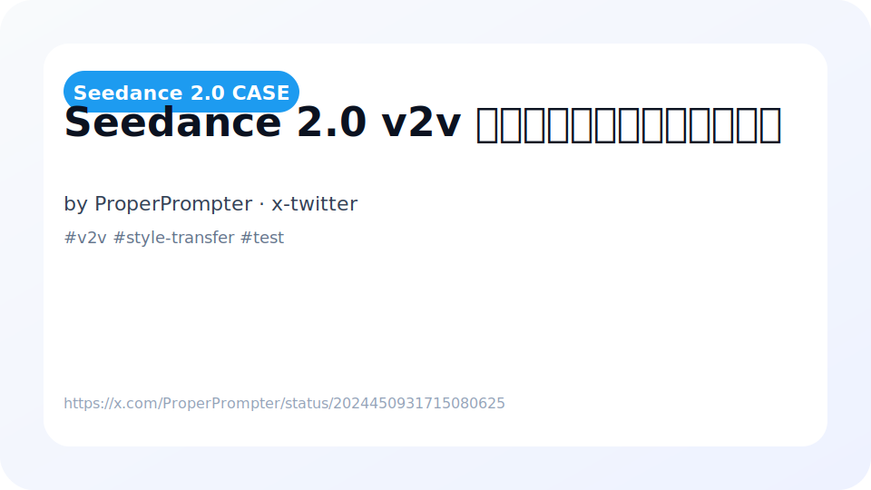</a>

**Tags:** `v2v` `style-transfer` `test`

> v2v 风格迁移：仅用文本作为引导做 style transfer，展示可控性边界。

### Case 267: [Denji & Reze 跳舞（Seedance 2.0 动画案例）](https://x.com/NACHOS2D_/status/2024452647026110770)（by [@NACHOS2D_](https://x.com/NACHOS2D_)）

<a href="https://x.com/NACHOS2D_/status/2024452647026110770">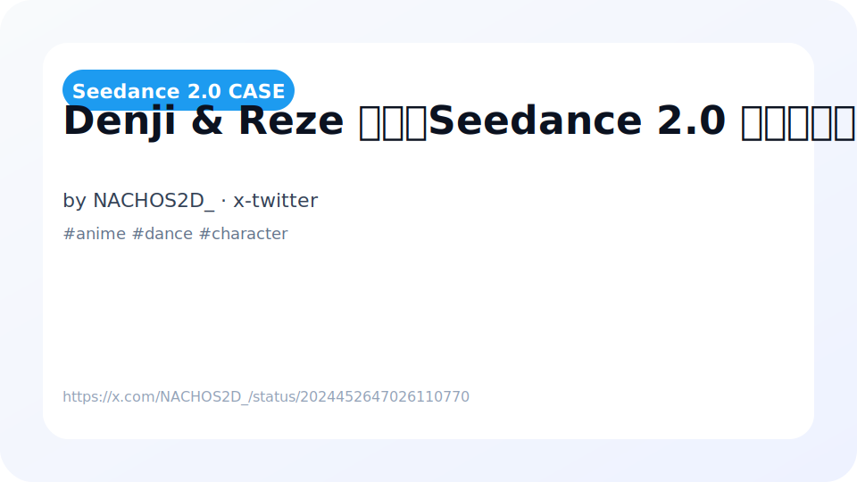</a>

**Tags:** `anime` `dance` `character`

> 用 Seedance 2.0 做角色舞蹈动画（Denji/Reze），91s 长片段，运动与一致性不错。

### Case 268: [竹林猫武士写实角色短片（Seedance 2.0）](https://x.com/Noor_ul_ain43/status/2024449911044051144)（by [@Noor_ul_ain43](https://x.com/Noor_ul_ain43)）

<a href="https://x.com/Noor_ul_ain43/status/2024449911044051144">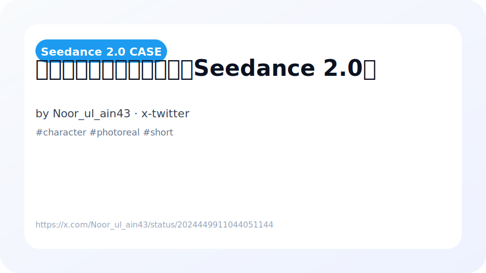</a>

**Tags:** `character` `photoreal` `short`

> 写实向角色短片：竹林猫武士，15s 片段看质感与细节。

### Case 269: [“AI 人类被迫作战”伪纪录片（Seedance 2.0）](https://x.com/BoriyaKishan/status/2024452094045082061)（by [@BoriyaKishan](https://x.com/BoriyaKishan)）

<a href="https://x.com/BoriyaKishan/status/2024452094045082061">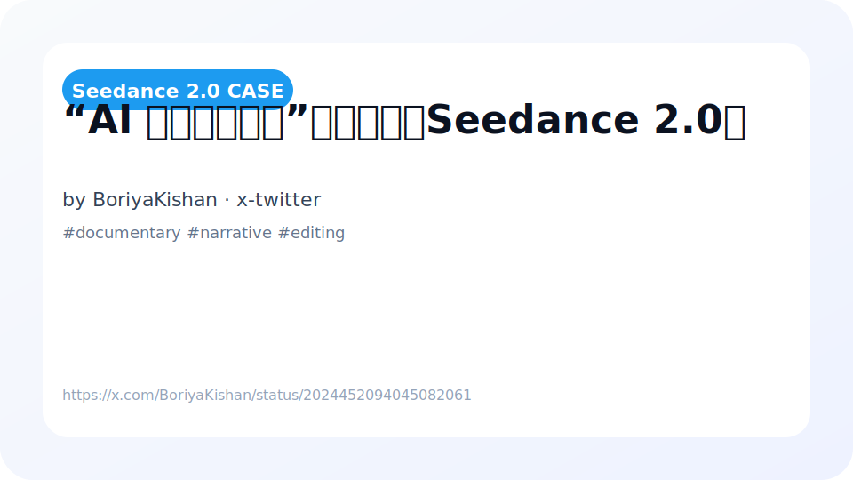</a>

**Tags:** `documentary` `narrative` `editing`

> 伪纪录片叙事：用 Seedance 2.0 拼出 95s 段落，偏故事/剪辑组织能力展示。

### Case 270: [Midjourney 图 → Seedance 2.0 视频 + Gemini 配乐工作流](https://x.com/liluocheng13/status/2024450317392421015)（by [@liluocheng13](https://x.com/liluocheng13)）

<a href="https://x.com/liluocheng13/status/2024450317392421015">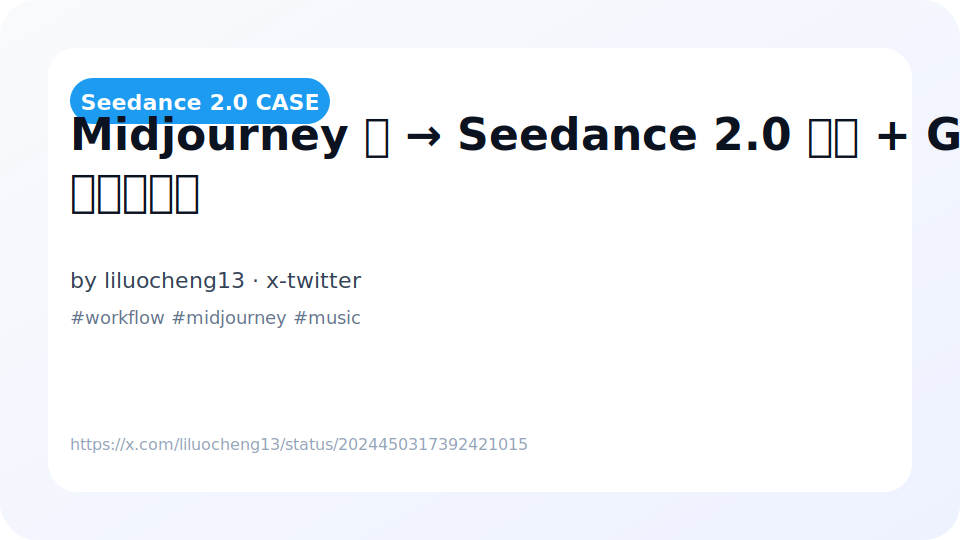</a>

**Tags:** `workflow` `midjourney` `music`

> 工作流示例：Midjourney 出图 → Seedance 2.0 动画 → Gemini 配乐/音轨。

### Case 271: [Kling 3.0 vs Seedance 2.0, What’s New & What Changes?](https://www.youtube.com/watch?v=xY-7C-mVaRw)（by NFT TIGERS SPOTON）

**Tags:** `comparison` `benchmark` `hands-on` `video`

> 对比 Kling 3.0 与 Seedance 2.0 的生成效果差异，偏实测对比。

### Case 272: [Seedance 2.0 Killed Greenscreen (Full AI Workflow Tutorial)](https://www.youtube.com/watch?v=3YH67e5jtdQ)（by JSFILMZ）

**Tags:** `tutorial` `workflow` `greenscreen` `hands-on` `video`

> 全流程工作流教程：Seedance 2.0 做绿幕/抠像替代（含实际生成输出）。

### Case 273: [전세계에서 난리난 미친 성능의 Seedance 2.0, 이제 촬영 없이 혼자 영화 다 만듭니다 | 씨댄스 AI 2.0 리뷰](https://www.youtube.com/watch?v=jhOz0aiHYPE)（by 조팀장의 AI 공략집）

**Tags:** `review` `hands-on` `ko` `workflow` `video`

> 韩语评测：Seedance 2.0 实际演示，强调无需拍摄也能独立完成电影级片段。

### Case 274: [Wolverine vs Hulk — Seedance 2.0 clip](https://x.com/BackBingers/status/2024502397222240620)（by [@BackBingers](https://x.com/BackBingers)）

<a href="https://x.com/BackBingers/status/2024502397222240620">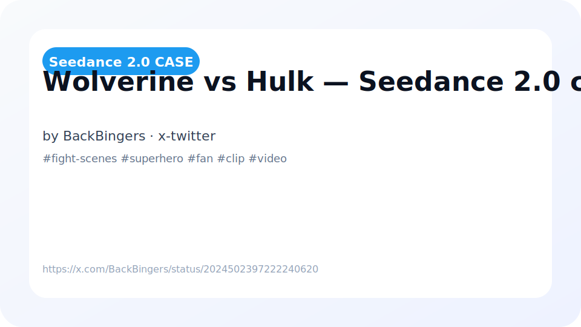</a>

**Tags:** `fight-scenes` `superhero` `fan` `clip` `video`

> Seedance 2.0 生成的 Wolverine vs Hulk 动作片段（流行 IP 战斗场景）。

### Case 275: [Porsche-style commercial clips in ~15 minutes (Seedance 2.0)](https://x.com/beiyika/status/2024503497174241684)（by [@beiyika](https://x.com/beiyika)）

<a href="https://x.com/beiyika/status/2024503497174241684">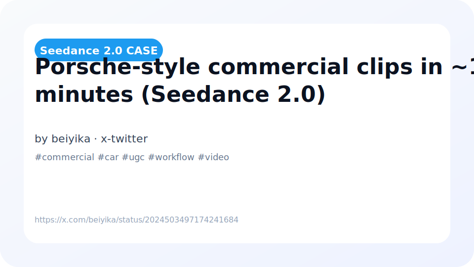</a>

**Tags:** `commercial` `car` `ugc` `workflow` `video`

> 商单/广告向：作者称用 Seedance 2.0 做保时捷风格短片，15 分钟左右可完成。

### Case 276: [The White Knight — mythology test (Seedance 2.0)](https://x.com/RefinerMANDAP/status/2024501717203898770)（by [@RefinerMANDAP](https://x.com/RefinerMANDAP)）

<a href="https://x.com/RefinerMANDAP/status/2024501717203898770">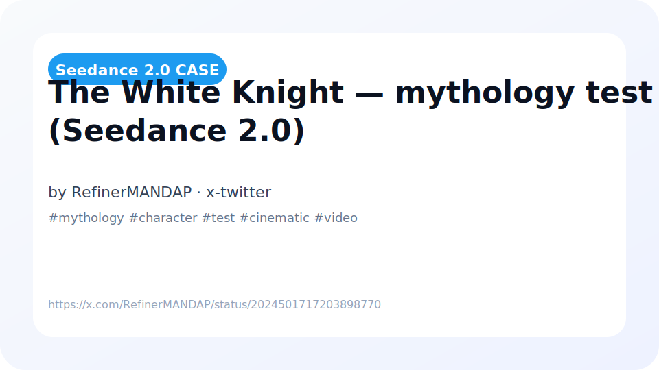</a>

**Tags:** `mythology` `character` `test` `cinematic` `video`

> 神话题材角色短片测试（White Knight），在 YouArtStudio 上测试 Seedance 2.0/Pro 2.0。

### Case 277: [Jiren vs Fused Goku & Vegeta (Potara) – Seedance 2.0](https://www.youtube.com/watch?v=CqHB0sNlE70)（by I am Artificial）

**Tags:** `fight-scenes` `anime` `multi-shot` `long-form` `video`

> 3 分钟左右的动漫战斗段落（Jiren vs Potara 合体），多镜头动作连贯性实测。

### Case 278: [AI Film Trailer made entirely with Seedance 2.0 in CapCut](https://www.youtube.com/watch?v=rYeuidNfMJE)（by Alex Patrascu）

**Tags:** `trailer` `workflow` `capcut` `multi-shot` `video`

> CapCut 内用 Seedance 2.0 做整支电影预告片的实例（偏工作流与多段落拼接）。

### Case 279: [Neon rain cyberpunk morph — Seedance 2.0](https://x.com/NaoyaCreates/status/2024586669572129166)（by [@NaoyaCreates](https://x.com/NaoyaCreates)）

<a href="https://x.com/NaoyaCreates/status/2024586669572129166">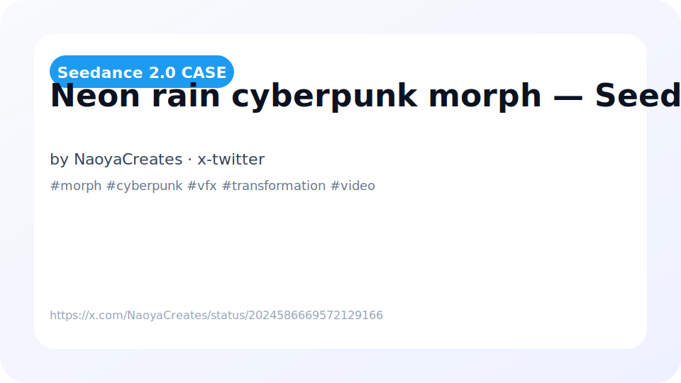</a>

**Tags:** `morph` `cyberpunk` `vfx` `transformation` `video`

> 赛博武士在霓虹雨中逐帧“金属化”变形，材质变化连续性很强（Seedance 2.0 + MJ）。

### Case 280: [Reference-image animation + unexpected CN dub (Seedance 2.0)](https://x.com/CNSamsonBooks/status/2024572490811687232)（by [@CNSamsonBooks](https://x.com/CNSamsonBooks)）

<a href="https://x.com/CNSamsonBooks/status/2024572490811687232">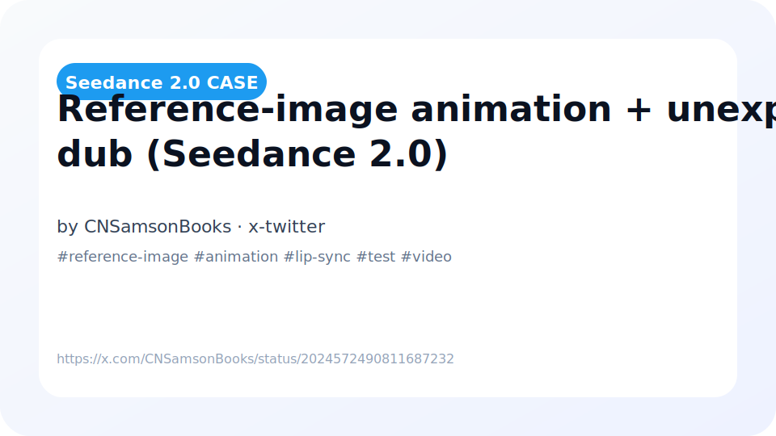</a>

**Tags:** `reference-image` `animation` `lip-sync` `test` `video`

> 参考图驱动的角色动画测试；提示词英文但输出像“中文配音”，适合看口型/语种一致性。

### Case 281: [Yellow cat POV — Seedance 2.0](https://x.com/miilesus/status/2024587855171842297)（by [@miilesus](https://x.com/miilesus)）

<a href="https://x.com/miilesus/status/2024587855171842297">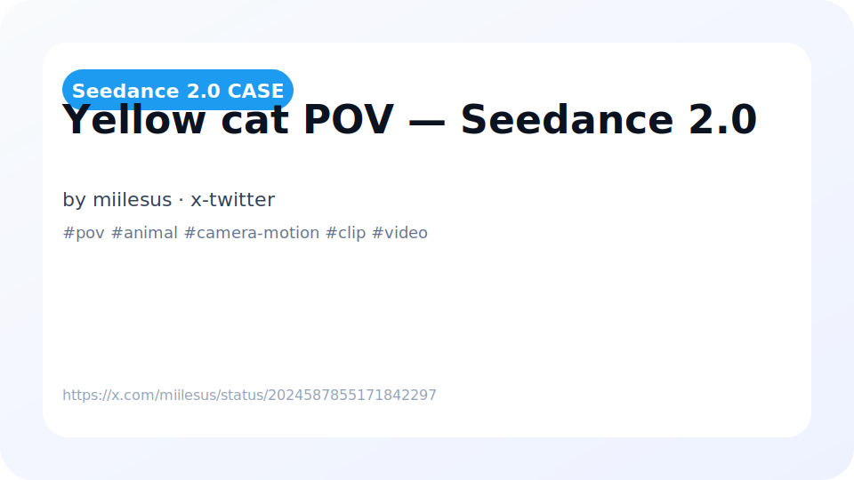</a>

**Tags:** `pov` `animal` `camera-motion` `clip` `video`

> 黄猫第一视角穿行世界的短片，POV 镜头运动自然，适合看运动与视角稳定性。

### Case 282: [Seedance 2.0 BROKE The Multiverse](https://www.youtube.com/watch?v=tYdKUrbrOJo)（by Airt）

**Tags:** `video` `showcase` `seedance2`

> Seedance 2.0 跨宇宙混剪合集，集中展示角色融合/风格迁移的完成度与稳定性。

### Case 283: [AI MAN | Made with Seedance 2.0 | AI Short Film](https://www.youtube.com/watch?v=dp4-Sv0uVzE)（by Heydin）

**Tags:** `video` `showcase` `seedance2`

> 用 Seedance 2.0 制作的短片《AI MAN》，展示从基图到成片的生成效果。

### Case 284: [Sea Dance 2.0 Stress Test | Total Chaos](https://www.youtube.com/watch?v=regHRWyJUbA)（by Yaroflasher）

**Tags:** `video` `showcase` `seedance2`

> Seedance 2.0 压测：在高复杂场景（混乱/特效/唇形等）下的稳定性测试。

### Case 285: [The 10 Most INSANE AI Films Created by Seedance 2.0](https://www.youtube.com/watch?v=KQIUp7H9Bkc)（by RandomAI）

**Tags:** `video` `showcase` `seedance2`

> Seedance 2.0 电影级案例精选 Top10，覆盖多类型叙事与镜头语言风格。

### Case 286: [Created this lightning transition of a normal man to warrior with Seedance 2.0 ⚡️  I like how this was near perfect to w](https://x.com/toebreaker2/status/2024780478914650313)（by [@toebreaker2](https://x.com/toebreaker2)）

<a href="https://x.com/toebreaker2/status/2024780478914650313">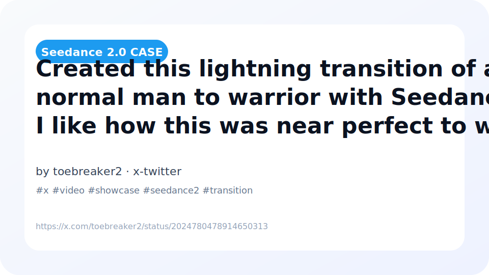</a>

**Tags:** `x` `video` `showcase` `seedance2` `transition`

> Seedance 2.0 实际生成视频片段（X），展示具体镜头/动作效果。

### Case 287: [Seedance 2.0: Here is another great example. https://t.co/l0qigjOfi6](https://x.com/awesome_visuals/status/2024777153896759585)（by [@awesome_visuals](https://x.com/awesome_visuals)）

<a href="https://x.com/awesome_visuals/status/2024777153896759585">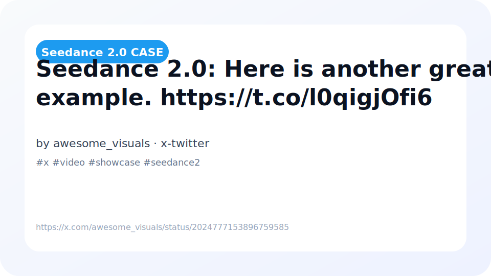</a>

**Tags:** `x` `video` `showcase` `seedance2`

> Seedance 2.0 实际生成视频片段（X），展示具体镜头/动作效果。

### Case 288: [「小耳👂实践」  调用了奶爸的seedance 2.0 API，在完善我的 video-skills  相对而言，故事类的视频，要注意很多的逻辑问题  还有首尾帧的需求  所以对于我的Agent Team 尤其导演有一些挑战～～  不过我也](https://x.com/xiaoerzhan/status/2024776445357400178)（by [@xiaoerzhan](https://x.com/xiaoerzhan)）

<a href="https://x.com/xiaoerzhan/status/2024776445357400178">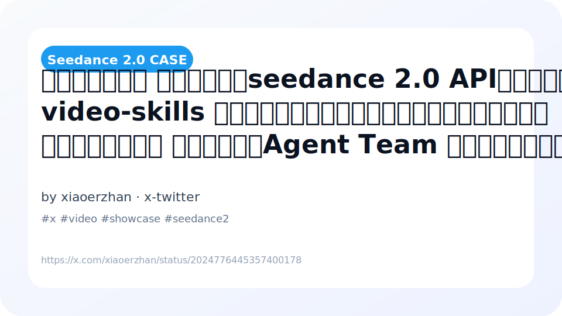</a>

**Tags:** `x` `video` `showcase` `seedance2`

> Seedance 2.0 实际生成视频片段（X），展示具体镜头/动作效果。

### Case 289: [Generated with Seedance 2.0. One model. One prompt. Full-scale cinematic action.  Studios spend millions on VFX, massive](https://x.com/oggii_0/status/2024774881066233958)（by [@oggii_0](https://x.com/oggii_0)）

<a href="https://x.com/oggii_0/status/2024774881066233958">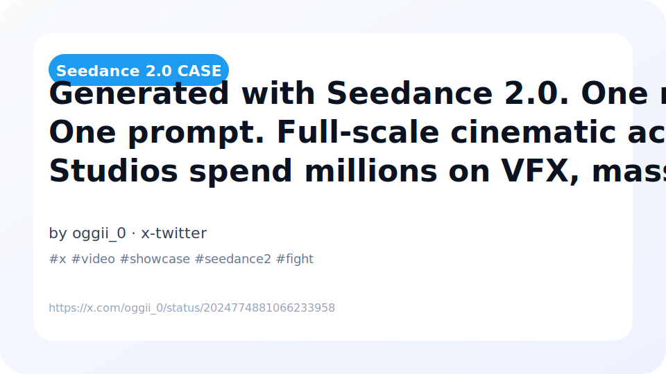</a>

**Tags:** `x` `video` `showcase` `seedance2` `fight`

> Seedance 2.0 实际生成视频片段（X），展示具体镜头/动作效果。

### Case 290: [Ink falls from a brush above the clouds.  The drops merge. They swirl. They become a dragon.  It spirals through the sun](https://x.com/NaoyaCreates/status/2024771224853786696)（by [@NaoyaCreates](https://x.com/NaoyaCreates)）

<a href="https://x.com/NaoyaCreates/status/2024771224853786696">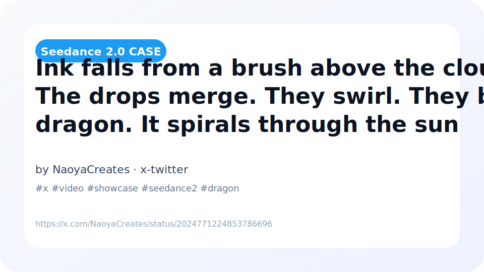</a>

**Tags:** `x` `video` `showcase` `seedance2` `dragon`

> Seedance 2.0 实际生成视频片段（X），展示具体镜头/动作效果。

### Case 291: [@sciencegirl Experimenting with fight choreography in Seedance 2.0: https://t.co/yRq0qNd007](https://x.com/AIspiired/status/2024771507814355101)（by [@AIspiired](https://x.com/AIspiired)）

<a href="https://x.com/AIspiired/status/2024771507814355101">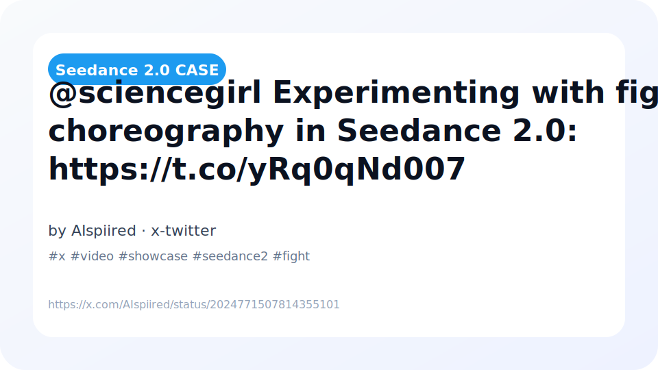</a>

**Tags:** `x` `video` `showcase` `seedance2` `fight`

> Seedance 2.0 实际生成视频片段（X），展示具体镜头/动作效果。

### Case 292: [The Best AI Fights (Seedance 2.0 Compilation) Hulk, Conor McGregor, Epstein, Justin Bieber and more](https://www.youtube.com/watch?v=DMqzbylLkJY)（by Esenpauk）

**Tags:** `video` `showcase` `compilation` `action` `fight` `seedance2`

> Seedance 2.0 生成的“AI 打斗”混剪合集：动作连续性、镜头运动和物理感都很适合当稳定性对照样本。

### Case 293: [春节一天天的走亲访友还真是又累又无聊，每天对着一堆人瞎聊，我也不爱打牌，觉得还是AI最好玩！Seedance2.0永远不会让你失望！ 【小姐姐热舞视频】Seedance2.0提示词👇 真人实拍风格，一位美丽的留着黑色波浪长发的少女，穿着粉色露脐装和瑜伽裤要求性感，皮肤白皙，正随着Future https://t.co/RA5QaC6drF](https://x.com/Adam38363368936/status/2024865420189241718)（by [@Adam38363368936](https://x.com/Adam38363368936)）

<a href="https://x.com/Adam38363368936/status/2024865420189241718">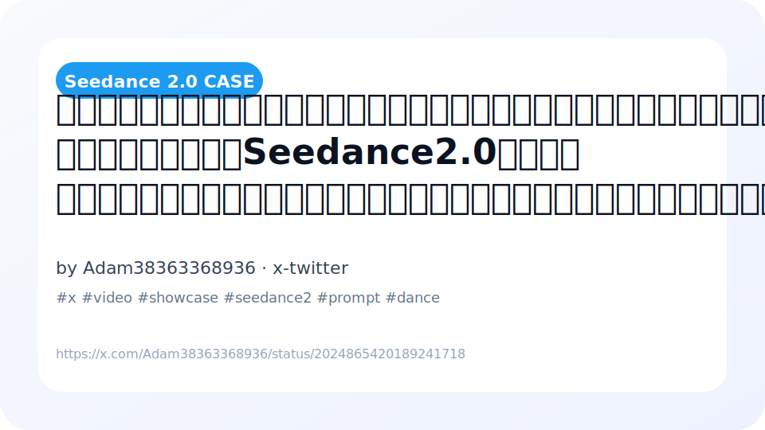</a>

**Tags:** `x` `video` `showcase` `seedance2` `prompt` `dance`

> Seedance 2.0 实际生成视频片段（X），展示具体镜头/动作/风格效果。

### Case 294: [Tried whip pans and dialogue. I don't think there's a model that does it better. Seedance 2.0 Prompt: ARGUMENT - WHIP PAN FOLLOWS SPEAKER 15 Seconds / Continuous Shot / Dynamic Camera SHOT DESCRIPTION: Interior. Apartment. Day. WOMAN (30s) and MAN (32) mid-argument. Camera https:](https://x.com/aimikoda/status/2024864600680776001)（by [@aimikoda](https://x.com/aimikoda)）

<a href="https://x.com/aimikoda/status/2024864600680776001">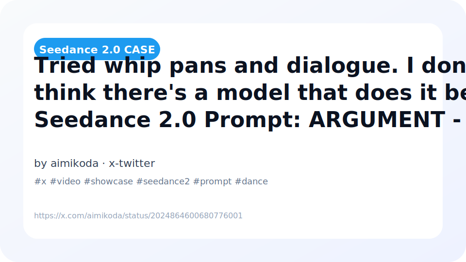</a>

**Tags:** `x` `video` `showcase` `seedance2` `prompt` `dance`

> Seedance 2.0 实际生成视频片段（X），展示具体镜头/动作/风格效果。

### Case 295: [This Ronaldo football kick video is 100% AI generated. 🤯 Seedance 2.0 by @ByteDance_Seed just made video studios obsolete. → Text to 2K cinematic video → Multi-participant sports scenes → Real physics simulation Every video agency should be scared. 💀 @DataChaz https://t.co/X7UxF7](https://x.com/SystemDaddyAi/status/2024864580711985215)（by [@SystemDaddyAi](https://x.com/SystemDaddyAi)）

<a href="https://x.com/SystemDaddyAi/status/2024864580711985215">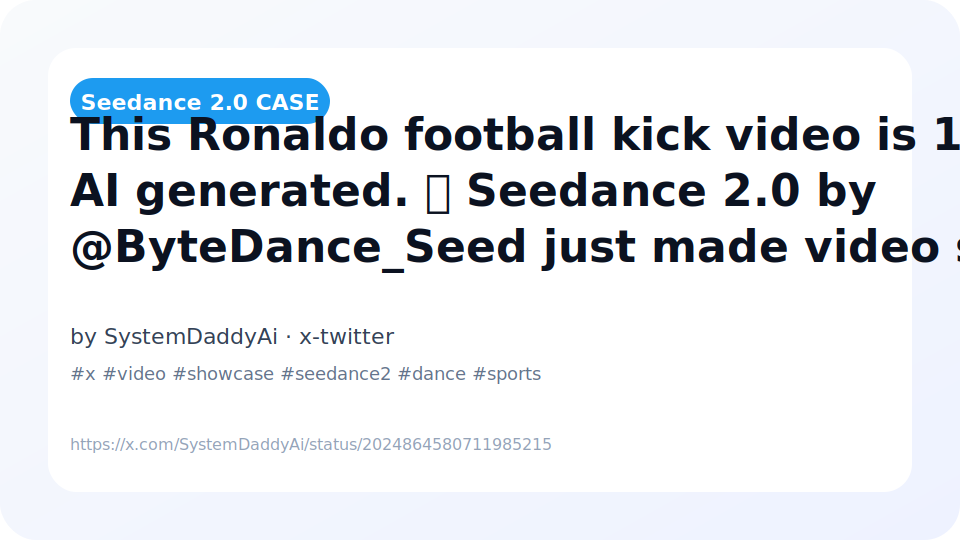</a>

**Tags:** `x` `video` `showcase` `seedance2` `dance` `sports` `cinematic`

> Seedance 2.0 实际生成视频片段（X），展示具体镜头/动作/风格效果。

### Case 296: [I think its game over for hollywood. They won't escape this Seedance 2.0 I predict all wide zoomed out overhead background cinematic shots, vfx and background greenscreen shots will be done by AI by the end of next year. Am I right or wrong? https://t.co/GM9TCLVB9g](https://x.com/Just_sharon7/status/2024864575884337585)（by [@Just_sharon7](https://x.com/Just_sharon7)）

<a href="https://x.com/Just_sharon7/status/2024864575884337585">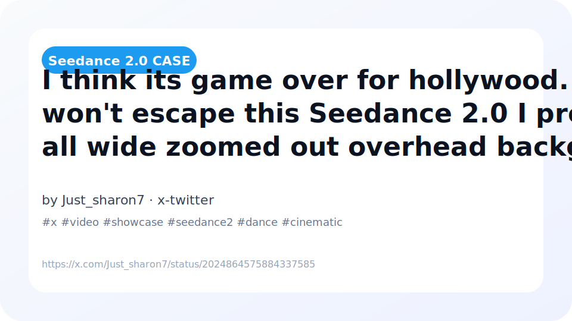</a>

**Tags:** `x` `video` `showcase` `seedance2` `dance` `cinematic`

> Seedance 2.0 实际生成视频片段（X），展示具体镜头/动作/风格效果。

### Case 297: [It's THAT easy. Have fun testing! If you liked this Seedance 2.0 tutorial, follow me for more @Framer_X We're just getting started 🔥 https://t.co/TfmIjmUClr](https://x.com/Framer_X/status/2024864154402893836)（by [@Framer_X](https://x.com/Framer_X)）

<a href="https://x.com/Framer_X/status/2024864154402893836">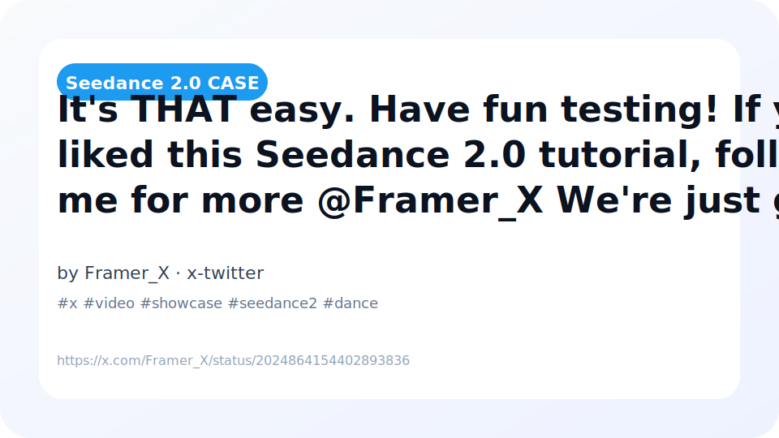</a>

**Tags:** `x` `video` `showcase` `seedance2` `dance`

> Seedance 2.0 实际生成视频片段（X），展示具体镜头/动作/风格效果。

### Case 298: [Seedance 2.0 vid2vid feature is just insane 🔥 Restyle any video in seconds. Quick tutorial 👇 https://t.co/CUsQUvBFqy](https://x.com/Framer_X/status/2024864006469734618)（by [@Framer_X](https://x.com/Framer_X)）

<a href="https://x.com/Framer_X/status/2024864006469734618">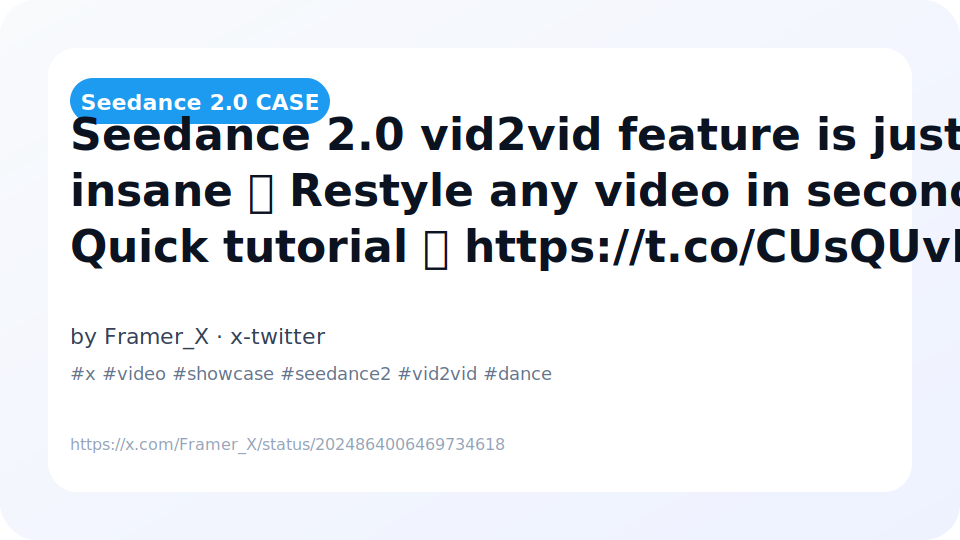</a>

**Tags:** `x` `video` `showcase` `seedance2` `vid2vid` `dance`

> Seedance 2.0 实际生成视频片段（X），展示具体镜头/动作/风格效果。

### Case 299: [Predator vs Terminator T800 remake in Seedance 2.0. Reimagining our childhood favorite movie moments with legendary new characters. https://t.co/t9tK8H47Xe](https://x.com/ShamsAmin56/status/2024863836139131078)（by [@ShamsAmin56](https://x.com/ShamsAmin56)）

<a href="https://x.com/ShamsAmin56/status/2024863836139131078">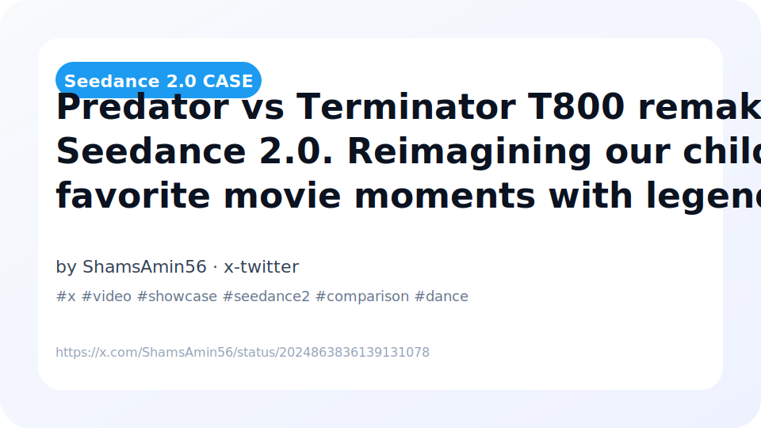</a>

**Tags:** `x` `video` `showcase` `seedance2` `comparison` `dance` `remake` `cinematic`

> Seedance 2.0 实际生成视频片段（X），展示具体镜头/动作/风格效果。

### Case 300: [Seedance 2.0 is on another level. #ai https://t.co/bhHV22ludQ](https://x.com/IA_videoo/status/2024863688054677979)（by [@IA_videoo](https://x.com/IA_videoo)）

<a href="https://x.com/IA_videoo/status/2024863688054677979">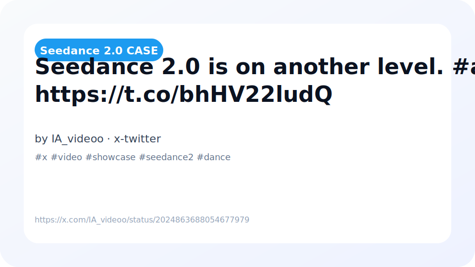</a>

**Tags:** `x` `video` `showcase` `seedance2` `dance`

> Seedance 2.0 实际生成视频片段（X），展示具体镜头/动作/风格效果。

### Case 301: [Seedance 2.0’s Director Mode lets you create stunning 4K videos fast with camera paths and face lock. https://t.co/OET1YqKuwN](https://x.com/ItsAIAndy/status/2024863149975810431)（by [@ItsAIAndy](https://x.com/ItsAIAndy)）

<a href="https://x.com/ItsAIAndy/status/2024863149975810431">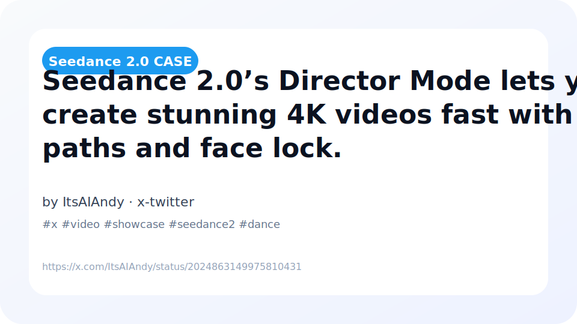</a>

**Tags:** `x` `video` `showcase` `seedance2` `dance`

> Seedance 2.0 实际生成视频片段（X），展示具体镜头/动作/风格效果。

### Case 302: [𝐉𝐚𝐦𝐞𝐬 𝐁𝐨𝐧𝐝 𝐱 𝐒𝐞𝐞𝐝𝐚𝐧𝐜𝐞 𝟐.𝟎 My predition for 2026 is that solo creators will be able to create feature length movies. For 2027 is that big studios will realize the potential and change the content format itself in a way we can't even predict. #seedance2 https://t.co/TQi9lKai8D](https://x.com/laszlogaal_/status/2024861847762223480)（by [@laszlogaal_](https://x.com/laszlogaal_)）

<a href="https://x.com/laszlogaal_/status/2024861847762223480">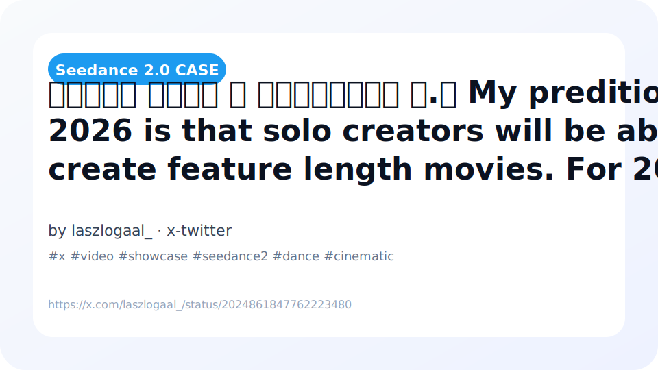</a>

**Tags:** `x` `video` `showcase` `seedance2` `dance` `cinematic`

> Seedance 2.0 实际生成视频片段（X），展示具体镜头/动作/风格效果。

### Case 303: [100% FREE Seedance 2.0 AI Video Generator : How to Use It WORLDWIDE](https://www.youtube.com/watch?v=jkPTYD5lXo8)（by How To In 5 Minutes）

**Tags:** `video` `showcase` `seedance2` `tutorial` `cinematic`

> Seedance 2.0 上手/教程（YouTube）：包含实际生成结果演示，便于快速验证能做到什么。

### Case 304: [SEEDANCE 2.0 Access (Only Real Way) + Kling 3.0 Comparison Example](https://www.youtube.com/watch?v=OjeSVCfpb_E)（by Creative Pad Media）

**Tags:** `video` `showcase` `seedance2` `comparison` `tutorial`

> Seedance 2.0 对比/实测视频（YouTube）：展示效果差异与可复现的输出片段。

### Case 305: [The Seedance 2.0 Panic Cycle Just Started — Here’s What That Means For The AI World](https://www.youtube.com/watch?v=cY1sHWlGj4A)（by Nick Ponte）

**Tags:** `video` `showcase` `seedance2` `fight` `action` `tutorial` `production` `cinematic`

> Seedance 2.0 上手/教程（YouTube）：包含实际生成结果演示，便于快速验证能做到什么。

### Case 306: [James Bond x Seedance 2.0](https://www.youtube.com/watch?v=_n4q-98A2pA)（by László Gaál）

**Tags:** `showcase` `cinematic` `film` `james-bond`

> James Bond 主题的 Seedance 2.0 生成短片示例，偏电影镜头/氛围展示。

### Case 307: [Seedance 2.0 Is INSANE… But There's a Catch](https://www.youtube.com/watch?v=gDP4bkeWbUs)（by Curious Refuge）

**Tags:** `seedance2` `seedance-2.0` `video-generation` `demo`

> Seedance 2.0 生成视频实测/展示（含结果片段或对比）。

### Case 308: [Seedance 2.0 - Pirate Fantasy Action - Short Film](https://www.youtube.com/watch?v=Xp5K0QeVzZA)（by OrctonAI）

**Tags:** `seedance2` `showcase` `video` `short-film` `cinematic` `pirate` `fantasy` `action`

> Seedance 2.0 生成的奇幻海盗动作短片示例，镜头和动作连贯性值得参考。

### Case 309: [The Best AI Fights (Seedance 2.0 Compilation) Terminator, Chucky, Hulk, Ronaldo and more](https://www.youtube.com/watch?v=ijHzyiyYmW8)（by Esenpauk）

**Tags:** `seedance2` `showcase` `video` `fight` `action` `compilation`

> Seedance 2.0 动作打斗片段合集示例，用来快速感受高强度动作场景的表现上限。

### Case 310: [THIS IS INSANE!!!....Seedance 2.0 Ai is TAKING OVER!](https://www.youtube.com/watch?v=-C3L17sQ5Is)（by InternetCity）

**Tags:** `video` `seedance2` `showcase` `reaction`

> 反应/点评向视频，包含 Seedance 2.0 生成的战斗片段剪辑，可做快速质量参考。

### Case 311: [Who says sports cars can't save the world? 🏎️💥🤖 Made by our Creative Partner @EugenioFi…](https://x.com/MartiniArt_/status/2025068150354755905)（by [@MartiniArt_](https://x.com/MartiniArt_)）

<a href="https://x.com/MartiniArt_/status/2025068150354755905">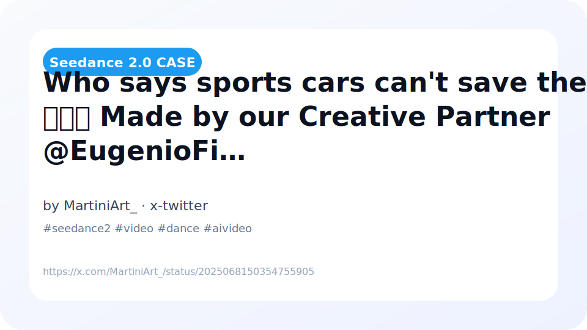</a>

**Tags:** `seedance2` `video` `dance` `aivideo`

> X 上的 Seedance 2.0 实际视频生成输出展示（含生成结果视频）。

### Case 312: [为Issey Miyake制作一支AI舞蹈影像 舞者穿着Issey Miyake 的Fluidity loop 系列服装，身体成为流动的载体，褶皱随呼吸延展与折叠，在弯曲与回…](https://x.com/dynamicwangs/status/2025067585860239719)（by [@dynamicwangs](https://x.com/dynamicwangs)）

<a href="https://x.com/dynamicwangs/status/2025067585860239719">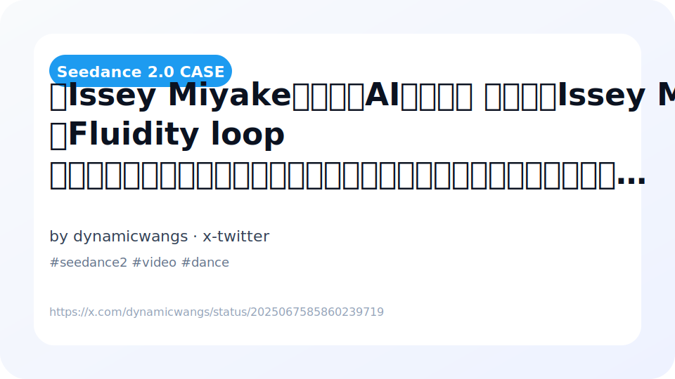</a>

**Tags:** `seedance2` `video` `dance`

> X 上的 Seedance 2.0 实际视频生成输出展示（含生成结果视频）。

### Case 313: [Seedance 2.0 ヒント：モンキーを殴って、モンキーがパンチを返してあげよう。女の子たちに誇らしい気持ちを届けよう。 #がんばれパンチ #がんばれパンチくん #市川市…](https://x.com/longpi68/status/2025067380729376987)（by [@longpi68](https://x.com/longpi68)）

<a href="https://x.com/longpi68/status/2025067380729376987">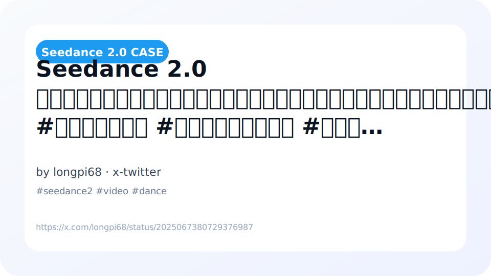</a>

**Tags:** `seedance2` `video` `dance`

> X 上的 Seedance 2.0 实际视频生成输出展示（含生成结果视频）。

### Case 314: [using seedance 2.0 i was able to make a 1min battle scene for my 2 characters, amazing!](https://x.com/SloppySintax/status/2025067122930373066)（by [@SloppySintax](https://x.com/SloppySintax)）

<a href="https://x.com/SloppySintax/status/2025067122930373066">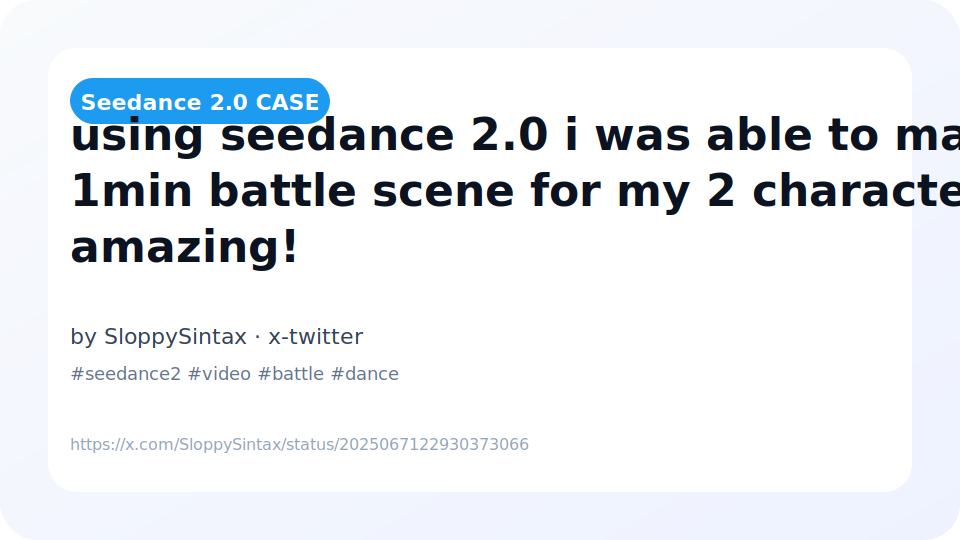</a>

**Tags:** `seedance2` `video` `battle` `dance`

> X 上的 Seedance 2.0 实际视频生成输出展示（含生成结果视频）。

### Case 315: [Seedance 2.0でどこまでプロンプト追従できるか試してみた。個人的には、かなり良いところまで行っていると思う 実際のプロンプトはリプに貼ります](https://x.com/safa_dayo/status/2025067053720502690)（by [@safa_dayo](https://x.com/safa_dayo)）

<a href="https://x.com/safa_dayo/status/2025067053720502690">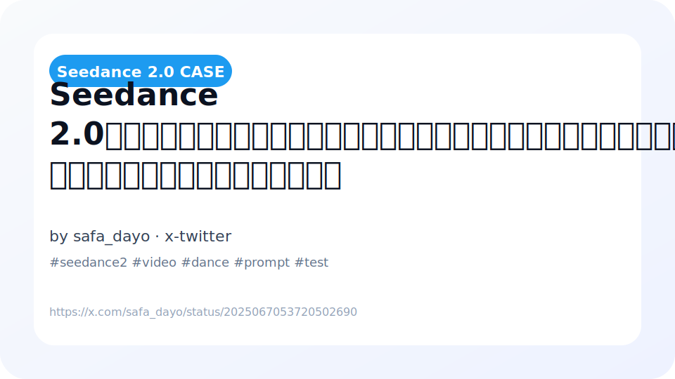</a>

**Tags:** `seedance2` `video` `dance` `prompt` `test`

> X 上的 Seedance 2.0 实际视频生成输出展示（含生成结果视频）。

### Case 316: [@yanhua1010 I was invited to go diving and swimming…… #Seedance2](https://x.com/briankuo/status/2025064900859757028)（by [@briankuo](https://x.com/briankuo)）

<a href="https://x.com/briankuo/status/2025064900859757028">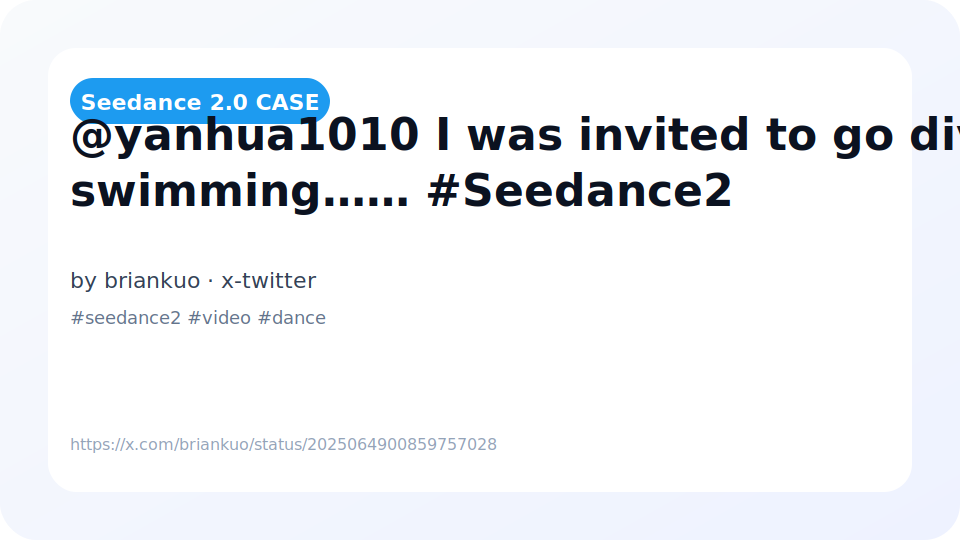</a>

**Tags:** `seedance2` `video` `dance`

> X 上的 Seedance 2.0 实际视频生成输出展示（含生成结果视频）。

### Case 317: [Made this Lego-style animated short using Seedance 2.0. Prompted in Claude, Claude tran…](https://x.com/flik_ai/status/2025064607359139941)（by [@flik_ai](https://x.com/flik_ai)）

<a href="https://x.com/flik_ai/status/2025064607359139941">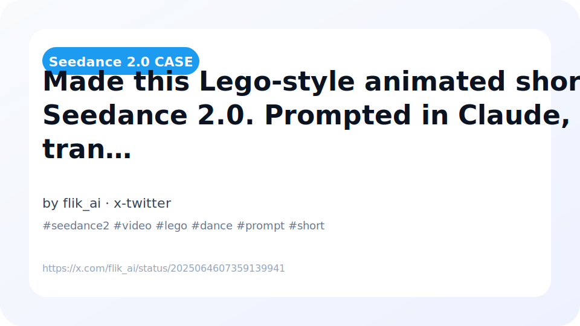</a>

**Tags:** `seedance2` `video` `lego` `dance` `prompt` `short`

> X 上的 Seedance 2.0 实际视频生成输出展示（含生成结果视频）。

### Case 318: [The gap between AI generation and studio animation is closing incredibly fast. This ent…](https://x.com/girish_lelouch/status/2025064022102733102)（by [@girish_lelouch](https://x.com/girish_lelouch)）

<a href="https://x.com/girish_lelouch/status/2025064022102733102">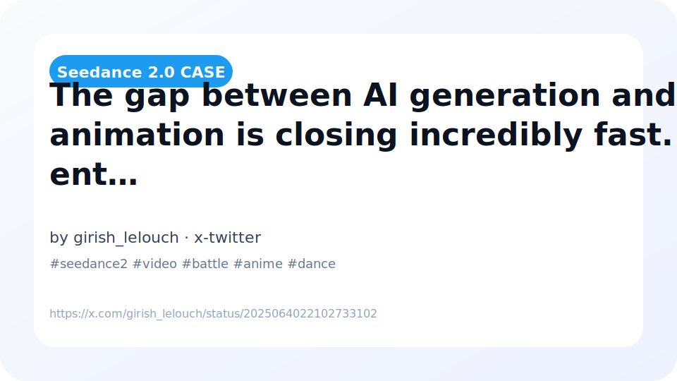</a>

**Tags:** `seedance2` `video` `battle` `anime` `dance`

> X 上的 Seedance 2.0 实际视频生成输出展示（含生成结果视频）。

### Case 319: [If you want, try Seedance 2.0 with Topaz upscaling, then use @YouArtStudio — here’s a s…](https://x.com/GumVue/status/2025063825716756821)（by [@GumVue](https://x.com/GumVue)）

<a href="https://x.com/GumVue/status/2025063825716756821">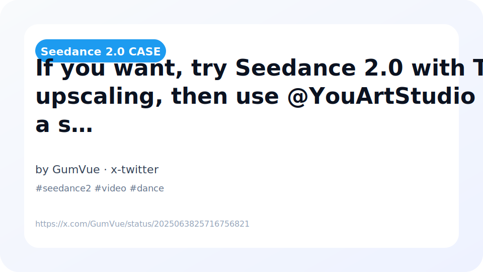</a>

**Tags:** `seedance2` `video` `dance`

> X 上的 Seedance 2.0 实际视频生成输出展示（含生成结果视频）。

### Case 320: [The most iconic villain entrance in anime Recreated with AI using Seedance 2.0 💀🔥](https://x.com/deeplyaihq/status/2025063794414895353)（by [@deeplyaihq](https://x.com/deeplyaihq)）

<a href="https://x.com/deeplyaihq/status/2025063794414895353">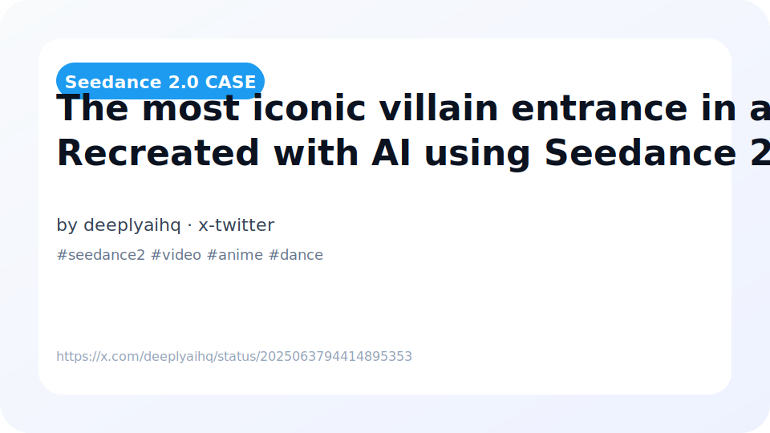</a>

**Tags:** `seedance2` `video` `anime` `dance`

> X 上的 Seedance 2.0 实际视频生成输出展示（含生成结果视频）。

### Case 321: [Seedance 2.0: But AI Will Never Be Able To Do This | CapCut](https://www.youtube.com/watch?v=DhB8JbJJ96I)（by Alex Patrascu）

**Tags:** `video` `seedance2` `capcut` `demo`

> 用 CapCut 的 Seedance 2.0 做的短片/演示，展示生成视频的画面与运动效果。

### Case 322: [seedance 2.0: one-shot AAA movie trailers 🎬](https://x.com/ProperPrompter/status/2025255510317117902)（by [@ProperPrompter](https://x.com/ProperPrompter)）

<a href="https://x.com/ProperPrompter/status/2025255510317117902">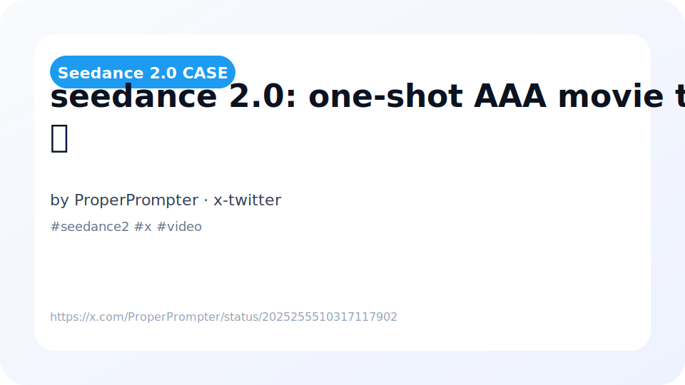</a>

**Tags:** `seedance2` `x` `video`

> Seedance 2.0 生成视频片段展示（推特原生视频）。

### Case 323: [That evolution is wild.](https://x.com/ZephyraLeigh/status/2025254262058746239)（by [@ZephyraLeigh](https://x.com/ZephyraLeigh)）

<a href="https://x.com/ZephyraLeigh/status/2025254262058746239">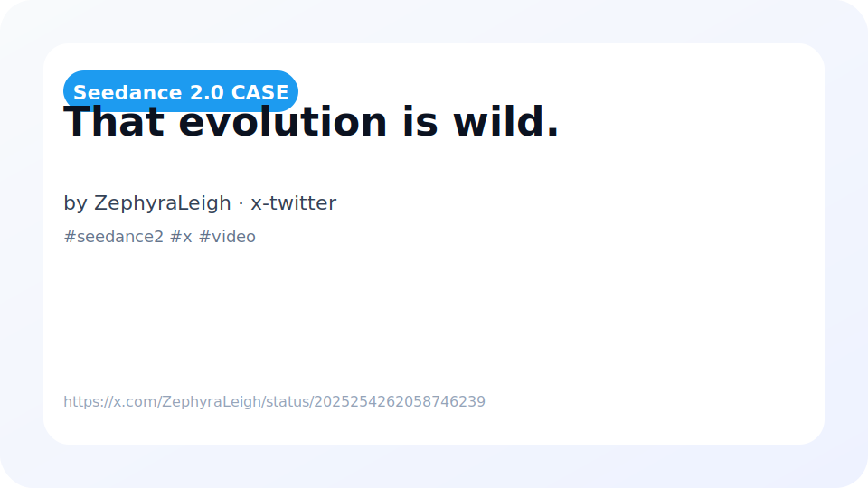</a>

**Tags:** `seedance2` `x` `video`

> Seedance 2.0 生成视频片段展示（推特原生视频）。

### Case 324: [Again... Washington vs Trump. 🥊](https://x.com/alphaixnft/status/2025254231427387414)（by [@alphaixnft](https://x.com/alphaixnft)）

<a href="https://x.com/alphaixnft/status/2025254231427387414">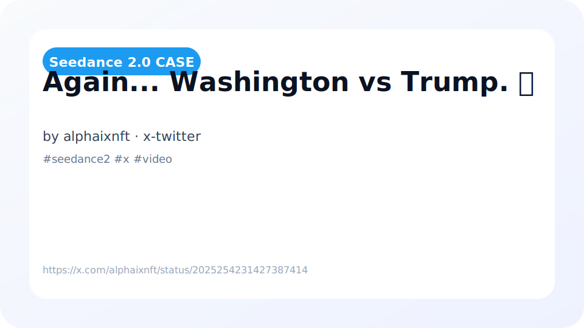</a>

**Tags:** `seedance2` `x` `video`

> Seedance 2.0 生成视频片段展示（推特原生视频）。

### Case 325: [🎬 تبغى تسوي فيديوهات بالذكاء الاصطناعي كأنها فيلم سينمائي؟](https://x.com/MOHAYA_AA/status/2025251837712957901)（by [@MOHAYA_AA](https://x.com/MOHAYA_AA)）

<a href="https://x.com/MOHAYA_AA/status/2025251837712957901">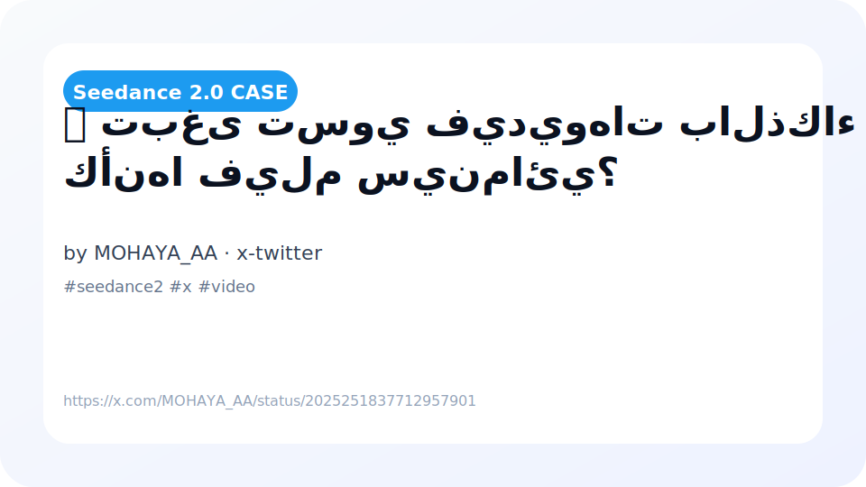</a>

**Tags:** `seedance2` `x` `video`

> Seedance 2.0 生成视频片段展示（推特原生视频）。

### Case 326: [Seedance 2.0 edit mode just transformed a fan animation into something that looks professionally produced. The upgrad...](https://x.com/NACHOS2D_/status/2025251641469837521)（by [@NACHOS2D_](https://x.com/NACHOS2D_)）

<a href="https://x.com/NACHOS2D_/status/2025251641469837521">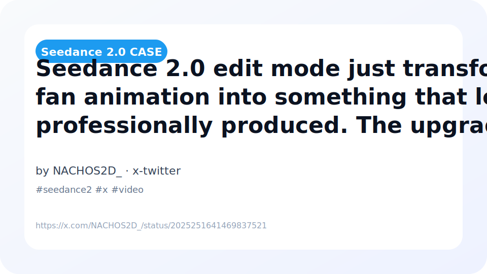</a>

**Tags:** `seedance2` `x` `video`

> Seedance 2.0 生成视频片段展示（推特原生视频）。

### Case 327: [试了试Seedance，用网络上很火的文案🤣。迈巴赫为什么广告打得那么好，连不少小孩张口都是提迈巴赫😂。@MercedesBenz](https://x.com/BiliFriday33333/status/2025251491603456375)（by [@BiliFriday33333](https://x.com/BiliFriday33333)）

<a href="https://x.com/BiliFriday33333/status/2025251491603456375">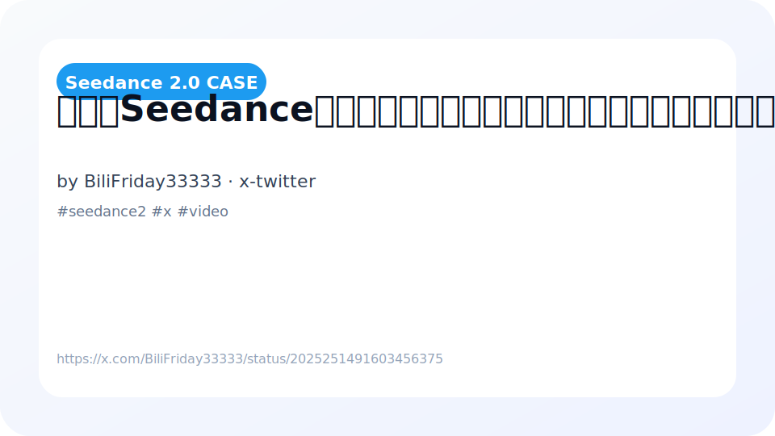</a>

**Tags:** `seedance2` `x` `video`

> Seedance 2.0 生成视频片段展示（推特原生视频）。

### Case 328: [Everyone kept saying Hollywood is cooked. I didn’t believe it… until I saw this Seedance 2.0 clip.😱 https://t.co/yIWY...](https://x.com/auqibhabib/status/2025247994262737325)（by [@auqibhabib](https://x.com/auqibhabib)）

<a href="https://x.com/auqibhabib/status/2025247994262737325">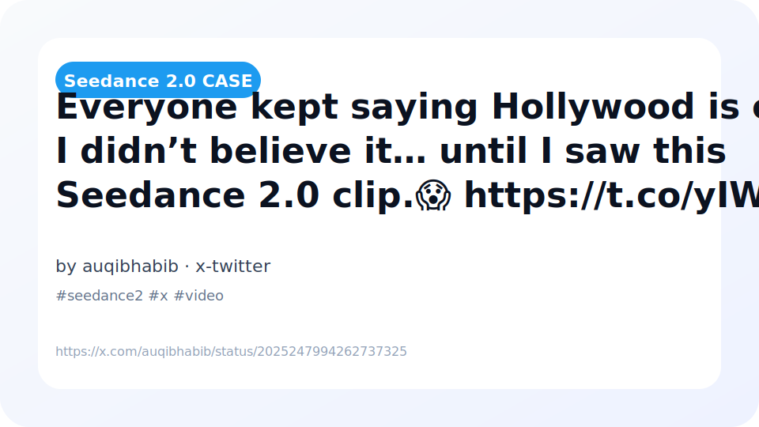</a>

**Tags:** `seedance2` `x` `video`

> Seedance 2.0 生成视频片段展示（推特原生视频）。

### Case 329: [Mungkinkah ini AI? Seedance 2.0 terlalu liar😱](https://x.com/Jonsart69/status/2025247877631803740)（by [@Jonsart69](https://x.com/Jonsart69)）

<a href="https://x.com/Jonsart69/status/2025247877631803740">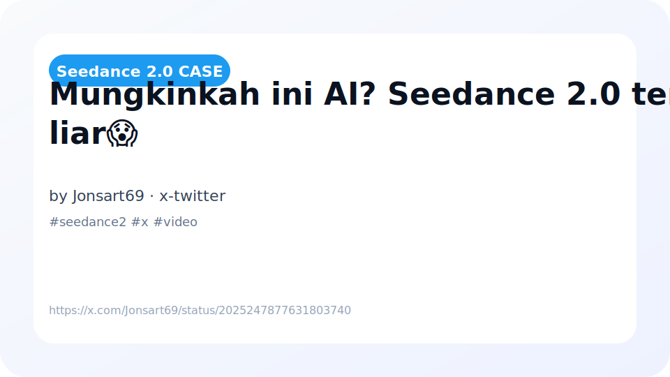</a>

**Tags:** `seedance2` `x` `video`

> Seedance 2.0 生成视频片段展示（推特原生视频）。

### Case 330: [IA's ](https://x.com/Rayo_Libertario/status/2025247708471046579)（by [@Rayo_Libertario](https://x.com/Rayo_Libertario)）

<a href="https://x.com/Rayo_Libertario/status/2025247708471046579">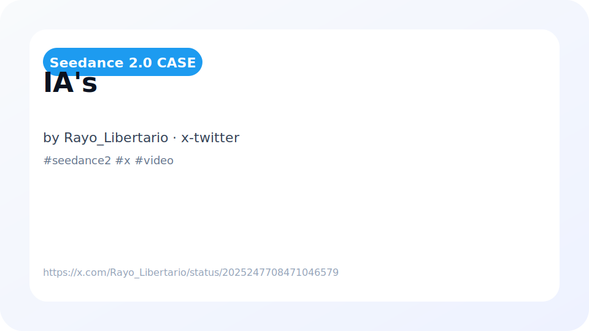</a>

**Tags:** `seedance2` `x` `video`

> Seedance 2.0 生成视频片段展示（推特原生视频）。

### Case 331: [Pushing past the limits: UI Goku vs. Legendary Super Saiyan Broly!](https://x.com/lexx_aura/status/2025246799288545628)（by [@lexx_aura](https://x.com/lexx_aura)）

<a href="https://x.com/lexx_aura/status/2025246799288545628">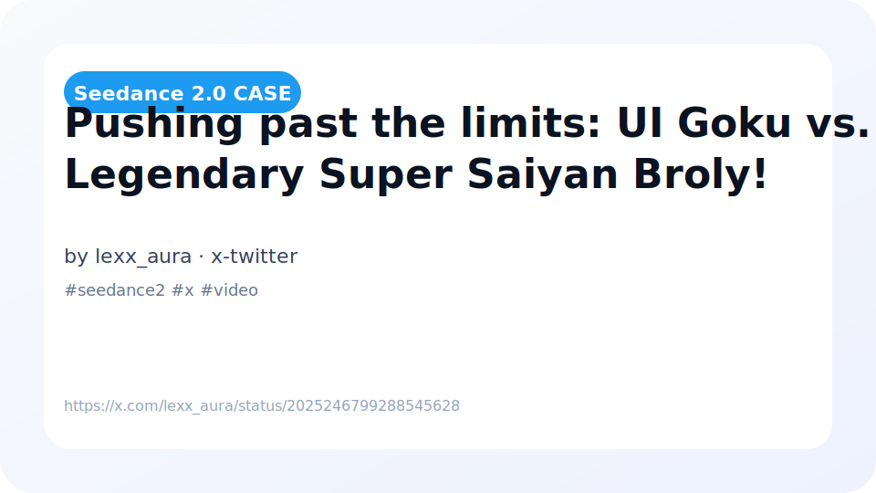</a>

**Tags:** `seedance2` `x` `video`

> Seedance 2.0 生成视频片段展示（推特原生视频）。

### Case 332: [Seedance 2.0 Hater vs Judge](https://www.youtube.com/watch?v=IfX8jWn5njg)（by JSFILMZ）

**Tags:** `video` `seedance2` `comparison` `kling3` `test`

> Seedance 2.0 实测+对比（含 Kling 3.0），展示生成输出与差异。

### Case 333: [Finally, Seedance 2.0 is Free & Unlimited for Everyone | Full Access + Kling 3.0 Comparison](https://www.youtube.com/watch?v=4nJwVzcy-aU)（by Pro Secret）

**Tags:** `video` `seedance2` `comparison` `kling3` `test`

> Seedance 2.0 实测+对比（含 Kling 3.0），展示生成输出与差异。

### Case 334: [Kling3、Sora2、Seedance 2.0：どのAIツールが最強なのか？](https://www.youtube.com/watch?v=jgqt-taUn7M)（by RKJ VIDEO）

**Tags:** `seedance2` `seedance-2.0` `video` `case`

> Seedance 2.0 生成效果展示/对比（视频内可见结果）

### Case 335: [The Best AI Fights (Seedance 2.0 Compilation) Homelander, Superman, Spider-Man Tobey, Trump and more](https://www.youtube.com/watch?v=GCMqAZUtPsU)（by Esenpauk）

**Tags:** `seedance2` `seedance-2.0` `video` `case`

> Seedance 2.0 生成效果展示/对比（视频内可见结果）

### Case 336: [Hollywood blockbuster visual effects Made with Seedance 2.0 model. The international ve…](https://x.com/oggii_0/status/2025443215835627521)（by [@oggii_0](https://x.com/oggii_0)）

<a href="https://x.com/oggii_0/status/2025443215835627521">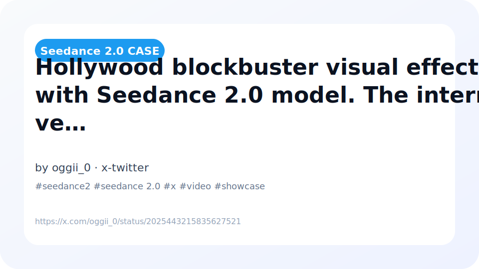</a>

**Tags:** `seedance2` `seedance 2.0` `x` `video` `showcase`

> Seedance 2.0 视频输出展示：Hollywood blockbuster visual effects Made with Seedance 2.0 。

### Case 337: [Holy Shit! This whole Scene of a Dragon Flying over New york City is ENTIRELY AI Genera…](https://x.com/realarmaansidhu/status/2025446302113226866)（by [@realarmaansidhu](https://x.com/realarmaansidhu)）

<a href="https://x.com/realarmaansidhu/status/2025446302113226866">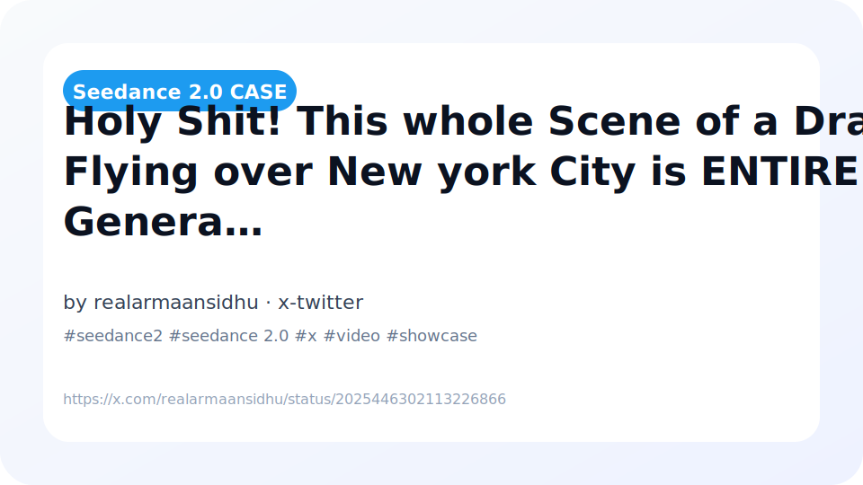</a>

**Tags:** `seedance2` `seedance 2.0` `x` `video` `showcase`

> Seedance 2.0 视频输出展示：Holy Shit! This whole Scene of a Dragon Flying over New york。

### Case 338: [Street fighter movie being created using Seedance 2.0 - behind the scenes.](https://x.com/kangmaxxing/status/2025446203190632559)（by [@kangmaxxing](https://x.com/kangmaxxing)）

<a href="https://x.com/kangmaxxing/status/2025446203190632559">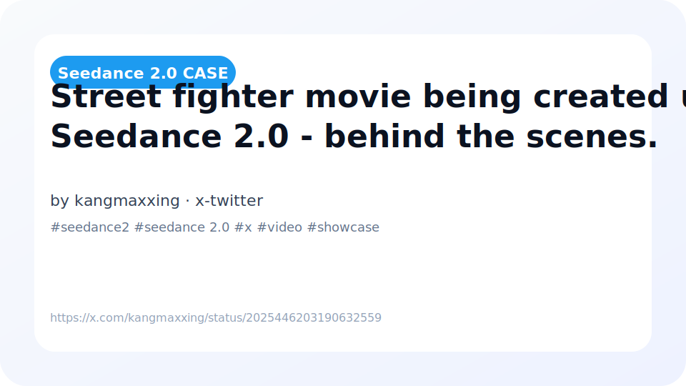</a>

**Tags:** `seedance2` `seedance 2.0` `x` `video` `showcase`

> Seedance 2.0 视频输出展示：Street fighter movie being created using Seedance 2.0 - behi。

### Case 339: [🚨 An AI-generated video showing Tom Cruise and Brad Pitt fighting on a desolate rooftop…](https://x.com/SanctumScoops/status/2025444436411645976)（by [@SanctumScoops](https://x.com/SanctumScoops)）

**Tags:** `seedance2` `seedance 2.0` `x` `video` `showcase`

> Seedance 2.0 视频输出展示：🚨 An AI-generated video showing Tom Cruise and Brad Pitt fig。

### Case 340: [Seedance 2.0 with image reference and a prompt made at](https://x.com/PaniaThong/status/2025443667645964709)（by [@PaniaThong](https://x.com/PaniaThong)）

<a href="https://x.com/PaniaThong/status/2025443667645964709">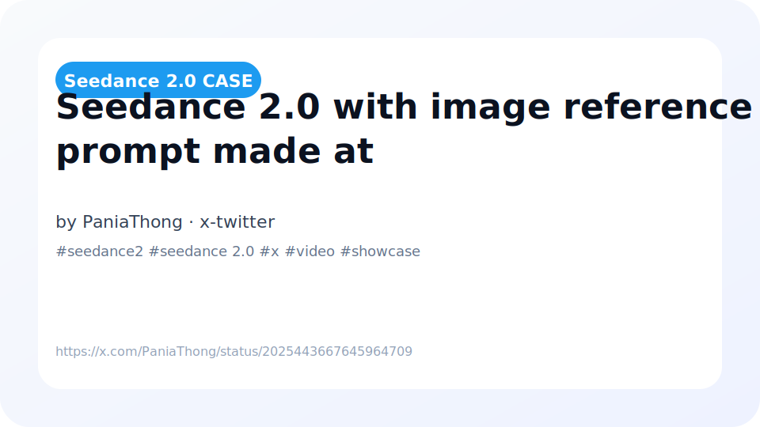</a>

**Tags:** `seedance2` `seedance 2.0` `x` `video` `showcase`

> Seedance 2.0 视频输出展示：Seedance 2.0 with image reference and a prompt made at。

### Case 341: [A tornado drilling through a downtown skyline 🌪️⚡️ The lightning inside the funnel is t…](https://x.com/niu_fa62502/status/2025441174815949234)（by [@niu_fa62502](https://x.com/niu_fa62502)）

<a href="https://x.com/niu_fa62502/status/2025441174815949234">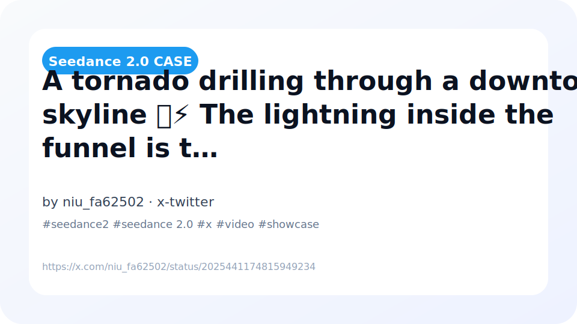</a>

**Tags:** `seedance2` `seedance 2.0` `x` `video` `showcase`

> Seedance 2.0 视频输出展示：A tornado drilling through a downtown skyline 🌪️⚡️ The light。

### Case 342: [What if you had the power of creating whatever you can imagine by just typing it in a t…](https://x.com/rasgo_ai/status/2025443357103669702)（by [@rasgo_ai](https://x.com/rasgo_ai)）

<a href="https://x.com/rasgo_ai/status/2025443357103669702">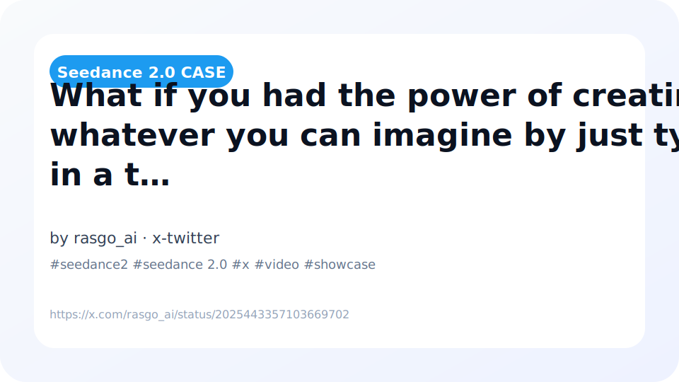</a>

**Tags:** `seedance2` `seedance 2.0` `x` `video` `showcase`

> Seedance 2.0 视频输出展示：What if you had the power of creating whatever you can imagi。

### Case 343: [Seedance 2.0의 발전의 끝은 어딜까... 능숙히 다루는 분들이 늘어나면서 엄청난 퀄리티의 영상들이 매일 등장하는 중 예전이면 몇 년에 걸쳤을 법한 …](https://x.com/YuhooGang_KR/status/2025443489090339090)（by [@YuhooGang_KR](https://x.com/YuhooGang_KR)）

**Tags:** `seedance2` `seedance 2.0` `x` `video` `showcase`

> Seedance 2.0 视频输出展示：Seedance 2.0의 발전의 끝은 어딜까... 능숙히 다루는 분들이 늘어나면서 엄청난 퀄리티의 영상들이 。

### Case 344: [The barrier wasn’t talent, it was budget. That wall is gone now. Seedance 2.0 evens the…](https://x.com/sanskar_pov/status/2025443348354662452)（by [@sanskar_pov](https://x.com/sanskar_pov)）

<a href="https://x.com/sanskar_pov/status/2025443348354662452">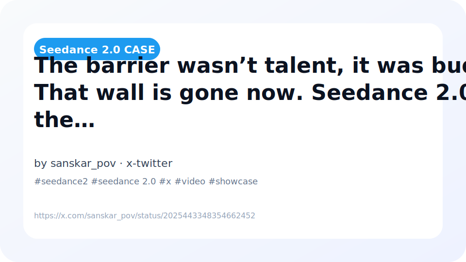</a>

**Tags:** `seedance2` `seedance 2.0` `x` `video` `showcase`

> Seedance 2.0 视频输出展示：The barrier wasn’t talent, it was budget. That wall is gone 。

### Case 345: [视频中的动态光效人工智能做不到这一点。 Seedance 2.0 做不到这一点。大家确信么](https://x.com/Williampunk23/status/2025441510150603242)（by [@Williampunk23](https://x.com/Williampunk23)）

<a href="https://x.com/Williampunk23/status/2025441510150603242">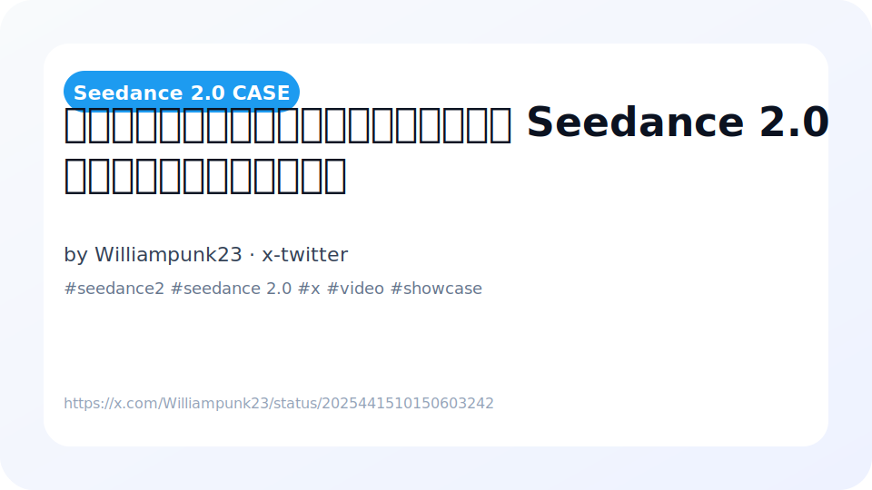</a>

**Tags:** `seedance2` `seedance 2.0` `x` `video` `showcase`

> Seedance 2.0 视频输出展示：视频中的动态光效人工智能做不到这一点。 Seedance 2.0 做不到这一点。大家确信么。

### Case 346: [Fighting my Favorite Heroes with Seedance 2.0](https://www.youtube.com/watch?v=cbuwOmFUVo8)（by Digitalista 4D）

**Tags:** `fight-scene` `cinematic` `character`

> 用 Seedance 2.0 生成的超级英雄电影级打斗场景

### Case 347: [Seedance 2.0 Destroyed Kling 3, Sora 2 & VEO 3.1 | Ultimate Test](https://www.youtube.com/watch?v=7QgRK4_1Wp8)（by Digital Assets）

**Tags:** `comparison` `benchmark` `kling` `sora` `veo`

> Seedance 2.0 与 Kling 3/Sora 2/VEO 3.1 的极限对比测试

### Case 348: [Seedance 2.0 is Finally Here! How to Access Globally?](https://www.youtube.com/watch?v=a1W3xQ6j55M)（by Somrat Dutta）

**Tags:** `tutorial` `comparison` `global-access`

> 全球访问指南及从入门到进阶的多场景对比测试

### Case 349: [Seedance 2.0 Is Taking Over AI Video](https://www.youtube.com/watch?v=-g0gp8xqv8c)（by TopviewAI）

**Tags:** `showcase` `montage` `compilation`

> TopviewAI 制作的 Seedance 2.0 生成视频合集，展示最新 AI 视频能力

### Case 350: [Seedance 2.0 Scenes That Look Like Movies | New AI Model Is Changing Everything](https://www.youtube.com/watch?v=VDY1EJBh2zY)（by Mikkel Lassalle）

**Tags:** `cinematic` `showcase` `prompting` `vfx`

> Mikkel Lassalle 展示 Seedance 2.0 生成的电影级场景，附带 Master Prompt 技巧分享

### Case 351: [Seedance 2.0 Just Changed AI UGC Forever (DON'T Miss Out)](https://www.youtube.com/watch?v=IL9mJUQQckM)（by Miko）

**Tags:** `ugc` `workflow` `tutorial`

> 展示 Seedance 2.0 在 UGC 内容创作中的实际生成效果

### Case 352: [Seedance 2.0 Could Get Your Channel TERMINATED](https://www.youtube.com/watch?v=9J7U0oAkLwY)（by Geekbot AI）

**Tags:** `analysis` `risk` `showcase`

> 分析 Seedance 2.0 生成能力及频道风险讨论，含实际生成示例

### Case 353: [Black Widow vs Captain China fight scene](https://x.com/afiqnymous/status/2025630823765205072)（by [@afiqnymous](https://x.com/afiqnymous)）

<a href="https://x.com/afiqnymous/status/2025630823765205072">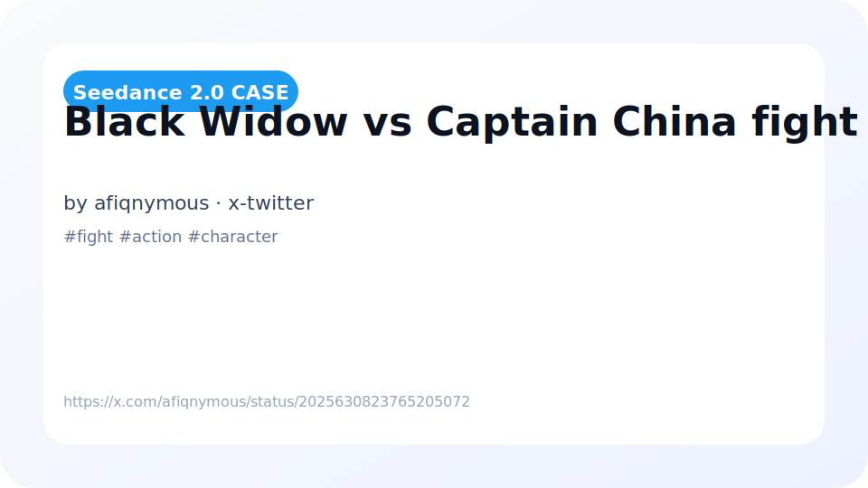</a>

**Tags:** `fight` `action` `character`

> 用 Seedance 2.0 生成的流畅格斗场景

### Case 354: [Seedance 2.0 复刻色彩缤纷的卡通动画](https://x.com/GothicOrnate/status/2025630582684705196)（by [@GothicOrnate](https://x.com/GothicOrnate)）

<a href="https://x.com/GothicOrnate/status/2025630582684705196">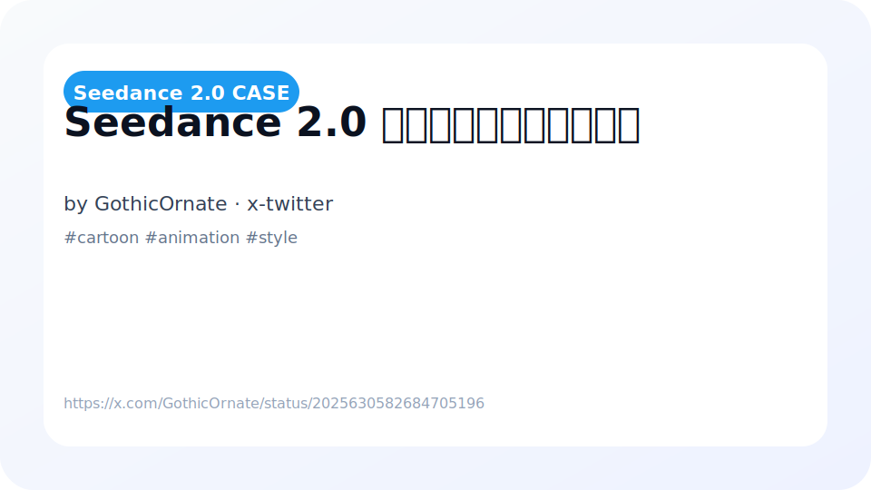</a>

**Tags:** `cartoon` `animation` `style`

> 用 Seedance 2.0 复刻色彩缤纷的卡通动画风格

### Case 355: [Insane Seedance 2.0 generation result](https://x.com/GMC_Reviews/status/2025630190727020866)（by [@GMC_Reviews](https://x.com/GMC_Reviews)）

<a href="https://x.com/GMC_Reviews/status/2025630190727020866">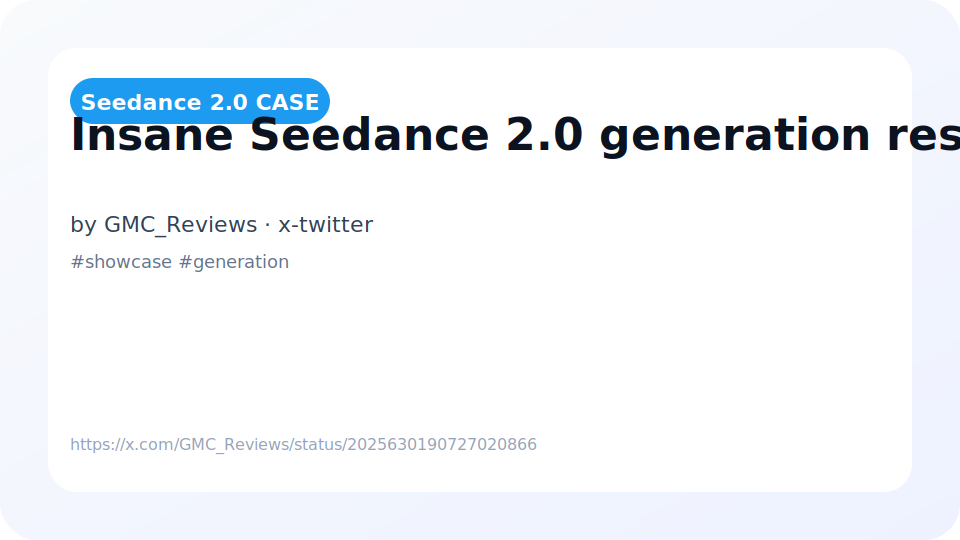</a>

**Tags:** `showcase` `generation`

> 展示 Seedance 2.0 令人惊叹的视频生成效果

### Case 356: [Luigi and Mario vs Sonic fight - million-dollar production quality](https://x.com/NACHOS2D_/status/2025630169411539242)（by [@NACHOS2D_](https://x.com/NACHOS2D_)）

<a href="https://x.com/NACHOS2D_/status/2025630169411539242">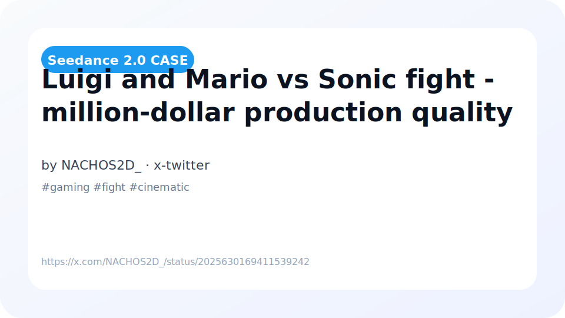</a>

**Tags:** `gaming` `fight` `cinematic`

> 用 Seedance 2.0 生成马里奥兄弟 vs 索尼克的电影级格斗

### Case 357: [No originality needed - Seedance 2.0 powered generation](https://x.com/GMC_Reviews/status/2025628325666853272)（by [@GMC_Reviews](https://x.com/GMC_Reviews)）

<a href="https://x.com/GMC_Reviews/status/2025628325666853272">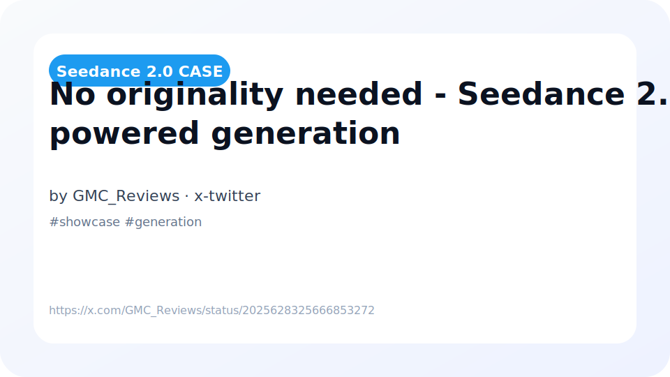</a>

**Tags:** `showcase` `generation`

> 又一个 Seedance 2.0 视频生成演示

### Case 358: [Seedance 2.0 film industry disruption showcase](https://x.com/kaan_alper/status/2025627455277736183)（by [@kaan_alper](https://x.com/kaan_alper)）

<a href="https://x.com/kaan_alper/status/2025627455277736183">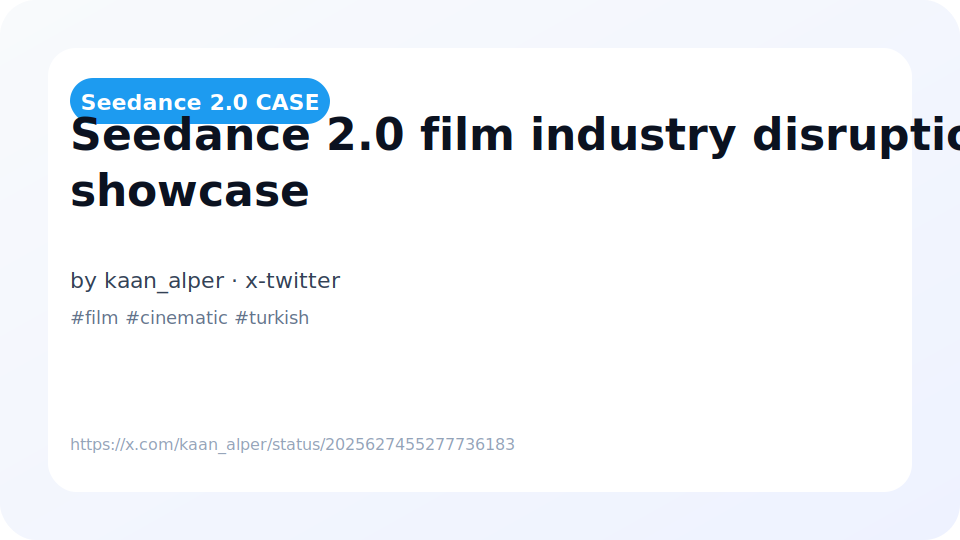</a>

**Tags:** `film` `cinematic` `turkish`

> 土耳其创作者展示 Seedance 2.0 电影级生成效果

### Case 359: [Hulk vs T-Rex brought to life by Seedance 2.0](https://x.com/Fujimoto_hina/status/2025625928609734952)（by [@Fujimoto_hina](https://x.com/Fujimoto_hina)）

<a href="https://x.com/Fujimoto_hina/status/2025625928609734952">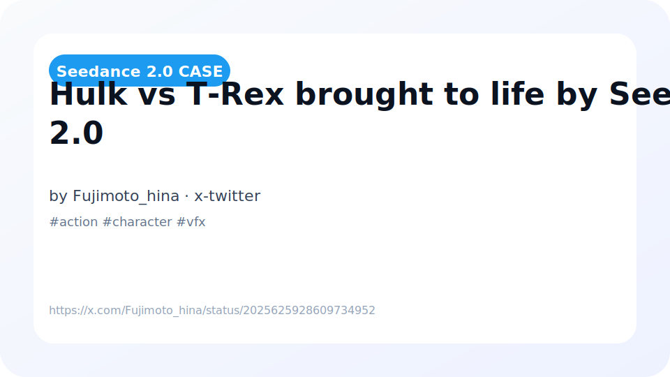</a>

**Tags:** `action` `character` `vfx`

> 用 Seedance 2.0 生成绿巨人 vs 霸王龙的动作场景

### Case 360: [Seedance 2.0 insane video AI showcase](https://x.com/Retrodayli/status/2025625895000797332)（by [@Retrodayli](https://x.com/Retrodayli)）

**Tags:** `showcase` `ai-video`

> 展示 Seedance 2.0 新一波 AI 视频生成浪潮

### Case 361: [SeeDance 2.0 - Sci-fi Story - The Neural Nexus - Act 1 The Sacrifice](https://www.youtube.com/watch?v=tC0fIQk_9zQ)（by Benji's AI Playground）

**Tags:** `seedance-2.0` `ai-video`

> Sci-fi short story created with Seedance 2.0, cinematic AI-generated narrative.

### Case 362: [SEEDANCE 2.0 – The Most Insane AI Battles Ever Created](https://www.youtube.com/watch?v=vTG3dvK3cHQ)（by Isabella IA & Tech News）

**Tags:** `seedance-2.0` `ai-video`

> Multiple AI combat sequences generated with Seedance 2.0, showcasing cinematic choreography and VFX.

### Case 363: [Seedance 2.0 Claims the AI Video Throne!](https://www.youtube.com/watch?v=F1kWxdfiBNE)（by AI Filmmaking Academy）

**Tags:** `vfx` `filmmaking` `comparison` `showcase`

> 展示 Seedance 2.0 接近 CGI 级别的视觉特效镜头，具备导演级时间控制能力。

### Case 364: [Seedance 2.0 INSANE Scenes Going Viral](https://www.youtube.com/watch?v=Sfa_WUHfbbk)（by Airt）

**Tags:** `compilation` `viral` `cinematic` `showcase`

> 病毒式传播的 Seedance 2.0 片段合集：电影级动作镜头与超写实 AI 生成画面。

### Case 365: [Seedance 2.0 保姆级教程！10 个案例实测](https://www.youtube.com/watch?v=lQwbzEgpHmM)（by 零度解说）

**Tags:** `tutorial` `multi-case` `character-consistency`

> 10个实测案例覆盖电影短剧、角色一致性、AI数字人等场景

### Case 366: [Seedance 2.0 AI Animation Test is Bonkers](https://www.youtube.com/watch?v=LYC-7k3I66s)（by AI Director Dave Clark）

**Tags:** `animation` `test` `short-film`

> 动画风格测试，两段15秒生成拼接，效果惊艳

### Case 367: [Umineko EP5 DLA DEATH anime by seedance2](https://x.com/bdsqlsz/status/2025955723721785606)（by [@bdsqlsz](https://x.com/bdsqlsz)）

<a href="https://x.com/bdsqlsz/status/2025955723721785606">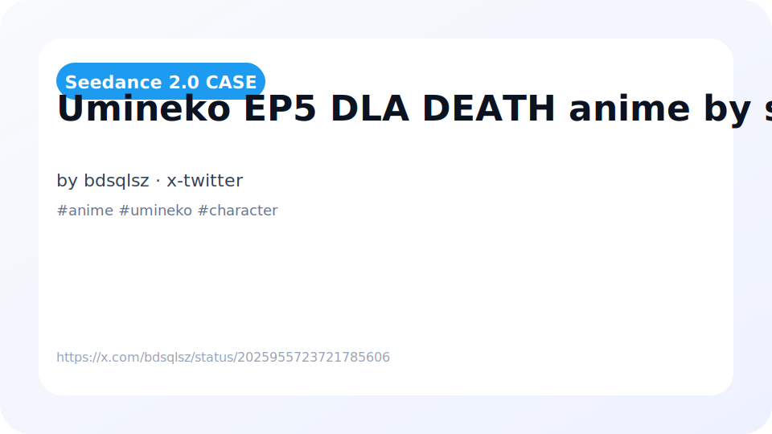</a>

**Tags:** `anime` `umineko` `character`

> 用Seedance2制作海猫鸣泣之时EP5动画片段

### Case 368: [Seedance 2.0 is absolutely insane, next level amazing](https://x.com/sammychrise/status/2025955701210632501)（by [@sammychrise](https://x.com/sammychrise)）

<a href="https://x.com/sammychrise/status/2025955701210632501">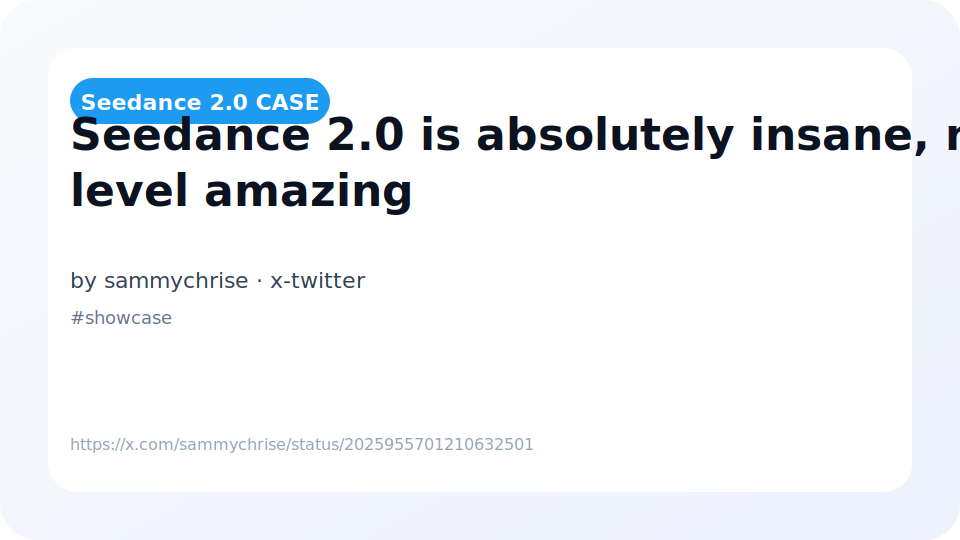</a>

**Tags:** `showcase`

> Seedance 2.0生成效果展示

### Case 369: [Seedance 2.0 VS Kling 3.0 comparison](https://x.com/olegcl/status/2025955440207475135)（by [@olegcl](https://x.com/olegcl)）

<a href="https://x.com/olegcl/status/2025955440207475135">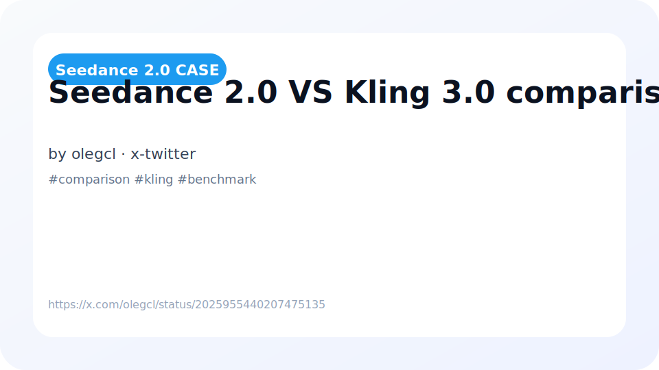</a>

**Tags:** `comparison` `kling` `benchmark`

> Seedance 2.0与Kling 3.0对比：运动/镜头更强 vs 对话/唇形更真实

### Case 370: [用seedance2.0生成梦境视频](https://x.com/melmanzone/status/2025955439599579531)（by [@melmanzone](https://x.com/melmanzone)）

<a href="https://x.com/melmanzone/status/2025955439599579531">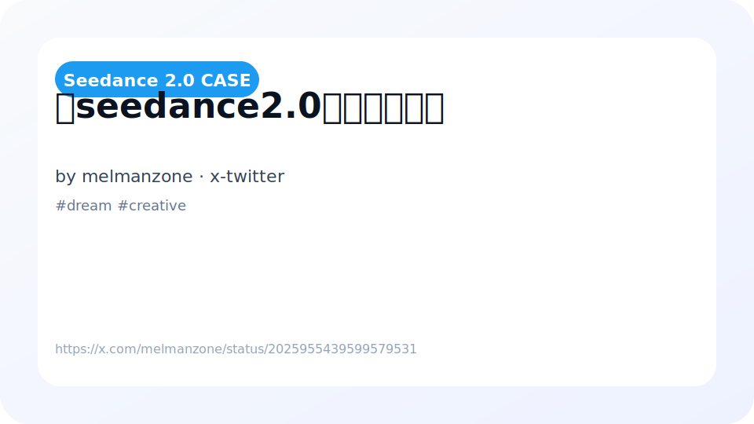</a>

**Tags:** `dream` `creative`

> 用Seedance 2.0生成梦境场景视频

### Case 371: [100% AI generated F1 racing by Seedance 2.0](https://x.com/Dheepanratnam/status/2025955435312816242)（by [@Dheepanratnam](https://x.com/Dheepanratnam)）

<a href="https://x.com/Dheepanratnam/status/2025955435312816242">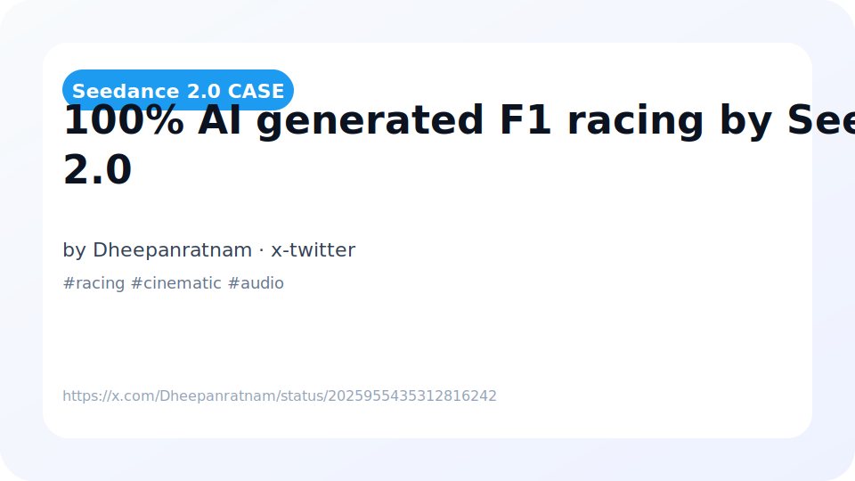</a>

**Tags:** `racing` `cinematic` `audio`

> 纯AI生成F1赛车场景，含降档、轮胎尖叫等音效

### Case 372: [大話西游 Seedance2 生成](https://x.com/hunt74828/status/2025955025609269440)（by [@hunt74828](https://x.com/hunt74828)）

<a href="https://x.com/hunt74828/status/2025955025609269440">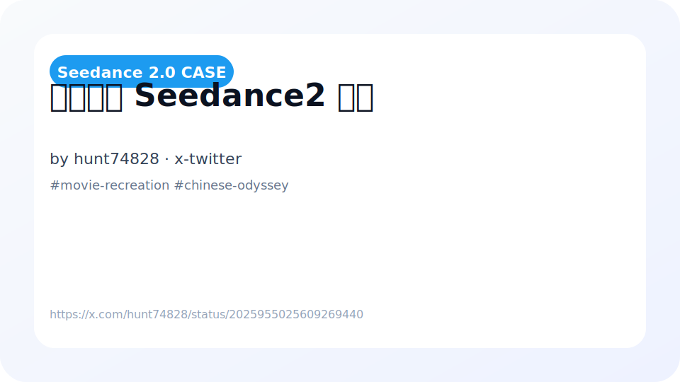</a>

**Tags:** `movie-recreation` `chinese-odyssey`

> 用Seedance2复刻大话西游经典场景

### Case 373: [Seedance 2.0 复刻周星驰大话西游经典情感戏](https://x.com/anson7956/status/2025954754518733097)（by [@anson7956](https://x.com/anson7956)）

<a href="https://x.com/anson7956/status/2025954754518733097">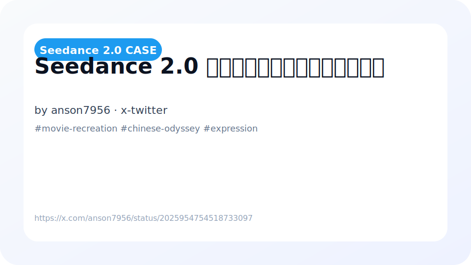</a>

**Tags:** `movie-recreation` `chinese-odyssey` `expression`

> 复刻大话西游经典情感戏片段，表情到位

### Case 374: [两大高手对决 Seedance2](https://x.com/GB_Kidding/status/2025954262287823282)（by [@GB_Kidding](https://x.com/GB_Kidding)）

<a href="https://x.com/GB_Kidding/status/2025954262287823282">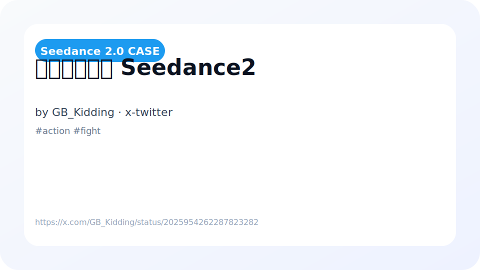</a>

**Tags:** `action` `fight`

> 两位高手对决的动作场景生成

### Case 375: [Seedance 2.0 showcase](https://x.com/Mrpinecone888/status/2025953335698661497)（by [@Mrpinecone888](https://x.com/Mrpinecone888)）

<a href="https://x.com/Mrpinecone888/status/2025953335698661497">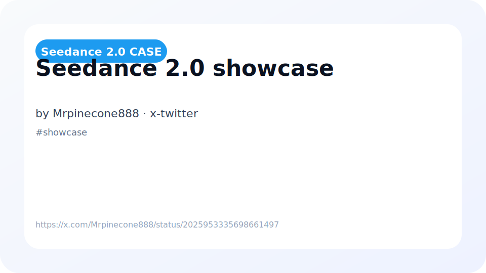</a>

**Tags:** `showcase`

> Seedance 2.0视频生成展示

### Case 376: [Seedance 2.0 cinema-grade multimodal output](https://x.com/lovart_ai/status/2025950981305909586)（by [@lovart_ai](https://x.com/lovart_ai)）

<a href="https://x.com/lovart_ai/status/2025950981305909586">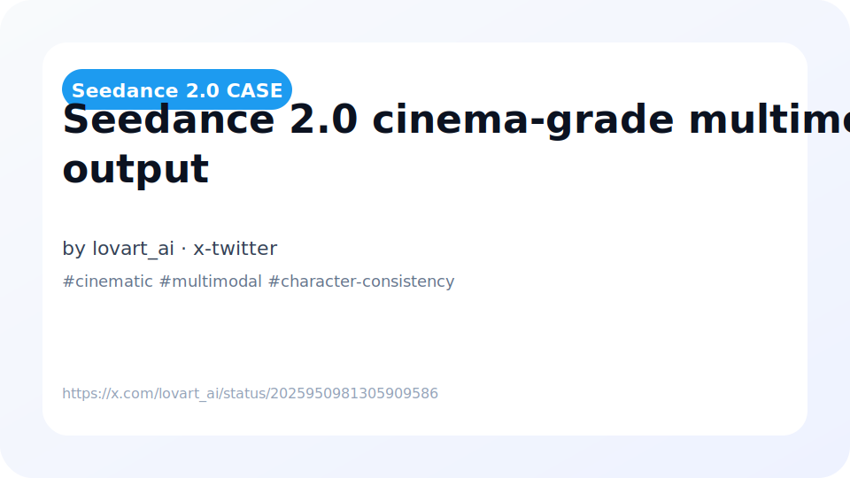</a>

**Tags:** `cinematic` `multimodal` `character-consistency`

> 展示Seedance 2.0多模态参考、角色一致性和电影级输出

### Case 377: [SEEDANCE 2.0 + Nano Banana Pro | Create Entire Film With Single Text Prompt](https://www.youtube.com/watch?v=wpkrIfowwMo)（by Ai Lockup）

**Tags:** `workflow` `text-to-video` `image-to-video` `short-film` `nano-banana-pro`

> 用 Seedance 2.0 + Nano Banana Pro 从单条文本提示生成完整短片，展示 text-to-image + image-to-video 全流程

### Case 378: [Seedance 2.0 Mega Showcase | CapCut](https://www.youtube.com/watch?v=g_kHV96VWy4)（by Alex Patrascu）

**Tags:** `showcase` `compilation` `capcut`

> Seedance 2.0 最大规模作品合集展示，涵盖多种风格场景

### Case 379: [The Best AI Fights (Seedance 2.0 Compilation)](https://www.youtube.com/watch?v=Smm0wcON9Gw)（by Esenpauk）

**Tags:** `fights` `compilation` `characters` `action`

> Seedance 2.0 生成的超逼真 AI 格斗场景合集，含多个知名角色

### Case 380: [New Silicon Valley with Seedance 2.0](https://x.com/rohanpaul_ai/status/2026145691677126797)（by [@rohanpaul_ai](https://x.com/rohanpaul_ai)）

<a href="https://x.com/rohanpaul_ai/status/2026145691677126797">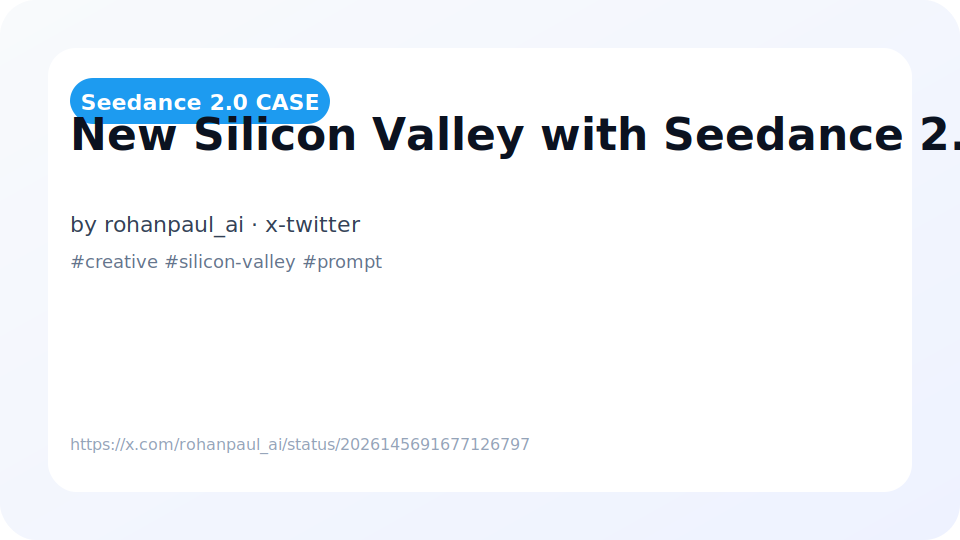</a>

**Tags:** `creative` `silicon-valley` `prompt`

> 用 Seedance 2.0 生成硅谷主题创意短片，展示 AI 独立制片潜力

### Case 381: [Seedance 2.0 生成林黛玉倒拔垂杨柳](https://x.com/liyue_ai/status/2026145699486916623)（by [@liyue_ai](https://x.com/liyue_ai)）

<a href="https://x.com/liyue_ai/status/2026145699486916623">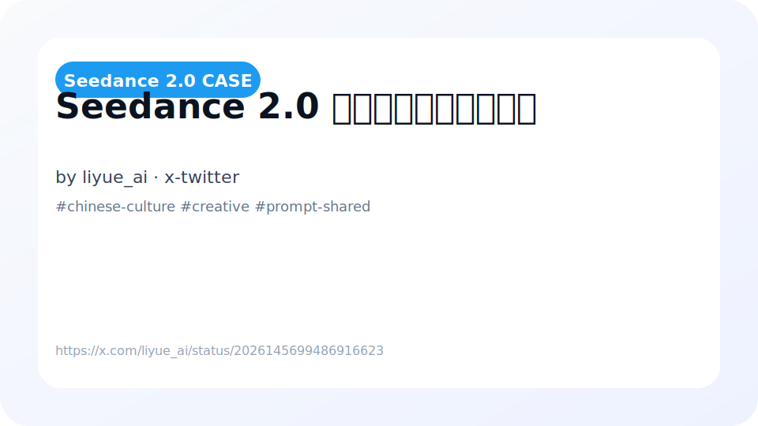</a>

**Tags:** `chinese-culture` `creative` `prompt-shared`

> 用 Seedance 2.0 生成林黛玉倒拔垂杨柳的创意视频，附提示词

### Case 382: [Seedance 2.0 + Evangelion](https://x.com/txt2mtxt/status/2026143267243647370)（by [@txt2mtxt](https://x.com/txt2mtxt)）

<a href="https://x.com/txt2mtxt/status/2026143267243647370">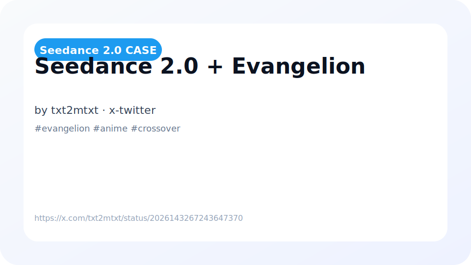</a>

**Tags:** `evangelion` `anime` `crossover`

> Seedance 2.0 生成新世纪福音战士风格视频

### Case 383: [IKEA Sword Fight - Seedance 2.0](https://x.com/shaolynsteez/status/2026141613341175979)（by [@shaolynsteez](https://x.com/shaolynsteez)）

**Tags:** `creative` `action` `humor`

> 用 Seedance 2.0 生成宜家内剑斗创意场景

### Case 384: [Seedance 2.0 showcase](https://x.com/infinitysim33/status/2026145328106279280)（by [@infinitysim33](https://x.com/infinitysim33)）

<a href="https://x.com/infinitysim33/status/2026145328106279280">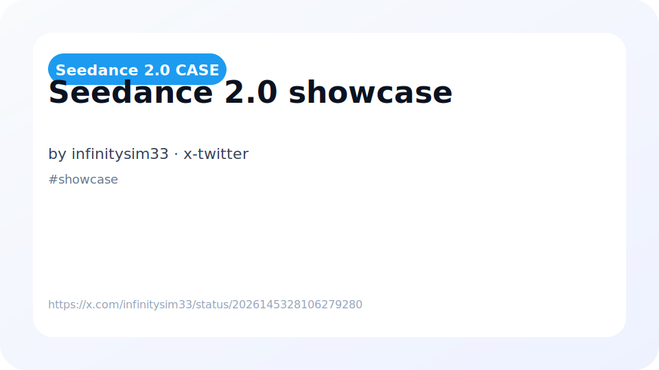</a>

**Tags:** `showcase`

> Seedance 2.0 视频生成效果展示

### Case 385: [SEEDANCE 2.0 video](https://x.com/MazuranDomagoj/status/2026143784506171843)（by [@MazuranDomagoj](https://x.com/MazuranDomagoj)）

<a href="https://x.com/MazuranDomagoj/status/2026143784506171843">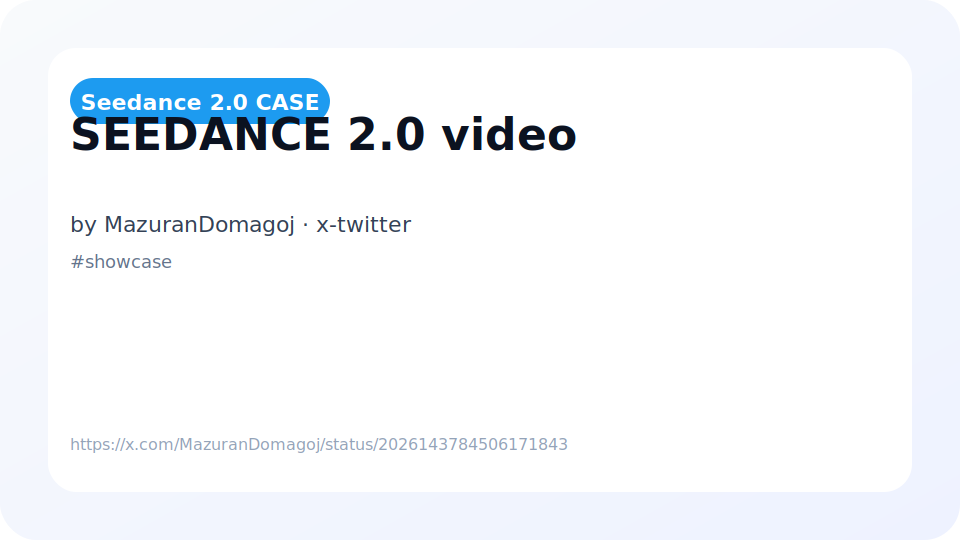</a>

**Tags:** `showcase`

> Seedance 2.0 生成视频展示

## 🤝 Contributing

Found an amazing Seedance 2.0 video? [Submit a Case](../../issues/new?template=submit-case.yml)!

---

*Auto-generated from [data/items.jsonl](data/items.jsonl). Do not edit the Cases section manually.*
